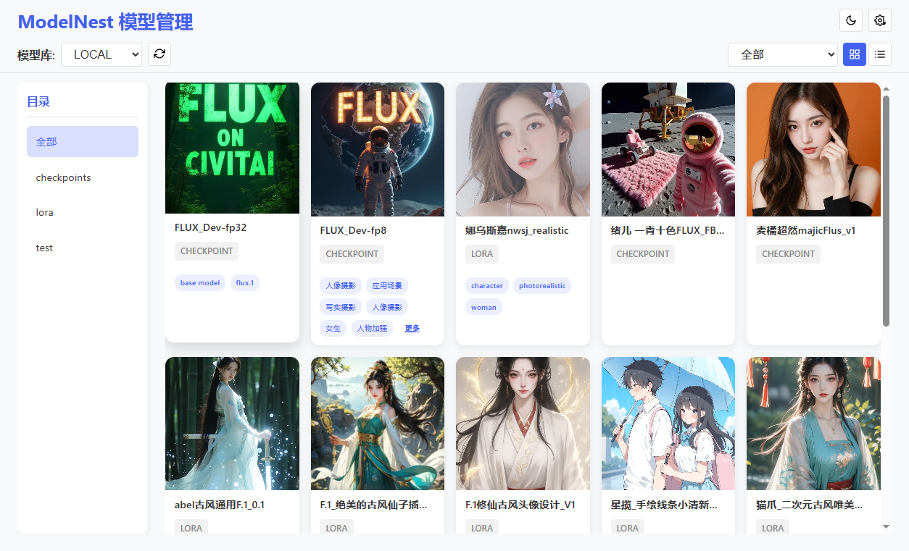

# ModelNest

ModelNest 是一款基于 Electron 构建的 生成式图像模型（SD、Flux等）管理与浏览工具，旨在帮助用户高效地整理和查找本地或远程存储的 AI 模型资源。

本项目主要为满足个人需求，但欢迎提出 Issue 或 Pull Request。其中大多数代码通过AI生成（感谢Roo Code为我节省了大量的时间和精力），代码质量可能存在不足，敬请谅解。

**核心特性:**

*   **多数据源支持:** 同时管理本地文件系统和 WebDAV 服务器上的模型库。
*   **灵活配置:** 支持添加、编辑和删除多个模型数据源。
*   **模型浏览与筛选:** 提供卡片和列表视图，可按模型类型（Checkpoint, LORA, VAE 等）进行筛选。
*   **详细信息展示:** 查看模型的预览图（支持多种格式）和元数据（从同名 `.json` 文件读取）。
*   **元数据编辑:** 对于非只读数据源，可以直接在应用内编辑模型的 `.json` 元数据文件。
*   **✨ Civitai 信息爬取 (新增):** 自动从 Civitai.com 拉取模型的元数据（描述、标签、触发词、版本信息等）和预览图，并保存到本地。
*   **🔒 数据源只读模式 (新增):** 可将重要的数据源设置为只读，防止意外修改或删除模型文件及元数据。
*   **图片缓存:** 优化预览图加载速度，支持内存和磁盘两级缓存。

## 应用截图



## 使用方法

1.  **下载与运行**:
    *   前往 [Releases](https://github.com/your-repo/modelnest/releases) 页面下载最新版本的预编译包（适用于 Windows）。
    *   解压下载的文件，并运行 `ModelNest` 可执行文件。
    *   （或者）对于开发者：克隆本仓库，然后运行 `npm install && npm start`。

2.  **添加模型库**:
    *   首次启动或点击界面右上方的设置按钮 <i class="fas fa-cog"></i> 打开设置界面。
    *   在“数据源配置”区域点击“添加”按钮。
    *   选择数据源类型（本地或 WebDAV），并填写必要的配置信息（名称、路径/URL、凭据等）。
    *   **只读模式 (可选):** 勾选“只读”复选框可以将此数据源标记为只读，防止应用对其进行任何写入操作（如保存元数据、下载爬虫文件）。

3.  **组织模型库文件**:

    为了让 ModelNest 正确识别您的模型及其相关信息，请按照以下方式在您配置的模型库目录（本地路径或 WebDAV 根目录）中组织文件：

    *   **目录结构**: ModelNest 会扫描您配置的根目录。请将模型文件、预览图和元数据文件放在此目录下。*(注意：当前版本可能不会递归扫描子目录，建议将文件直接放在根目录)*
    *   **文件命名**:
        *   **模型文件**: 使用 `config.json` 中 `supportedExtensions` 定义的扩展名（可在设置中查看），例如 `my_cool_model.safetensors`。
        *   **预览图片 (可选)**: 图片文件必须与模型文件具有**相同的基本名称**（不含扩展名），并且扩展名为 `.png`, `.jpg`, `.jpeg`, `.webp` 等常见图片格式。例如，`my_cool_model.png`。
        *   **元数据文件 (可选)**: JSON 文件也必须与模型文件具有**相同的基本名称**，扩展名为 `.json`。例如，`my_cool_model.json`。
    *   **元数据 JSON 文件格式 (`.json`)**:
        这是一个可选的文件，用于提供模型的详细信息。其内容是一个 JSON 对象，可以包含以下常用字段（以及任何您想添加的自定义字段）：
        *   `modelType` (string): 模型的类型（例如 "LORA", "Checkpoint", "TextualInversion"）。如果未提供，将根据文件扩展名猜测。
        *   `description` (string): 模型的描述信息。
        *   `triggerWord` (string): 使用该模型（尤其是 LORA 或 Textual Inversion）时建议的触发词。
        *   `tags` (array of strings): 与模型相关的标签，方便分类和搜索。
        *   `trainedWords` (array of strings): 训练时使用的触发词。
        *   `baseModel` (string): 训练该模型所基于的基础模型。
        *   *以及其他从 Civitai 获取或您自定义的字段...*

    **示例文件结构**:
    假设您的本地模型库路径配置为 `D:/AI/Models/MyLib`：

    ```
    D:/AI/Models/MyLib/
    ├── character_a.safetensors
    ├── character_a.png
    ├── character_a.json
    ├── style_b.ckpt
    ├── style_b.jpg
    ├── style_b.json
    ├── object_c.vae.pt
    ├── object_c.webp
    ```

    **`character_a.json` 文件内容示例**:
    ```json
    {
      "modelType": "LORA",
      "description": "一个可爱的动漫角色 LORA 模型。",
      "triggerWord": "charA",
      "tags": ["anime", "character", "cute"],
      "baseModel": "AnimeFinal",
      "author": "CreatorX"
    }
    ```

4.  **使用 Civitai 信息爬取 (可选)**:
    *   在主界面，将鼠标悬停在模型卡片或列表项上，会显示操作按钮。
    *   点击 <i class="fas fa-sync-alt"></i>（同步 Civitai 信息）按钮。*(注意：此功能目前可能只对本地数据源有效)*
    *   应用将根据模型文件的哈希值尝试从 Civitai.com 获取信息。
    *   如果找到匹配项，它会自动下载模型的元数据（保存为 `.json` 文件）和默认预览图（保存为同名图片文件）。如果相应文件已存在，则可能会跳过或覆盖（取决于具体实现）。
    *   您可以通过点击界面右上角的 <i class="fas fa-tasks"></i>（任务状态）按钮来查看爬取进度和控制任务。

## 架构与开发

本项目采用 Electron 构建，详细的架构设计和开发规范请参考：

*   [架构说明文档 (doc/架构说明.md)](doc/架构说明.md)

该文档包含了项目核心组件、数据流、IPC 通信、分层设计、日志和多语言规范等详细信息。


## 许可
[MIT License](LICENSE)
