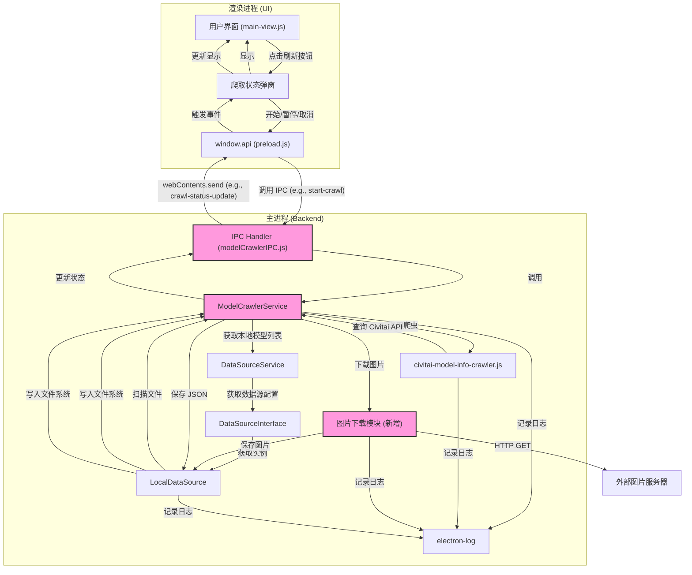

# 功能设计：本地模型信息与图片自动补全 (Civitai)

**版本:** 1.0
**日期:** 2025-05-05

## 1. 目标

为 ModelNest 的本地模型库 (`LOCAL` 类型数据源) 添加一项新功能：自动扫描模型文件，识别缺失的模型信息 (`.json`) 或预览图，并通过查询 Civitai API 补全这些信息和图片。

## 2. 功能描述

*   **触发:** 用户在主界面，当模型库类型为 `LOCAL` 时，点击一个特定的“刷新/同步”按钮。
*   **处理:** 后端服务启动一个异步任务，扫描指定目录下的模型文件。
*   **识别:** 找出没有对应 `.json` 文件或常见图片格式（如 `.png`, `.jpg`, `.jpeg`, `.webp`) 文件的模型。
*   **爬取:** 对每个需要处理的模型，使用其文件哈希调用 `civitai-model-info-crawler.js` 工具查询 Civitai API。
*   **保存:**
    *   如果成功获取到模型信息且本地缺少 `.json` 文件，则将 `civitai-model-info-crawler.js` 返回的 **完整原始对象** 保存为同名的 `.json` 文件。
    *   如果成功获取到模型信息、本地缺少图片文件且信息中包含图片 URL，则下载该图片并保存为同名的图片文件（扩展名根据下载内容或 URL 推断）。
*   **反馈:** 在 UI 上弹出一个模态窗口，实时显示任务进度（总数、已完成数、当前处理的模型名）、状态（运行中、暂停、完成、取消、错误），并提供控制按钮（开始、暂停/恢复、取消）。
*   **控制:** 用户可以通过弹窗按钮控制任务的开始、暂停、恢复和取消。

## 3. 核心流程

1.  **UI 触发:** 用户点击刷新按钮。
2.  **IPC 调用:** UI 通过 `window.api.startCrawl(sourceId, directory)` 请求启动任务。
3.  **服务启动 (`ModelCrawlerService`):**
    *   获取 `LocalDataSource` 实例。
    *   扫描目录，获取所有模型文件列表。
    *   检查每个模型对应的 `.json` 和图片文件是否存在。
    *   生成待处理任务队列。
    *   初始化状态和进度，开始异步处理队列 (`_processQueue`)。
    *   通过 IPC 推送初始状态 (`crawl-status-update`)。
4.  **任务处理循环 (`_processQueue`):**
    *   检查任务状态（是否暂停或取消）。
    *   从队列取出一个模型文件路径。
    *   推送当前处理状态给 UI。
    *   调用 `civitai-model-info-crawler.js`。
    *   **处理结果:**
        *   **成功:**
            *   若缺 JSON，调用 `LocalDataSource.writeModelJson()` 保存 **原始** 返回对象。
            *   若缺图片且有 URL，调用 `ImageDownloader.downloadAndSaveImage()`。
        *   **失败/未找到:** 记录日志。
    *   更新完成计数，推送状态给 UI。
    *   加入延迟，处理下一个任务。
5.  **任务结束:** 队列处理完毕、被取消或出错，推送最终状态给 UI。
6.  **用户控制:** UI 上的暂停/恢复/取消按钮通过 IPC 调用 `ModelCrawlerService` 的相应方法来改变任务状态。

## 4. 架构设计

## 5. 组件职责

*   **`ModelCrawlerService` (新增 `src/services/modelCrawlerService.js`)**: 核心服务，管理任务状态、队列、进度，协调扫描、爬取、保存流程，处理用户控制请求。
*   **`ImageDownloader` (新增 `src/utils/imageDownloader.js`)**: 负责根据 URL 下载图片并使用 `LocalDataSource` 保存到本地。
*   **`modelCrawlerIPC.js` (新增 `src/ipc/modelCrawlerIPC.js`)**: 处理与爬取任务相关的 IPC 请求，并将状态更新推送到渲染进程。
*   **`preload.js`**: 暴露新的 API 调用和事件监听接口给渲染进程。
*   **渲染进程 UI (`main-view.js` 及弹窗组件)**:
    *   **触发按钮:**
        *   在 `main-view.js` 中，监听当前选中的数据源。
        *   当数据源类型为 `LOCAL` 时，在模型库类型下拉框旁边显示一个“刷新/同步”图标按钮（例如，使用 Font Awesome 的 `fa-sync` 或类似图标）。
        *   按钮初始状态为可用。当爬取任务正在进行时，可以考虑禁用该按钮，防止重复触发。
    *   **状态弹窗 (Modal Dialog):**
        *   **触发:** 点击“刷新/同步”按钮时，弹出一个模态对话框。该对话框将阻止用户与主界面的其他部分交互，直到关闭。
        *   **布局:**
            *   **标题:** "补全模型信息" (或类似，支持 i18n)。
            *   **信息区域:** 一个文本区域，用于显示任务的实时状态和进度。
            *   **按钮区域:** 包含“开始”、“暂停/恢复”、“取消”按钮。
        *   **状态文本显示 (信息区域):**
            *   `idle` (空闲/未开始): "未开始" 或 "点击“开始”按钮以扫描并补全本地模型信息。"
            *   `scanning` (扫描中): "正在扫描本地模型文件..."
            *   `running` (运行中): `正在获取模型信息 ${status.completed}/${status.total} - 处理模型: ${status.currentModelName}` (示例)
            *   `paused` (暂停中): `已暂停 ${status.completed}/${status.total}`
            *   `finished` (已完成): `任务完成。成功处理 ${status.completed} / ${status.total} 个模型。` (可考虑添加失败数量)
            *   `canceled` (已取消): "任务已取消。"
            *   `error` (错误): `出现错误: ${status.errorMessage}`
        *   **按钮状态管理:**
            *   **初始/空闲 (`idle`):** "开始" (可用), "暂停/恢复" (禁用), "取消" (可用, 点击直接关闭弹窗)。
            *   **扫描中 (`scanning`):** "开始" (禁用), "暂停/恢复" (禁用), "取消" (可用)。
            *   **运行中 (`running`):** "开始" (禁用), "暂停" (可用, 显示“暂停”), "取消" (可用)。
            *   **暂停中 (`paused`):** "开始" (禁用), "恢复" (可用, 显示“恢复”), "取消" (可用)。
            *   **完成/取消/错误 (`finished`/`canceled`/`error`):** "开始" (禁用), "暂停/恢复" (禁用), "取消" (可用, 文本改为“关闭”)。
        *   **交互:**
            *   点击“开始”: 调用 `window.api.startCrawl()`。
            *   点击“暂停”: 调用 `window.api.pauseCrawl()`。
            *   点击“恢复”: 调用 `window.api.resumeCrawl()`。
            *   点击“取消”/“关闭”: 调用 `window.api.cancelCrawl()` 并关闭弹窗。
            *   弹窗右上角关闭按钮 (X): 行为同“取消”/“关闭”。
    *   **事件监听:** 使用 `window.api.onCrawlStatusUpdate((status) => { ... })` 监听后端推送的状态，并据此更新弹窗内的文本和按钮状态。
*   **`LocalDataSource.js`**: 需要确保提供检查文件存在 (`fileExists`) 和写入任意二进制文件 (`writeFile`) 的方法。
*   **`services/index.js`**: 注册新的 `ModelCrawlerService` 并注入依赖。

## 6. 数据格式

*   **JSON 文件:** 直接使用 `civitai-model-info-crawler.js` 返回的 **原始** JavaScript 对象结构。
*   **图片文件:** 使用模型文件名（去除扩展名）加上推断出的图片扩展名（如 `.png`, `.jpg`）。

## 7. 注意事项

*   **API 速率限制:** 在 `_processQueue` 循环中加入适当延迟（如 500ms-1s）以避免触发 Civitai API 的速率限制。
*   **错误处理:** 需要在爬取、下载、文件写入等环节添加健壮的错误处理和日志记录。考虑是否需要简单的重试机制。
*   **并发:** 当前设计为单任务顺序处理。如果未来需要支持并发处理多个模型，需要重构任务队列和状态管理。
*   **用户体验:** 弹窗应清晰展示进度和状态，按钮状态需正确反映当前任务状态。取消操作应能及时响应。