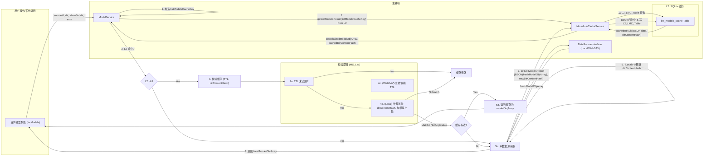

# ModelNest `model info` 及 `listModels` 缓存方案设计文档 (修订版)

## 1. 引言

本文档旨在对 ModelNest 项目的 `model info` 及 `listModels` 缓存系统进行修订和扩展设计。`model info` 指的是模型的详细元数据，而 `listModels` 是获取模型列表的核心操作。先前的设计主要集中在单个 `model info` 的缓存，本次修订将重点关注以下几个方面：

1.  将二级磁盘缓存（L2）的存储后端从原计划或早期实现（如基于文件的 JSON）统一并明确为使用 **SQLite** 数据库。
2.  统一采用 **BSON (Binary JSON, bsonspec.org)** 作为在 L2 缓存中存储复杂对象的序列化格式，以提升效率和减少存储空间。
3.  为高频操作 `listModels` 方法设计并集成全新的缓存机制，该机制同样利用 SQLite 和 BSON。
4.  梳理并明确服务间的依赖关系与初始化顺序，以增强系统稳定性和可维护性。

此修订方案旨在解决先前实现与用户最新核心需求之间的偏差，并为 ModelNest 提供一个更健壮、高效的缓存基础设施。设计将基于项目现有架构，并重点关注 `ModelInfoCacheService` 的重构以及其与 `ModelService`、`DataSource` 实现的集成。

## 2. 核心需求与缓存目标 (修订)

*   **缓存 `ModelService` 返回的 `modelObj`**: L1 内存缓存中可以缓存完整的 `modelObj` 以加速对已加载模型详情的重复访问。
*   **缓存 JSON 解析结果 (`modelJsonInfo`)**: L2 磁盘缓存（SQLite+BSON）主要缓存从 `.json` 文件解析或外部 API 获取的 `modelJsonInfo`，以节省重复IO和解析开销。
*   **缓存 `listModels` 操作结果**: L2 磁盘缓存（SQLite+BSON）缓存 `ModelService.listModels` 方法返回的 `modelObj` 数组，以加速模型列表的加载。
*   **两级缓存**:
    *   L1: 内存缓存 (`Map`)，速度最快，容量有限，主要服务于热点数据（如单个 `modelObj`）。
    *   L2: SQLite 数据库，容量较大，持久化，使用 BSON 序列化。
*   **按模型库隔离**: 缓存应能感知并区分不同的数据源 (`sourceId`)。
*   **高效的失效机制**:
    *   对于 `modelJsonInfo`: 基于源 `.json` 文件的元数据 (修改时间、大小) 和 TTL。
    *   对于 `listModels` 结果:
        *   `LocalDataSource`: 基于被查询目录的内容元数据摘要和 TTL。
        *   `WebDavDataSource`: 主要基于 TTL 和用户手动刷新。
*   **IO 友好与高性能**: L2 磁盘缓存采用 SQLite + BSON 以优化 IO、存储和解析性能。
*   **服务依赖清晰**: 明确服务初始化顺序，避免循环依赖和初始化时序问题。

## 3. 缓存结构设计 (修订)

### 3.1. 缓存键策略 (修订)

#### 3.1.1. `modelJsonInfo` 缓存键

用于 `model_json_info_cache` 表和 L1 中缓存单个 `modelObj` (其 `modelJsonInfo` 是核心)。
*   **格式**: `model_info:{sourceId}:{normalized_json_path}`
    *   `sourceId`: 数据源的唯一标识符。
    *   `normalized_json_path`: 模型关联的 `.json` 文件的规范化相对路径（相对于数据源根目录）。如果模型没有 `.json` 文件，此键可能不适用，或者需要特殊处理（原设计文档中提及基于主模型文件路径的键，但 L2 主要缓存 `modelJsonInfo`，故此场景下 `.json` 路径更核心）。

#### 3.1.2. `listModels` 结果缓存键

用于 `list_models_cache` 表。
*   **格式**: `list_models:{sourceId}:{normalized_directory_path}:{show_subdirectory_flag}:{supported_exts_hash}`
    *   `sourceId`: 数据源 ID。
    *   `normalized_directory_path`: 请求的规范化目录路径。空字符串、`.` 或 `/` 代表数据源根目录。应统一表示（例如，统一为相对路径，根目录用空字符串或特定占位符）。
    *   `show_subdirectory_flag`: `0` (false) 或 `1` (true)，表示是否递归查询子目录。
    *   `supported_exts_hash`: 一个哈希值，通过以下步骤生成：
        1.  获取 `supportedExts` 数组（包含如 `.safetensors`, `.ckpt` 等扩展名）。
        2.  将所有扩展名统一为小写。
        3.  对扩展名数组进行字母顺序排序。
        4.  将排序后的扩展名用特定分隔符（如 `|`）连接成一个字符串。
        5.  计算该字符串的 SHA256 哈希值。

### 3.2. L1: 内存缓存

*   **存储内容**: 主要缓存完整的 `modelObj` JavaScript 对象，特别是那些被频繁访问的模型详情。
*   **数据结构**: 使用 `Map` 对象实现。
    *   键: `model_info:{sourceId}:{normalized_json_path}` (与 L2 `model_json_info_cache` 的键对应)。
    *   值: `{ data: modelObj, timestamp: Date.now(), ttlMs: configuredTtlForL1, sourceJsonStats: { mtimeMs: ..., size: ... } | null }`
        *   `sourceJsonStats`: 如果 `modelObj.jsonPath` 存在，则记录其关联的 `.json` 文件的 `mtimeMs` 和 `size`，用于快速失效判断。如果不存在 `.json` 文件，则为 `null`。字段名统一为 `sourceJsonStats`。
*   **大小限制**: 可配置的最大条目数 (例如，默认 200 个)。
*   **替换策略**: LRU (最近最少使用)。
*   **实现位置**: `ModelInfoCacheService` 内部。
*   **`listModels` 结果的 L1 缓存**: 本次设计主要将 `listModels` 结果缓存于 L2。未来可评估是否也将其部分热点结果（如特定常用目录的列表）放入 L1，但这会增加 L1 管理的复杂性。

### 3.3. L2: 磁盘缓存 (SQLite + BSON) (修订)

*   **存储机制**: 单个 SQLite 数据库文件。
    *   **文件路径**: 通过 `ConfigService` 配置，例如 `app.getPath('userData')/ModelNest/cache/model_cache.sqlite`。
*   **数据格式**: 所有存入 SQLite `BLOB` 字段的复杂数据（如 `modelJsonInfo` 对象、`modelObj` 数组）都将通过 **BSON** 序列化为二进制 `Buffer` 后存储。
*   **依赖**: 需要引入 `sqlite3` (或 `better-sqlite3`) 和 `bson` npm 包。
*   **实现位置**: `ModelInfoCacheService` 内部。

#### 3.3.1. SQLite 表 1: `model_json_info_cache`

用于缓存单个模型的 `modelJsonInfo`。

| 列名                      | 类型    | 约束          | 描述                                                                 |
| :------------------------ | :------ | :------------ | :------------------------------------------------------------------- |
| `cache_key`               | TEXT    | PRIMARY KEY   | `model_info:{sourceId}:{normalized_json_path}`                       |
| `source_id`               | TEXT    | NOT NULL      | 数据源 ID                                                            |
| `normalized_json_path`    | TEXT    | NOT NULL      | 源 JSON 文件在其数据源中的规范化相对路径                               |
| `bson_data`               | BLOB    | NOT NULL      | BSON 序列化后的 `modelJsonInfo` 数据                                 |
| `source_json_mtime_ms`    | REAL    | NOT NULL      | 缓存时，源 JSON 文件的 `mtimeMs` (毫秒时间戳)                        |
| `source_json_size`        | INTEGER | NOT NULL      | 缓存时，源 JSON 文件的大小 (bytes)                                   |
| `cached_timestamp_ms`     | INTEGER | NOT NULL      | 此条目被缓存的 Unix 毫秒时间戳                                         |
| `ttl_seconds`             | INTEGER | NOT NULL      | 此条目的有效生存时间 (秒)                                            |
| `last_accessed_timestamp_ms`| INTEGER | NOT NULL      | 最近访问此条目的 Unix 毫秒时间戳 (用于 LRU 清理)                      |

**索引 (`model_json_info_cache`):**
*   `cache_key` (PK)
*   `idx_mjic_source_id`: ON `model_json_info_cache` (`source_id`)
*   `idx_mjic_last_accessed`: ON `model_json_info_cache` (`last_accessed_timestamp_ms`)
*   `idx_mjic_expiration`: ON `model_json_info_cache` (`cached_timestamp_ms`, `ttl_seconds`) (用于计算过期 (`cached_timestamp_ms + ttl_seconds * 1000`))

#### 3.3.2. SQLite 表 2: `list_models_cache`

用于缓存 `listModels` 方法的调用结果 (`modelObj` 数组)。

| 列名                      | 类型    | 约束          | 描述                                                                     |
| :------------------------ | :------ | :------------ | :----------------------------------------------------------------------- |
| `cache_key`               | TEXT    | PRIMARY KEY   | `list_models:{sourceId}:{normalized_dir_path}:{show_subdir_flag}:{exts_hash}` |
| `source_id`               | TEXT    | NOT NULL      | 数据源 ID                                                                |
| `directory_path`          | TEXT    | NOT NULL      | 请求的规范化目录路径 (用于辅助查询和清理)                                |
| `show_subdirectory`       | INTEGER | NOT NULL      | 0 (false) 或 1 (true) (用于辅助查询和清理)                               |
| `supported_exts_hash`     | TEXT    | NOT NULL      | 支持的模型扩展名列表（排序后）的哈希值                                     |
| `bson_data`               | BLOB    | NOT NULL      | BSON 序列化后的 `modelObj` 数组                                          |
| `directory_content_hash`  | TEXT    | NULL          | (LocalDataSource) 目录内容元数据摘要。 (WebDav) 可为 ETag 或 NULL。      |
| `cached_timestamp_ms`     | INTEGER | NOT NULL      | 此条目被缓存的 Unix 毫秒时间戳                                             |
| `ttl_seconds`             | INTEGER | NOT NULL      | 此条目的有效生存时间 (秒)                                                |
| `last_accessed_timestamp_ms`| INTEGER | NOT NULL      | 最近访问此条目的 Unix 毫秒时间戳 (用于 LRU 清理)                          |

**索引 (`list_models_cache`):**
*   `cache_key` (PK)
*   `idx_lmc_source_id_dir`: ON `list_models_cache` (`source_id`, `directory_path`) (便于按源或目录清理)
*   `idx_lmc_last_accessed`: ON `list_models_cache` (`last_accessed_timestamp_ms`)
*   `idx_lmc_expiration`: ON `list_models_cache` (`cached_timestamp_ms`, `ttl_seconds`)

## 4. 缓存读写逻辑 (修订)

### 4.1. 数据流图

#### 4.1.1. 读取 `getModelDetail` (单个模型信息)

```mermaid
graph LR
    subgraph UserAction["用户操作/系统调用"]
        ActionGetDetail["请求模型详情 (getModelDetail)"]
    end

    subgraph MainProcess["主进程"]
        MS["ModelService"]
        MICS["ModelInfoCacheService"]
        DSInt["DataSourceInterface (Local/WebDAV)"]
        FS["文件系统 (用于LocalDataSource)"]
        WebDAVClient["WebDAV Client (用于WebDavDataSource)"]
        CivitaiAPI["Civitai API (按需)"]

        subgraph L1Cache["L1: 内存缓存 (modelObj)"]
            L1Map["Map<modelInfoCacheKey, CachedModelObj>"]
        end
        subgraph L2Cache["L2: SQLite 缓存"]
            L2_MJIC_Table["model_json_info_cache Table"]
        end
    end

    ActionGetDetail -- sourceId, jsonPath, modelFilePath --> MS

    MS -- 1. 构造 modelInfoCacheKey --> MS
    MS -- 2. getFromMemory(modelInfoCacheKey) --> MICS
    MICS -- 查 L1Map --> L1Map
    L1Map -- A1. L1 命中 --> MICS
    MICS -- A2. 获取源JSON文件当前元数据 (mtime, size) --> DSInt
    DSInt -- A2.1 (Local) --> FS
    DSInt -- A2.2 (WebDAV) --> WebDAVClient
    DSInt -- currentSourceJsonStats --> MICS
    MICS -- A3. 校验 L1 (TTL, sourceJsonStats vs currentSourceJsonStats) --> MICS
    MICS -- A4. L1 有效 --> MS
    MS -- A5. 返回克隆的 modelObj --> ActionGetDetail

    L1Map -- B1. L1 未命中/失效 --> MICS
    MICS -- 3. getModelJsonInfo(modelInfoCacheKey) from L2 --> L2_MJIC_Table
    L2_MJIC_Table -- B2. SQLite 查询 (BLOB) --> MICS
    MICS -- B3. L2 命中 --> MICS
    MICS -- B4. BSON 反序列化 --> MICS
    MICS -- B5. 获取源JSON文件当前元数据 (mtime, size) --> DSInt
    DSInt -- currentSourceJsonStats --> MICS
    MICS -- B6. 校验 L2 (TTL, L2.sourceJsonStats vs currentSourceJsonStats) --> MICS
    MICS -- B7. L2 有效 (得到 modelJsonInfo) --> MS
    MS -- B8. 从数据源加载基础 modelObj (不含 modelJsonInfo) --> DSInt
    DSInt -- baseModelObj --> MS
    MS -- B9. 组合 baseModelObj 和 L2.modelJsonInfo --> MS
    MS -- B10. 更新 L1 (新 modelObj, currentSourceJsonStats) --> MICS
    MICS -- 写 L1Map --> L1Map
    MS -- B11. 返回 modelObj --> ActionGetDetail

    MICS -- C1. L2 未命中/失效 (或L1失效后跳过L2检查) --> MS
    MS -- 4. 从数据源加载完整 modelObj (含新 modelJsonInfo) --> DSInt
    DSInt -- fullModelObj, newSourceJsonStats --> MS
    
    alt 如果需要从 Civitai 获取 modelJsonInfo (由 DSInt 或 MS 内部逻辑触发)
      MS --或 DSInt --> CivitaiAPI
      CivitaiAPI -- civitaiData --> MS --或 DSInt
      MS --或 DSInt --> "写入 .json 文件"
      "写入 .json 文件" -- newSourceJsonStats --> MS
    end

    MS -- 5. 得到最终 modelObj 和 newSourceJsonStats --> MS
    MS -- 6. 更新 L2 (setModelJsonInfo with BSON(modelObj.modelJsonInfo), newSourceJsonStats) --> MICS
    MICS -- BSON 序列化 & 写 L2_MJIC_Table --> L2_MJIC_Table
    MS -- 7. 更新 L1 (最终 modelObj, newSourceJsonStats) --> MICS
    MICS -- 写 L1Map --> L1Map
    MS -- 8. 返回 modelObj --> ActionGetDetail
```

#### 4.1.2. 读取 `listModels` (模型列表)



### 4.2. 读取流程: `ModelService.getModelDetail(sourceId, jsonPath, modelFilePath)` (修订)

1.  **构造缓存键 (`modelInfoCacheKey`)**:
    *   统一使用 `model_info:{sourceId}:{normalizedJsonPath}`。`normalizedJsonPath` 是 `jsonPath` 参数经过规范化处理后的结果。
2.  **查询 L1 内存缓存 (`ModelInfoCacheService.getFromMemory(modelInfoCacheKey)`)**:
    *   **命中**:
        *   获取缓存的 `{ data: modelObj, timestamp, ttlMs, sourceJsonStats }`。
        *   检查 TTL (`timestamp`, `ttlMs`) 是否过期。
        *   如果 `modelObj.jsonPath` 存在且 `sourceJsonStats` 存在：
            *   调用 `DataSourceInterface.getFileStats(sourceConfig, modelObj.jsonPath)` 获取源 `.json` 文件当前的 `mtimeMs` 和 `size` (`currentSourceJsonStats`)。
            *   比较 `sourceJsonStats` 与 `currentSourceJsonStats`。若文件已更改，则 L1 此条目视为无效。
        *   **L1 有效**: 返回 `modelObj` 的深拷贝。更新此条目在 L1 LRU 中的位置。**流程结束。**
        *   **L1 无效**: 从 L1 中移除此条目。继续。
    *   **未命中**: 继续。
3.  **查询 L2 磁盘缓存 (`ModelInfoCacheService.getModelJsonInfo(modelInfoCacheKey)`)**:
    *   **命中**:
        *   从 SQLite `model_json_info_cache` 表读取 `{ bson_data, source_json_mtime_ms, source_json_size, cached_timestamp_ms, ttl_seconds }`。
        *   检查 TTL (`cached_timestamp_ms`, `ttl_seconds`) 是否过期。
        *   调用 `DataSourceInterface.getFileStats(sourceConfig, normalizedJsonPath)` 获取源 `.json` 文件当前的 `mtimeMs` 和 `size` (`currentSourceJsonStats`)。
        *   与记录的 `source_json_mtime_ms`, `source_json_size` 比较。若文件已更改，则 L2 此条目视为无效。
        *   **L2 有效**:
            *   使用 `BSON.deserialize(bson_data)` 得到 `modelJsonInfo` 对象。
            *   更新此条目在 L2 中的 `last_accessed_timestamp_ms`。
            *   **从数据源加载基础 `modelObj`**: 调用 `dataSourceInterface.readModelDetail(sourceConfig, jsonPath, modelFilePath)`，但指示它只返回基础模型信息，不重新解析JSON或爬取（如果接口支持此区分）。或者，`ModelService` 自己构建一个不含 `modelJsonInfo` 的基础 `modelObj`。
            *   将 L2 提供的 `modelJsonInfo` 填充到基础 `modelObj` 中。
            *   使用最终的 `modelObj` 和 `currentSourceJsonStats` 更新 L1 缓存 (`ModelInfoCacheService.setToMemory`)。
            *   返回 `modelObj` 的深拷贝。**流程结束。**
        *   **L2 无效**: 从 L2 中删除此条目 (`ModelInfoCacheService.deleteFromL2`)。`modelJsonInfo` 仍需从源获取。
    *   **未命中**: `modelJsonInfo` 需从源获取。
4.  **从数据源加载/构建完整 `modelObj`**:
    *   调用 `dataSourceInterface.readModelDetail(sourceConfig, jsonPath, modelFilePath)` 获取完整的 `modelObj` (包含最新的 `modelJsonInfo`)。此方法内部可能读取文件、解析 JSON、甚至触发爬虫。
    *   `dataSourceInterface.readModelDetail` 或 `ModelService` 在获取到最终的 `modelJsonInfo` 后，如果它来自文件，应获取该 `.json` 文件最新的元数据 (`newSourceJsonStats` = `{ mtimeMs, size }`)。
5.  **更新 L2 磁盘缓存**:
    *   如果成功获取了 `modelObj.modelJsonInfo` 和 `newSourceJsonStats`：
        *   `ModelInfoCacheService.setModelJsonInfo(modelInfoCacheKey, modelObj.modelJsonInfo, newSourceJsonStats, configuredL2TtlSeconds)`。
6.  **更新 L1 内存缓存**:
    *   `ModelInfoCacheService.setToMemory(modelInfoCacheKey, modelObj, configuredL1TtlMs, newSourceJsonStats)`。
7.  返回 `modelObj` 的深拷贝。

### 4.3. 读取流程: `ModelService.listModels(sourceId, directory, showSubdirectory, supportedExts)` (新增)

1.  **构造缓存键 (`listModelsCacheKey`)**:
    *   根据 3.1.2 节定义的策略，使用 `sourceId`, `directory`, `showSubdirectory`, `supportedExts` 生成 `listModelsCacheKey`。
2.  **查询 L2 磁盘缓存 (`ModelInfoCacheService.getListModelsResult(listModelsCacheKey)`)**:
    *   `ModelInfoCacheService` 从 `list_models_cache` 表查询。
    *   **命中**:
        *   返回 `{ data: modelObjArray, directoryContentHash, cachedTimestampMs, ttlSeconds }` (其中 `data` 是 BSON 反序列化后的 `modelObj` 数组)。
        *   **校验缓存**:
            *   检查 TTL (`cachedTimestampMs`, `ttlSeconds`) 是否过期。如果过期，视为无效。
            *   **对于 `LocalDataSource`**:
                *   调用 `LocalDataSource.getDirectoryContentMetadataDigest(...)` 计算当前目录的 `currentDirectoryContentHash`。
                *   如果 `currentDirectoryContentHash` 与缓存的 `directoryContentHash` 不匹配，视为无效。
            *   **对于 `WebDavDataSource`**:
                *   如果缓存的 `directoryContentHash` 存储了 ETag/Last-Modified，并且可以通过轻量级请求验证其未改变，则缓存有效。
                *   否则，主要依赖 TTL。
        *   **L2 有效**: 返回 `modelObjArray`。**流程结束。**
        *   **L2 无效**: 从 L2 中删除此条目。继续。
    *   **未命中**: 继续。
3.  **从数据源加载模型列表**:
    *   调用 `dataSourceInterface.listModels(sourceConfig, directory, supportedExts, showSubdirectory)` 获取 `freshModelObjArray`。
    *   `ModelService` 内部可能还会对 `freshModelObjArray` 进行过滤。
4.  **准备并更新 L2 磁盘缓存**:
    *   **对于 `LocalDataSource`**:
        *   在步骤 2 或 3 之后（如果未命中或失效），应已计算过一次 `currentDirectoryContentHash`。如果是在获取数据后计算，确保使用最新的目录状态。
    *   **对于 `WebDavDataSource`**:
        *   `newDirectoryContentHash` 可以是获取到的 ETag/Last-Modified (如果适用)，否则为 `null`。
    *   获取 `listModels` 的配置 TTL (`configuredListModelsTtlSeconds`)。
    *   调用 `ModelInfoCacheService.setListModelsResult(listModelsCacheKey, freshModelObjArray, newDirectoryContentHash, configuredListModelsTtlSeconds, keyParts)`。`keyParts` 包含用于填充表中其他字段（如 `source_id`, `directory_path` 等）的原始值。
5.  返回 `freshModelObjArray`。

### 4.4. 写入/更新流程 (修订)

*   **场景1: `ModelService.saveModel()` 保存 `modelObj`**
    1.  `ModelService` 将 `modelObj.modelJsonInfo` 通过 `DataSourceInterface.writeModelJson` 写入对应的 `.json` 文件。
    2.  获取该 `.json` 文件最新的元数据 `newSourceJsonStats` (`mtimeMs`, `size`)。
    3.  **更新 `model_json_info_cache`**: 调用 `ModelInfoCacheService.setModelJsonInfo(modelInfoCacheKey, modelObj.modelJsonInfo, newSourceJsonStats, ttl)`。
    4.  **更新 L1 缓存**: `ModelService` 通常会重新调用 `getModelDetail` (或其内部逻辑) 来获取包含最新时间戳等的 `modelObj`，这个过程会自动用 `newSourceJsonStats` 更新 L1。或者，`saveModel` 成功后，可以直接用新数据和 `newSourceJsonStats` 更新 L1。
    5.  **使相关的 `listModels` 缓存失效**:
        *   `ModelService` 调用 `ModelInfoCacheService.invalidateListModelsCacheForDirectory(sourceId, directoryPath)`，其中 `directoryPath` 是被修改的 `.json` 文件所在的目录。
*   **场景2: 爬虫服务或其他外部服务更新了 `.json` 文件**
    1.  服务获取 `newModelJsonInfo` 并写入 `.json` 文件。
    2.  服务获取该 `.json` 文件最新的 `newSourceJsonStats`。
    3.  服务调用 `ModelInfoCacheService.setModelJsonInfo(modelInfoCacheKey, newModelJsonInfo, newSourceJsonStats, ttl)`。
    4.  服务调用 `ModelInfoCacheService.deleteFromMemory(modelInfoCacheKey)` (或 `invalidateL1`) 使 L1 失效。
    5.  服务调用 `ModelInfoCacheService.invalidateListModelsCacheForDirectory(sourceId, directoryPath)`。

## 5. 缓存失效机制 (修订)

### 5.1. TTL (Time To Live)

*   L1 和 L2 (两个表) 的缓存条目都包含创建时间戳 (`cached_timestamp_ms`) 和可配置的 TTL (`ttl_seconds`)。
*   通过 `ConfigService` 配置，可为 `model_json_info_cache` 和 `list_models_cache` 设置不同的默认 TTL。
*   读取缓存时检查是否过期。过期则视为未命中，并可触发删除。

### 5.2. 基于文件元数据的失效 (`model_json_info_cache`)

*   **L1 (`modelObj`)**: 当从 L1 读取 `modelObj` 时，如果其 `jsonPath` 和 `sourceJsonStats` 存在，则会获取实际 `.json` 文件的当前 `mtimeMs` 和 `size`。与 `sourceJsonStats` 不一致则 L1 条目失效。
*   **L2 (`modelJsonInfo`)**: 当从 L2 的 `model_json_info_cache` 读取 `modelJsonInfo` 时，会获取其源 `.json` 文件的当前 `mtimeMs` 和 `size`。与 L2 缓存中记录的 `source_json_mtime_ms` 和 `source_json_size` 不一致则 L2 条目失效。

### 5.3. `listModels` 缓存的特定失效机制 (新增)

#### 5.3.1. `LocalDataSource`

*   **基于目录内容元数据摘要 (`directory_content_hash`)**:
    *   在 `ModelService.listModels` 尝试从缓存读取或在写入新缓存条目之前，会调用 `LocalDataSource` 的一个新方法（例如 `getDirectoryContentMetadataDigest`）来计算当前请求目录（考虑 `showSubdirectory`）下所有相关文件（模型文件和 `.json` 文件）的元数据（路径、大小、修改时间）的聚合哈希值。
    *   如果计算出的当前哈希与 `list_models_cache` 中存储的 `directory_content_hash` 不符，则缓存条目视为无效，即使 TTL 未到期。
    *   新获取的数据将与新计算的哈希一同存入缓存。

#### 5.3.2. `WebDavDataSource`

*   **主要依赖 TTL**: 由于远程特性，精确的内容变更检测成本高昂。
*   **可选的 ETag/Last-Modified**: 如果 WebDAV 服务器对目录的 `PROPFIND` 请求返回可靠的 `ETag` 或 `Last-Modified` 头，并且 `webdav` 客户端库可以获取它们，则可以将这些值存储在 `directory_content_hash` 字段中。在检查缓存有效性时，可以通过轻量级请求（如 `HEAD` 或条件 `PROPFIND`）来验证这些头部是否变化。如果此方法不可行，则此字段为空，完全依赖 TTL。
*   **用户手动刷新**: 提供明确的 UI 选项，允许用户强制刷新特定 WebDAV 数据源的模型列表，这将清除相关的 `listModels` 缓存。

### 5.4. 数据写入/更新操作触发的缓存更新与失效 (修订)

*   当通过 `ModelService.saveModel()` 修改或创建 `.json` 文件时：
    *   对应的 `model_json_info_cache` 条目会被更新（包含新的 BSON 数据和文件元数据）。
    *   对应的 L1 `modelObj` 缓存条目会失效或被更新。
    *   **所有可能包含该已修改/新建文件所在目录的 `list_models_cache` 条目都应被主动失效。** `ModelInfoCacheService` 将提供如 `invalidateListModelsCacheForDirectory(sourceId, dirPath)` 的方法，该方法会删除 `list_models_cache` 中 `source_id` 匹配且 `directory_path` 与 `dirPath` 相关的条目。

### 5.5. 用户手动触发 (修订)

*   IPC 接口允许用户：
    *   `clearModelCache({ sourceId, resourcePath })`: 清除特定模型的 L1 和 `model_json_info_cache` 条目，并使其所在目录相关的 `list_models_cache` 条目失效。
    *   `clearSourceCache({ sourceId })`: 清除某个数据源 (`sourceId`) 的所有 L1 缓存、`model_json_info_cache` 条目和 `list_models_cache` 条目。
    *   `clearAllModelCache()`: 清除所有缓存（L1 和 L2 的两个表）。
*   `ModelInfoCacheService` 提供相应方法实现这些操作。

### 5.6. BSON 序列化/反序列化错误处理

*   **序列化 (写入 L2)**: 如果 `BSON.serialize()` 失败，记录错误，本次不写入 L2 缓存。
*   **反序列化 (读取 L2)**: 如果 `BSON.deserialize()` 失败，记录错误，将此 L2 条目视为无效（可从数据库删除），并尝试从源数据加载。

## 6. 高级考虑点 (修订)

### 6.1. 并发控制

*   **缓存击穿**: 对于 `getModelDetail` 和 `listModels`，当缓存失效且多个并发请求尝试加载同一资源时，可以使用内存中的 Promise 锁 (`Map<cacheKey, Promise<Result>>`) 来确保只有一个请求实际执行数据加载操作，其他请求等待此 Promise。

### 6.2. 缓存穿透 (`model_json_info_cache`)

*   当查询一个不存在的 `.json` 文件或外部 API 未找到模型信息时，可以在 `model_json_info_cache` 中存储一个特殊标记（例如，`bson_data` 为特定空值或特殊结构，或有额外状态字段），并设置较短 TTL，以避免重复查询。

### 6.3. 缓存预热

*   **`getModelDetail`**: 可考虑应用启动时异步加载用户最近访问的 N 个模型的 `model info`。
*   **`listModels`**: 可考虑在应用启动或添加/刷新数据源后，异步预加载用户最常访问的几个目录的模型列表。

### 6.4. 缓存清理 (L1 和 L2 SQLite) (修订)

*   **L1**: 通过 LRU 和数量限制被动清理。TTL 过期条目在访问时移除。
*   **L2 (SQLite)**:
    *   **TTL 清理**: 定期任务（如应用启动时或每日后台任务）执行 SQL 删除两个 L2 表中过期的条目：
        `DELETE FROM table_name WHERE (cached_timestamp_ms + ttl_seconds * 1000) < ?` (当前时间的毫秒时间戳)。
    *   **LRU 清理**:
        *   可为每个 L2 表配置最大条目数。
        *   当条目数超限时（可在写入后检查），删除 `last_accessed_timestamp_ms` 最早的 N 条记录。
        *   `DELETE FROM table_name WHERE cache_key IN (SELECT cache_key FROM table_name ORDER BY last_accessed_timestamp_ms ASC LIMIT ?)`
    *   **数据库文件大小**: 定期执行 SQLite `VACUUM` 命令（应在空闲时）可以回收未使用空间。

### 6.5. 可配置性 (`ConfigService`) (修订)

以下参数应可通过 `ConfigService` 配置：
*   `cache.enabled` (boolean, 总开关)
*   `cache.l1.enabled` (boolean)
*   `cache.l1.maxItems` (number)
*   `cache.l1.ttlSeconds.modelInfo` (number)
*   `cache.l2.enabled` (boolean)
*   `cache.l2.dbPath` (string)
*   `cache.l2.ttlSeconds.modelInfo` (number, for `model_json_info_cache`)
*   `cache.l2.ttlSeconds.listModelsLocal` (number, for `list_models_cache` with `LocalDataSource`)
*   `cache.l2.ttlSeconds.listModelsWebDAV` (number, for `list_models_cache` with `WebDavDataSource`)
*   `cache.l2.maxItems.modelInfo` (number)
*   `cache.l2.maxItems.listModels` (number)
*   `cache.l2.cleanupIntervalHours` (number, 定期清理任务间隔)

### 6.6. 错误处理 (修订)

*   **SQLite 操作错误**: 记录详细错误。可考虑短暂禁用 L2 或本次操作跳过 L2。
*   **BSON 错误**: 记录错误。序列化失败不写入，反序列化失败视条目无效。
*   **文件/目录元数据操作错误**: 记录错误。可能导致缓存有效性判断不准，此时可选择将缓存条目视为无效。
*   **优雅降级**: 缓存系统严重错误时，应能降级到无缓存模式。

### 6.7. 日志记录 (`electron-log`)

保持详细日志记录，覆盖 `listModels` 缓存操作。

## 7. 服务依赖与初始化 (新增/整合)

确保 ModelNest 应用中服务的初始化顺序和依赖关系清晰、稳健，对于避免如 `ReferenceError: Cannot access '...' before initialization` 之类的错误至关重要。

### 7.1. 推荐的初始化顺序

在主进程的 `initializeServices` 函数 (例如在 [`src/services/index.js`](src/services/index.js)) 中，应严格遵循以下顺序实例化和初始化服务：

1.  **`ConfigService`**: 首先初始化，因为它通常不依赖其他服务，但其他服务依赖它。其 `initialize` 方法（例如加载配置文件）必须是 `async` 并被 `await`。
2.  **`DataSourceService`**: 依赖 `ConfigService`。
3.  **`ModelInfoCacheService`**: 依赖 `ConfigService`。
    *   其构造函数应接收 `ConfigService` 实例。
    *   其 `initialize` 方法必须是 `async` 并被 `await`。此方法将负责：
        *   从 `ConfigService` 读取所有缓存配置。
        *   建立 SQLite 数据库连接（如果数据库文件不存在，则创建它）。
        *   执行 `PRAGMA foreign_keys = ON;` (如果设计中使用了外键)。
        *   执行 `CREATE TABLE IF NOT EXISTS ...` 为 `model_json_info_cache` 和 `list_models_cache` 创建表结构。
        *   启动任何必要的后台清理任务（或设置定时器）。
4.  **`ModelService`**: 依赖 `DataSourceService`, `ModelInfoCacheService`, 和 `ConfigService`。在其构造时，这些依赖项必须已经完全初始化。
5.  **其他服务**: 根据其具体依赖关系依次初始化。

### 7.2. 服务设计原则

*   **构造函数轻量化**: 服务构造函数应主要用于设置内部状态的默认值和接收依赖注入的实例。避免在构造函数中执行异步操作或复杂的初始化逻辑。
*   **显式 `initialize` 方法**: 对于需要异步操作（如文件IO、数据库连接、网络请求）或复杂设置的服务，提供一个独立的 `async initialize()` 方法。此方法应在服务实例创建后、被其他服务使用前调用并 `await`。
*   **单向依赖**: 尽量维持服务间的单向依赖关系，以避免循环依赖。如果出现循环依赖，通常表明服务职责划分可能需要调整。
*   **明确的错误处理**: 在 `initialize` 方法中，对可能发生的错误（如数据库连接失败、配置文件读取错误）进行捕获，并抛出明确的错误或采取适当的降级措施。`initializeServices` 函数应能处理这些初始化失败的情况。

通过遵循这些原则，可以显著降低出现初始化相关错误（如 `ReferenceError`）的风险，并提高系统的整体可靠性。

## 8. 与现有架构的集成 (修订)

### 8.1. `ModelInfoCacheService` (修订)

*   **职责**:
    *   封装 L1 (内存 Map) 的缓存逻辑。
    *   封装 L2 (SQLite + BSON) 的所有缓存逻辑，包括对 `model_json_info_cache` 和 `list_models_cache` 两个表的操作。
    *   初始化 SQLite 连接，创建/维护表结构。
    *   提供针对两种缓存内容的 `get/set/delete/invalidate` 方法。
    *   处理 BSON 序列化/反序列化。
    *   处理 LRU 和 TTL 逻辑，执行定期的 L2 清理任务。
    *   从 `ConfigService` 读取缓存配置。
*   在主进程中实例化和运行。

### 8.2. `ModelService` 集成 (修订)

*   在其构造函数中接收 `ModelInfoCacheService` 实例。
*   **`getModelDetail` 方法**: 按照 4.2 节描述的逻辑与 `ModelInfoCacheService` 交互，处理 `model_json_info_cache` 和 L1 缓存。
*   **`listModels` 方法 (新增集成)**: 按照 4.3 节描述的逻辑与 `ModelInfoCacheService` 交互，处理 `list_models_cache`。
*   **`saveModel` 方法**: 成功写入 `.json` 文件后，调用 `ModelInfoCacheService` 的方法更新 `model_json_info_cache` 和 L1 缓存，并调用方法使相关的 `list_models_cache` 条目失效。

### 8.3. `DataSource` 实现 (`LocalDataSource`, `WebDavDataSource`)

*   `LocalDataSource` 需要新增 `async getDirectoryContentMetadataDigest(directory, supportedExts, showSubdirectory)` 方法，供 `ModelService` 在处理 `listModels` 缓存时调用。
*   `WebDavDataSource` 的 `listModels` 方法可能需要尝试暴露目录的 ETag/Last-Modified 信息（如果可行），供 `ModelService` 使用。

### 8.4. IPC 接口 (修订)

*   `clearModelCache({ sourceId, resourcePath })`: 清除特定模型的 L1、`model_json_info_cache` 条目，并使其所在目录相关的 `list_models_cache` 条目失效。
*   `clearSourceCache({ sourceId })`: 清除指定源在 L1、`model_json_info_cache` 和 `list_models_cache` 中的所有相关条目。
*   `clearAllModelCache()`: 清空所有 L1 缓存和 L2 中的两个表。
*   `getCacheStatus()`: 获取 L1 和 L2 (两个表) 的统计信息。

## 9. 所选方案理由分析 (修订)

*   **两级缓存**: 结合内存的速度和 SQLite 的持久性、查询能力与大容量。
*   **L1 缓存 `modelObj`**: 提升对热点模型详情的访问性能。
*   **L2 缓存 `modelJsonInfo` (SQLite + BSON)**:
    *   **SQLite**: 提供结构化存储、事务、索引查询，优于文件系统方案，便于管理和高效操作。
    *   **BSON**: 二进制格式，序列化/反序列化速度快，存储体积可能更小。
*   **`listModels` 结果缓存 (SQLite + BSON)**:
    *   显著提升模型列表加载速度，改善用户体验。
    *   **失效机制**:
        *   `LocalDataSource` 的内容摘要机制提供了较高的准确性。
        *   `WebDavDataSource` 的 TTL + 手动刷新是在远程源限制下的实用方案。
*   **基于 `.json` 文件元数据失效 (`modelJsonInfo`)**: 准确可靠。
*   **缓存键设计**: 确保唯一性，并支持按需清理。
*   **模块化与服务依赖**: `ModelInfoCacheService` 内聚缓存逻辑，清晰的服务初始化顺序保证系统稳定性。

此修订方案旨在全面提升 ModelNest 的缓存能力和整体性能，同时增强系统的可维护性和健壮性。