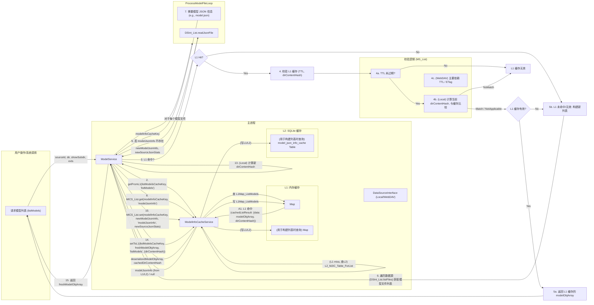

# ModelNest `model info` 及 `listModels` 缓存方案设计文档 (V2 - `listModels` L1 缓存核心)

## 1. 引言

本文档旨在对 ModelNest 项目的 `model info` 及 `listModels` 缓存系统进行修订和扩展设计。`model info` 指的是模型的详细元数据，而 `listModels` 是获取模型列表的核心操作。

**本次修订的核心目标是将 `listModels` 操作的结果缓存严格限制在 L1 内存中，并明确其与 `model_json_info_cache` (L1+L2 缓存) 的协同工作方式。**

主要变更点包括：

1.  **`list_models_cache` 的范围和存储**：
    *   明确指出 `list_models_cache` **仅作为 L1 内存缓存存在**。
    *   **移除**所有关于 `list_models_cache` 表在 SQLite (L2) 中的设计和描述。
    *   SQLite 数据库中将只保留 `model_json_info_cache` 表，用于缓存单个 `.json` 文件的内容。
2.  **`listModels` 方法的缓存逻辑调整**：
    *   `ModelService.listModels` 首先检查 L1 内存。
    *   L1 `listModels` 缓存条目包含 `directoryContentHash` 用于失效判断。
    *   构建列表时利用 `model_json_info_cache` (L1+L2)。
    *   最终列表存入 L1 内存缓存。
3.  **`ModelInfoCacheService` 的职责调整**：
    *   其 L2 (SQLite) 操作现在**仅针对 `model_json_info_cache`**。
    *   提供通用的 L1 缓存辅助方法，`ModelService` 利用此管理 `listModels` 结果的 L1 缓存。
4.  统一采用 **BSON (Binary JSON, bsonspec.org)** 作为在 L2 缓存中存储复杂对象（即 `modelJsonInfo`）的序列化格式。
5.  梳理并明确服务间的依赖关系与初始化顺序。

此修订方案旨在解决先前设计与用户最新核心需求之间的偏差，并为 ModelNest 提供一个更健壮、高效的缓存基础设施。

## 2. 核心需求与缓存目标 (修订 V2)

*   **缓存 `ModelService` 返回的 `modelObj` (针对单个模型详情)**: L1 内存缓存中可以缓存完整的 `modelObj` 以加速对已加载模型详情的重复访问。
*   **缓存 JSON 解析结果 (`modelJsonInfo`)**: L2 磁盘缓存（SQLite+BSON）主要缓存从 `.json` 文件解析或外部 API 获取的 `modelJsonInfo`，以节省重复IO和解析开销。L1 内存中也会有其副本。
*   **缓存 `listModels` 操作结果**: **L1 内存缓存**缓存 `ModelService.listModels` 方法返回的 `modelObj` 数组，以加速模型列表的加载。
*   **两级缓存**:
    *   L1: 内存缓存 (`Map`)，速度最快，容量有限。
        *   缓存单个 `modelObj` (热点数据)。
        *   缓存 `listModels` 的结果数组。
    *   L2: SQLite 数据库，容量较大，持久化，使用 BSON 序列化。
        *   **仅缓存 `modelJsonInfo`**。
*   **按模型库隔离**: 缓存应能感知并区分不同的数据源 (`sourceId`)。
*   **高效的失效机制**:
    *   对于 `modelJsonInfo` (L1 和 L2): 基于源 `.json` 文件的元数据 (修改时间、大小) 和 TTL。
    *   对于 `listModels` 结果 (L1):
        *   基于 TTL。
        *   `LocalDataSource`: 基于被查询目录的内容元数据摘要 (`directoryContentHash`)。
        *   `WebDavDataSource`: 主要基于 TTL 和用户手动刷新，可尝试使用 ETag。
*   **IO 友好与高性能**: L2 磁盘缓存采用 SQLite + BSON 以优化 IO、存储和解析性能。
*   **服务依赖清晰**: 明确服务初始化顺序，避免循环依赖和初始化时序问题。

## 3. 缓存结构设计 (修订 V2)

### 3.1. 缓存键策略

#### 3.1.1. `modelJsonInfo` 缓存键

用于 L1 内存缓存中的 `modelObj` (其 `modelJsonInfo` 是核心) 和 L2 SQLite 的 `model_json_info_cache` 表。
*   **格式**: `model_info:{sourceId}:{normalized_json_path}`
    *   `sourceId`: 数据源的唯一标识符。
    *   `normalized_json_path`: 模型关联的 `.json` 文件的规范化相对路径（相对于数据源根目录）。

#### 3.1.2. `listModels` 结果缓存键 (L1 内存专用)

用于 L1 内存中缓存 `listModels` 方法的结果数组。
*   **格式**: `list_models:{sourceId}:{normalized_directory_path}:{show_subdirectory_flag}:{supported_exts_hash}`
    *   `sourceId`: 数据源 ID。
    *   `normalized_directory_path`: 请求的规范化目录路径。空字符串、`.` 或 `/` 代表数据源根目录。
    *   `show_subdirectory_flag`: `0` (false) 或 `1` (true)。
    *   `supported_exts_hash`: 通过对排序后的小写 `supportedExts` 数组连接字符串计算 SHA256 哈希得到。

### 3.2. L1: 内存缓存

*   **存储内容**:
    *   单个模型的完整 `modelObj` JavaScript 对象。
    *   `listModels` 方法返回的 `modelObj` 数组。
*   **数据结构**: 由 `ModelInfoCacheService` 内部管理的 `Map` 对象实现。可以是一个 `Map` 存储不同类型的缓存项，或多个 `Map` 分别存储。
    *   **`modelObj` 缓存项**:
        *   键: `model_info:{sourceId}:{normalized_json_path}`
        *   值: `{ data: modelObj, timestamp: Date.now(), ttlMs: configuredTtlForL1ModelInfo, sourceJsonStats: { mtimeMs: ..., size: ... } | null }`
            *   `sourceJsonStats`: 记录关联 `.json` 文件的元数据。
    *   **`listModels` 结果缓存项**:
        *   键: `list_models:{sourceId}:{normalized_directory_path}:{show_subdirectory_flag}:{supported_exts_hash}`
        *   值: `{ data: modelObjArray, timestamp: Date.now(), ttlMs: configuredTtlForL1ListModels, directoryContentHash: "..." | null }`
            *   `directoryContentHash`: 用于 `LocalDataSource` 的目录内容摘要。
*   **大小限制**: 可为不同类型的缓存（`modelInfo`, `listModels`）配置各自的最大条目数。
*   **替换策略**: LRU (最近最少使用)。
*   **实现位置**: `ModelInfoCacheService` 提供通用的 L1 缓存管理能力。`ModelService` 调用这些能力来缓存 `listModels` 的结果。

### 3.3. L2: 磁盘缓存 (SQLite + BSON) (修订 V2)

*   **存储机制**: 单个 SQLite 数据库文件。
    *   **文件路径**: 通过 `ConfigService` 配置。
*   **数据格式**: 存入 SQLite `BLOB` 字段的 `modelJsonInfo` 对象通过 **BSON** 序列化为二进制 `Buffer` 后存储。
*   **依赖**: `sqlite3` (或 `better-sqlite3`) 和 `bson` npm 包。
*   **实现位置**: `ModelInfoCacheService` 内部。
*   **核心变更**: **L2 缓存仅包含 `model_json_info_cache` 表。不再有 `list_models_cache` 表。**

#### 3.3.1. SQLite 表: `model_json_info_cache`

用于缓存单个模型的 `modelJsonInfo`。

| 列名                      | 类型    | 约束          | 描述                                                                 |
| :------------------------ | :------ | :------------ | :------------------------------------------------------------------- |
| `cache_key`               | TEXT    | PRIMARY KEY   | `model_info:{sourceId}:{normalized_json_path}`                       |
| `source_id`               | TEXT    | NOT NULL      | 数据源 ID                                                            |
| `normalized_json_path`    | TEXT    | NOT NULL      | 源 JSON 文件在其数据源中的规范化相对路径                               |
| `bson_data`               | BLOB    | NOT NULL      | BSON 序列化后的 `modelJsonInfo` 数据                                 |
| `source_json_mtime_ms`    | REAL    | NOT NULL      | 缓存时，源 JSON 文件的 `mtimeMs` (毫秒时间戳)                        |
| `source_json_size`        | INTEGER | NOT NULL      | 缓存时，源 JSON 文件的大小 (bytes)                                   |
| `cached_timestamp_ms`     | INTEGER | NOT NULL      | 此条目被缓存的 Unix 毫秒时间戳                                         |
| `ttl_seconds`             | INTEGER | NOT NULL      | 此条目的有效生存时间 (秒)                                            |
| `last_accessed_timestamp_ms`| INTEGER | NOT NULL      | 最近访问此条目的 Unix 毫秒时间戳 (用于 LRU 清理)                      |

**索引 (`model_json_info_cache`):**
*   `cache_key` (PK)
*   `idx_mjic_source_id`: ON `model_json_info_cache` (`source_id`)
*   `idx_mjic_last_accessed`: ON `model_json_info_cache` (`last_accessed_timestamp_ms`)
*   `idx_mjic_expiration`: ON `model_json_info_cache` (`cached_timestamp_ms`, `ttl_seconds`)

## 4. 缓存读写逻辑 (修订 V2)

### 4.1. 数据流图

#### 4.1.1. 读取 `getModelDetail` (单个模型信息) - 流程不变，L2 仅 `model_json_info_cache`

```mermaid
graph LR
    subgraph UserAction["用户操作/系统调用"]
        ActionGetDetail["请求模型详情 (getModelDetail)"]
    end

    subgraph MainProcess["主进程"]
        MS["ModelService"]
        MICS["ModelInfoCacheService"]
        DSInt["DataSourceInterface (Local/WebDAV)"]
        FS["文件系统 (用于LocalDataSource)"]
        WebDAVClient["WebDAV Client (用于WebDavDataSource)"]
        CivitaiAPI["Civitai API (按需)"]

        subgraph L1Cache["L1: 内存缓存 (modelObj)"]
            L1Map_ModelInfo["Map<modelInfoCacheKey, CachedModelObj>"]
        end
        subgraph L2Cache["L2: SQLite 缓存"]
            L2_MJIC_Table["model_json_info_cache Table"]
        end
    end

    ActionGetDetail -- sourceId, jsonPath, modelFilePath --> MS

    MS -- 1. 构造 modelInfoCacheKey --> MS
    MS -- 2. getFromL1(modelInfoCacheKey, 'modelInfo') --> MICS
    MICS -- 查 L1Map_ModelInfo --> L1Map_ModelInfo
    L1Map_ModelInfo -- A1. L1 命中 --> MICS
    MICS -- A2. 获取源JSON文件当前元数据 (mtime, size) --> DSInt
    DSInt -- currentSourceJsonStats --> MICS
    MICS -- A3. 校验 L1 (TTL, sourceJsonStats vs currentSourceJsonStats) --> MICS
    MICS -- A4. L1 有效 --> MS
    MS -- A5. 返回克隆的 modelObj --> ActionGetDetail

    L1Map_ModelInfo -- B1. L1 未命中/失效 --> MICS
    MICS -- 3. getModelJsonInfoFromL2(modelInfoCacheKey) --> L2_MJIC_Table
    L2_MJIC_Table -- B2. SQLite 查询 (BLOB) --> MICS
    MICS -- B3. L2 命中 --> MICS
    MICS -- B4. BSON 反序列化 --> MICS
    MICS -- B5. 获取源JSON文件当前元数据 (mtime, size) --> DSInt
    DSInt -- currentSourceJsonStats --> MICS
    MICS -- B6. 校验 L2 (TTL, L2.sourceJsonStats vs currentSourceJsonStats) --> MICS
    MICS -- B7. L2 有效 (得到 modelJsonInfo) --> MS
    MS -- B8. 从数据源加载基础 modelObj (不含 modelJsonInfo) --> DSInt
    DSInt -- baseModelObj --> MS
    MS -- B9. 组合 baseModelObj 和 L2.modelJsonInfo --> MS
    MS -- B10. 更新 L1 (setToL1 with 新 modelObj, currentSourceJsonStats, 'modelInfo') --> MICS
    MICS -- 写 L1Map_ModelInfo --> L1Map_ModelInfo
    MS -- B11. 返回 modelObj --> ActionGetDetail

    MICS -- C1. L2 未命中/失效 --> MS
    MS -- 4. 从数据源加载完整 modelObj (含新 modelJsonInfo) --> DSInt
    DSInt -- fullModelObj, newSourceJsonStats --> MS
    
    alt 如果需要从 Civitai 获取 modelJsonInfo
      MS --或 DSInt --> CivitaiAPI
      CivitaiAPI -- civitaiData --> MS --或 DSInt
      MS --或 DSInt --> "写入 .json 文件"
      "写入 .json 文件" -- newSourceJsonStats --> MS
    end

    MS -- 5. 得到最终 modelObj 和 newSourceJsonStats --> MS
    MS -- 6. 更新 L2 (setModelJsonInfoToL2 with BSON(modelObj.modelJsonInfo), newSourceJsonStats) --> MICS
    MICS -- BSON 序列化 & 写 L2_MJIC_Table --> L2_MJIC_Table
    MS -- 7. 更新 L1 (setToL1 with 最终 modelObj, newSourceJsonStats, 'modelInfo') --> MICS
    MICS -- 写 L1Map_ModelInfo --> L1Map_ModelInfo
    MS -- 8. 返回 modelObj --> ActionGetDetail
```

#### 4.1.2. 读取 `listModels` (模型列表) - 核心变更：仅 L1 缓存，并与 `model_json_info_cache` 交互



### 4.2. 读取流程: `ModelService.getModelDetail(sourceId, jsonPath, modelFilePath)` (修订 V2)

此流程基本不变，但 `ModelInfoCacheService` 的 L1/L2 方法调用可能因通用化而略有调整。

1.  **构造缓存键 (`modelInfoCacheKey`)**: `model_info:{sourceId}:{normalizedJsonPath}`.
2.  **查询 L1 内存缓存 (`ModelInfoCacheService.getFromL1(modelInfoCacheKey, 'modelInfo')`)**:
    *   **命中**:
        *   获取缓存的 `{ data: modelObj, timestamp, ttlMs, sourceJsonStats }`。
        *   校验 TTL 和 `sourceJsonStats` (与实际文件元数据比较)。
        *   **L1 有效**: 返回 `modelObj` 深拷贝。**流程结束。**
        *   **L1 无效**: 从 L1 移除。继续。
    *   **未命中**: 继续。
3.  **查询 L2 磁盘缓存 (`ModelInfoCacheService.getModelJsonInfoFromL2(modelInfoCacheKey)`)**:
    *   **命中**:
        *   从 `model_json_info_cache` 表读取。
        *   校验 TTL 和文件元数据 (`source_json_mtime_ms`, `source_json_size`)。
        *   **L2 有效**:
            *   反序列化 `modelJsonInfo`。
            *   加载基础 `modelObj`，填充 `modelJsonInfo`。
            *   更新 L1 (`ModelInfoCacheService.setToL1(..., 'modelInfo', ...)`).
            *   返回 `modelObj` 深拷贝。**流程结束。**
        *   **L2 无效**: 从 L2 删除。继续。
    *   **未命中**: 继续。
4.  **从数据源加载/构建完整 `modelObj`**:
    *   调用 `dataSourceInterface.readModelDetail(...)`。
    *   获取 `newSourceJsonStats`。
5.  **更新 L2 磁盘缓存**:
    *   `ModelInfoCacheService.setModelJsonInfoToL2(modelInfoCacheKey, modelObj.modelJsonInfo, newSourceJsonStats, ttl)`。
6.  **更新 L1 内存缓存**:
    *   `ModelInfoCacheService.setToL1(modelInfoCacheKey, modelObj, 'modelInfo', { ttlMs, sourceJsonStats: newSourceJsonStats })`。
7.  返回 `modelObj` 深拷贝。

### 4.3. 读取流程: `ModelService.listModels(sourceId, directory, showSubdirectory, supportedExts)` (修订 V2 - 核心变更)

1.  **构造 L1 缓存键 (`listModelsCacheKey`)**:
    *   根据 3.1.2 节定义的策略生成。
2.  **查询 L1 内存缓存 (`ModelInfoCacheService.getFromL1(listModelsCacheKey, 'listModels')`)**:
    *   `ModelInfoCacheService` 从其内部 L1 `Map` 查询。
    *   **命中**:
        *   返回 `{ data: modelObjArray, directoryContentHash, timestamp, ttlMs }`。
        *   **校验 L1 缓存**:
            *   检查 TTL (`timestamp`, `ttlMs`) 是否过期。
            *   **对于 `LocalDataSource`**:
                *   调用 `LocalDataSource.getDirectoryContentMetadataDigest(...)` 计算当前目录的 `currentDirectoryContentHash`。
                *   如果 `currentDirectoryContentHash` 与缓存的 `directoryContentHash` 不匹配，视为无效。
            *   **对于 `WebDavDataSource`**:
                *   主要依赖 TTL。如果 `directoryContentHash` 存储了 ETag，可尝试验证。
        *   **L1 有效**: 返回 `modelObjArray`。**流程结束。**
        *   **L1 无效**: 从 L1 中删除此条目 (`ModelInfoCacheService.deleteFromL1(listModelsCacheKey, 'listModels')`)。继续。
    *   **未命中**: 继续。
3.  **L1 未命中或失效：构建新的模型列表**:
    *   调用 `dataSourceInterface.listFiles(sourceConfig, directory, supportedExts, showSubdirectory)` 获取基础文件列表（例如，只包含文件路径和基本元数据）。
    *   初始化一个空的 `freshModelObjArray`。
    *   **遍历基础文件列表，为每个模型文件构建 `modelObj`**:
        *   对于每个模型文件（如 `model.safetensors`）：
            *   确定其关联的 `.json` 文件路径 (e.g., `model.json`)。
            *   构造 `modelInfoCacheKey` (如 `model_info:{sourceId}:{normalized_json_path}`).
            *   **通过 `ModelInfoCacheService` 获取 `modelJsonInfo`**:
                *   `modelJsonInfo = await ModelInfoCacheService.get(modelInfoCacheKey, 'modelJsonInfo')`
                    *   此 `get` 方法会依次尝试：
                        1.  从 L1 获取 `modelObj`，若有效且其 `modelJsonInfo` 存在，则使用。
                        2.  若 L1 无或无效，从 L2 (`model_json_info_cache`) 获取 `modelJsonInfo`，若有效，则使用。
                        3.  若 L1 和 L2 均无或无效，则返回 `null`。
            *   **如果 `modelJsonInfo` 未从缓存获取到**:
                *   从数据源读取 `.json` 文件内容 (`dataSourceInterface.readJsonFileContent(sourceConfig, jsonPath)`).
                *   解析 JSON 内容得到 `newModelJsonInfo`。
                *   获取该 `.json` 文件最新的元数据 (`newSourceJsonStats`).
                *   **存入缓存**: `await ModelInfoCacheService.set(modelInfoCacheKey, newModelJsonInfo, 'modelJsonInfo', { sourceJsonStats: newSourceJsonStats, isJsonInfoOnly: true })`
                    *   此 `set` 方法会将 `newModelJsonInfo` 存入 L2 (`model_json_info_cache`) 和 L1 (可能只存 `modelJsonInfo` 部分，或一个基础的 `modelObj` 包装)。
                    *   `modelJsonInfo = newModelJsonInfo`。
            *   基于模型文件路径和获取到的 `modelJsonInfo` 构建完整的 `modelObj`。
            *   将构建的 `modelObj` 添加到 `freshModelObjArray`。
4.  **准备并更新 L1 内存缓存**:
    *   **对于 `LocalDataSource`**:
        *   计算 `newDirectoryContentHash` (如果之前未计算或需要刷新)。
    *   **对于 `WebDavDataSource`**:
        *   `newDirectoryContentHash` 可以是获取到的 ETag (如果适用)，否则为 `null`。
    *   获取 `listModels` 的 L1 配置 TTL (`configuredL1ListModelsTtlMs`)。
    *   调用 `ModelInfoCacheService.setToL1(listModelsCacheKey, freshModelObjArray, 'listModels', { ttlMs: configuredL1ListModelsTtlMs, directoryContentHash: newDirectoryContentHash })`。
5.  返回 `freshModelObjArray`。

### 4.4. 写入/更新流程 (修订 V2)

*   **场景1: `ModelService.saveModel()` 保存 `modelObj`**
    1.  写入 `.json` 文件。
    2.  获取 `newSourceJsonStats`。
    3.  **更新 `model_json_info_cache` (L2) 和对应 L1 条目**: 调用 `ModelInfoCacheService.set(modelInfoCacheKey, modelObj.modelJsonInfo, 'modelJsonInfo', { sourceJsonStats: newSourceJsonStats, isJsonInfoOnly: true })` (或类似方法)。
    4.  **使相关的 `listModels` L1 缓存失效**:
        *   `ModelService` 调用 `ModelInfoCacheService.invalidateL1ByPrefix('list_models:' + sourceId + ':' + normalizedDirPathPrefix)` 或更精确的键匹配逻辑，以清除受影响目录的 `listModels` L1 缓存。
*   **场景2: 爬虫服务或其他外部服务更新了 `.json` 文件**
    1.  写入 `.json` 文件，获取 `newModelJsonInfo` 和 `newSourceJsonStats`。
    2.  调用 `ModelInfoCacheService.set(modelInfoCacheKey, newModelJsonInfo, 'modelJsonInfo', ...)` 更新 L2 和 L1。
    3.  调用 `ModelInfoCacheService.invalidateL1ByPrefix(...)` 使相关 `listModels` L1 缓存失效。

## 5. 缓存失效机制 (修订 V2)

### 5.1. TTL (Time To Live)

*   L1 (`modelInfo`, `listModels`) 和 L2 (`model_json_info_cache`) 的缓存条目都包含创建时间戳和可配置的 TTL。
*   读取缓存时检查是否过期。

### 5.2. 基于文件元数据的失效 (`model_json_info_cache` - L1/L2)

*   与之前设计类似，比较缓存中记录的 `.json` 文件元数据与实际文件元数据。不一致则失效。

### 5.3. `listModels` L1 缓存的特定失效机制

#### 5.3.1. `LocalDataSource`

*   **基于目录内容元数据摘要 (`directoryContentHash`)**:
    *   在 `ModelService.listModels` 尝试从 L1 缓存读取时，会计算当前目录的 `currentDirectoryContentHash`。
    *   与 L1 缓存中存储的 `directoryContentHash` 不符，则 L1 条目视为无效。

#### 5.3.2. `WebDavDataSource`

*   **主要依赖 TTL**:
*   **可选的 ETag**: 如果可用，ETag 可存储在 L1 缓存项的 `directoryContentHash` 字段中，并用于校验。

### 5.4. 数据写入/更新操作触发的缓存更新与失效

*   修改 `.json` 文件时：
    *   更新对应的 `model_json_info_cache` (L2) 和 L1 `modelInfo` 缓存。
    *   **使所有可能包含该已修改文件所在目录的 `listModels` L1 缓存条目失效。**

### 5.5. 用户手动触发

*   IPC 接口允许用户：
    *   `clearModelCache({ sourceId, resourcePath })`: 清除特定模型的 L1 `modelInfo` 和 L2 `model_json_info_cache` 条目，并使其所在目录相关的 `listModels` L1 缓存失效。
    *   `clearSourceCache({ sourceId })`: 清除某个数据源的所有 L1 (`modelInfo`, `listModels`) 和 L2 (`model_json_info_cache`) 条目。
    *   `clearAllModelCache()`: 清除所有缓存。
*   `ModelInfoCacheService` 提供相应方法。

### 5.6. BSON 序列化/反序列化错误处理 (L2 `model_json_info_cache`)

*   保持不变。

## 6. 高级考虑点 (修订 V2)

### 6.1. 并发控制

*   **`getModelDetail`**: Promise 锁保护 L1/L2 的加载。
*   **`listModels`**: Promise 锁保护 L1 缓存的构建过程（包括遍历数据源和查询/填充 `model_json_info_cache`）。

### 6.2. 缓存穿透 (`model_json_info_cache`)

*   保持不变 (存储特殊标记)。

### 6.3. 缓存预热

*   **`getModelDetail`**: L1/L2 预热。
*   **`listModels`**: L1 预热。

### 6.4. 缓存清理 (L1 和 L2 SQLite)

*   **L1**: 通过 LRU 和数量限制被动清理。TTL 过期条目在访问时移除。
*   **L2 (SQLite - `model_json_info_cache` 表)**:
    *   **TTL 清理**: 定期任务删除过期条目。
    *   **LRU 清理**: 可配置最大条目数，超限时删除 `last_accessed_timestamp_ms` 最早的。
    *   **数据库文件大小**: 定期 `VACUUM`。

### 6.5. 可配置性 (`ConfigService`)

以下参数应可通过 `ConfigService` 配置：
*   `cache.enabled`
*   `cache.l1.enabled`
*   `cache.l1.maxItems.modelInfo`
*   `cache.l1.ttlSeconds.modelInfo`
*   `cache.l1.maxItems.listModels` (新增)
*   `cache.l1.ttlSeconds.listModelsLocal` (新增, 用于 LocalDataSource 的 listModels L1)
*   `cache.l1.ttlSeconds.listModelsWebDAV` (新增, 用于 WebDavDataSource 的 listModels L1)
*   `cache.l2.enabled`
*   `cache.l2.dbPath`
*   `cache.l2.ttlSeconds.modelInfo` (原 `cache.l2.ttlSeconds.modelInfo`)
*   `cache.l2.maxItems.modelInfo` (原 `cache.l2.maxItems.modelInfo`)
*   `cache.l2.cleanupIntervalHours`

### 6.6. 错误处理

*   保持不变，优雅降级。

### 6.7. 日志记录 (`electron-log`)

*   保持详细日志记录。

## 7. 服务依赖与初始化 (修订 V2)

### 7.1. 推荐的初始化顺序

1.  `ConfigService`
2.  `DataSourceService`
3.  `ModelInfoCacheService`:
    *   初始化 L1 缓存结构。
    *   初始化 SQLite 连接，**仅创建/维护 `model_json_info_cache` 表结构**。
4.  `ModelService`
5.  其他服务

### 7.2. 服务设计原则

*   保持不变。

## 8. 与现有架构的集成 (修订 V2)

### 8.1. `ModelInfoCacheService`

*   **职责**:
    *   封装 L1 (内存 Map) 的通用缓存逻辑 (管理 `modelInfo` 和 `listModels` 结果)。
    *   封装 L2 (SQLite + BSON) 的所有缓存逻辑，**仅针对 `model_json_info_cache` 表**。
    *   提供针对 L1 和 L2 `modelJsonInfo` 的 `get/set/delete/invalidate` 方法。
    *   提供针对 L1 `listModels` 结果的 `get/set/delete/invalidate` 方法。
    *   处理 BSON 序列化/反序列化 (仅 L2)。

### 8.2. `ModelService` 集成

*   **`getModelDetail` 方法**: 与 `ModelInfoCacheService` 交互，处理 L1 `modelInfo` 和 L2 `model_json_info_cache`。
*   **`listModels` 方法**:
    *   与 `ModelInfoCacheService` 交互，处理 `listModels` 结果的 L1 缓存。
    *   负责 `directoryContentHash` 的计算与比较。
    *   负责在 L1 未命中/失效时，遍历数据源，并调用 `ModelInfoCacheService` 获取或填充单个模型的 `modelJsonInfo` (L1/L2)。
*   **`saveModel` 方法**: 更新 L1/L2 `modelJsonInfo`，并使相关的 `listModels` L1 缓存失效。

### 8.3. `DataSource` 实现

*   `LocalDataSource.getDirectoryContentMetadataDigest` 方法依然需要。

### 8.4. IPC 接口

*   `clearModelCache`: 清除 L1 `modelInfo`, L2 `model_json_info_cache`, 并使相关 `listModels` L1 缓存失效。
*   `clearSourceCache`: 清除源在 L1 (`modelInfo`, `listModels`) 和 L2 (`model_json_info_cache`) 的条目。
*   `clearAllModelCache`: 清空所有 L1 和 L2 (`model_json_info_cache` 表)。
*   `getCacheStatus`: 获取 L1 (`modelInfo`, `listModels`) 和 L2 (`model_json_info_cache`) 的统计。

## 9. 所选方案理由分析 (修订 V2)

*   **`listModels` 结果移至 L1 内存缓存**:
    *   **性能**: 内存访问远快于磁盘 I/O，对于频繁调用的 `listModels` 提升显著。
    *   **简化 L2**: SQLite 只需管理一种核心数据 (`modelJsonInfo`)，降低了 L2 的复杂性。
    *   **与 `model_json_info_cache` 协同**: `listModels` 在构建时可以高效利用已缓存的 `modelJsonInfo` (无论来自 L1 还是 L2)，避免了重复解析大量 JSON 文件。
    *   **`directoryContentHash`**: 为 `LocalDataSource` 提供了精确的 L1 失效机制。
*   **两级缓存 (`modelJsonInfo`)**: 结合内存的速度和 SQLite 的持久性。
*   **SQLite + BSON (L2 `modelJsonInfo`)**: 结构化存储、高效序列化。
*   **模块化与服务依赖**: 清晰的职责划分。

此修订方案旨在通过优化 `listModels` 的缓存策略，进一步提升 ModelNest 的性能和用户体验，同时保持缓存系统的健壮性和可维护性。