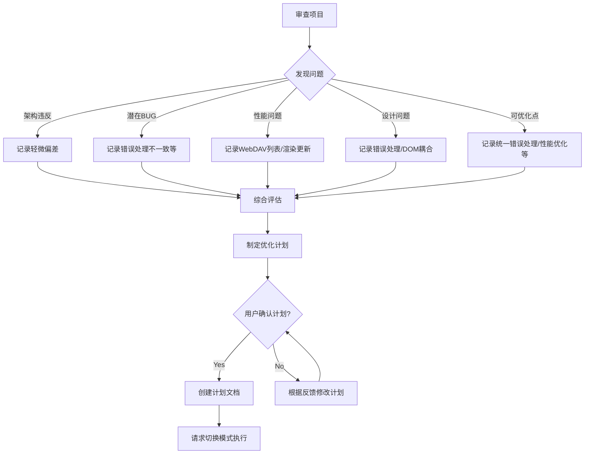

# ModelNest 项目审查报告与优化计划

## 1. 项目审查总结

基于对项目文档 (`doc/架构说明.md`) 和关键源代码（主进程、渲染进程、IPC、服务层、数据访问层、UI 组件等）的审查，得出以下结论：

### 1.1 架构设计符合性
*   **总体符合:** 项目高度遵循了文档中定义的 Electron 主/渲染进程模型及分层设计。
*   **轻微偏差:**
    *   `appIPC.js` 直接调用 `imageCache` (应通过 `ImageService`)。
    *   `main.js` 处理 `open-folder-dialog` (可移至 `appIPC`)。
    *   `ModelCrawlerService` 直接实例化 `LocalDataSource` (可接受，但偏离工厂模式)。
*   **结论:** 架构基本得到遵守，偏差较小。

### 1.2 潜在问题与 BUG
*   **错误处理不一致:** 最显著问题，不同层/模块处理错误方式（抛出/返回默认值/返回特定对象）不统一，增加上层处理复杂性。
*   **只读错误检查脆弱:** 依赖错误消息字符串判断 `ReadOnlyError`，不够健壮。
*   **`main.js` `activate` 事件:** 低概率竞争条件。
*   **`ModelCrawlerService` 错误报告:** 单个模型爬取失败信息未明确传递给 UI。
*   **`detail-model.js` 数组处理:** 保存额外信息时可能丢失数组类型。

### 1.3 性能问题
*   **WebDAV 列表性能:** `WebDavDataSource.listModels` 递归获取文件可能成为性能瓶颈。
*   **渲染进程列表更新:** `main-view.js` 在模型更新后全量刷新列表，效率较低。

### 1.4 代码设计问题
*   **错误处理不一致:** (同 1.2)
*   **渲染进程 DOM 强耦合:** 组件直接操作 DOM ID 和类名，不利于维护和测试。
*   **渲染进程状态管理:** 状态分散在模块变量中，复杂后可能难维护。
*   **数据访问层接口错误处理:** 读/写操作错误处理策略不统一。

### 1.5 可优化内容
*   统一错误处理策略。
*   优化渲染进程列表更新（局部更新）。
*   评估并优化 WebDAV 性能。
*   增强 `ModelCrawlerService` 错误报告。
*   改进 `getImageData` MIME 类型检测 (WebDAV)。
*   统一日志规范和前缀（`modelCrawlerIPC`, `ModelService`）。
*   改进 `ReadOnlyError` 判断方式。
*   修复 `detail-model.js` 数组处理。
*   清理过时代码/注释。

## 2. 优化计划建议

建议按以下优先级进行优化：

1.  **【高】统一错误处理策略:**
    *   目标：在 IPC、服务、数据访问层建立一致的错误传递机制（建议优先采用抛出特定类型错误的方式）。
    *   步骤：
        *   定义项目级错误类（如 `ConfigurationError`, `DataSourceError`, `ReadOnlyError` 等）。
        *   修改各层代码，统一错误抛出和捕获逻辑。
        *   调整渲染进程的 API 调用处，以正确处理新错误类型。
2.  **【中】优化渲染进程性能:**
    *   目标：改进 `main-view.js`，实现模型列表的局部更新。
    *   步骤：
        *   修改 `model-updated` 事件处理逻辑。
        *   识别更新的模型，仅重新渲染或更新对应的 DOM 元素。
3.  **【中】增强健壮性:**
    *   目标：修复已识别的 BUG 和潜在问题。
    *   步骤：
        *   改进 `ReadOnlyError` 判断（使用错误代码或类型）。
        *   完善 `ModelCrawlerService` 错误报告机制（传递失败详情给 UI）。
        *   修复 `detail-model.js` `collectExtraData` 对数组的处理。
        *   检查并修复 `main.js` `activate` 事件的潜在问题。
4.  **【中】改进 WebDAV 交互:**
    *   目标：提升 WebDAV 数据源的稳定性和性能。
    *   步骤：
        *   实现 `getImageData` 的 MIME 类型检测。
        *   评估 `listModels` 性能，若有必要则进行优化。
5.  **【低】代码规范与清理:**
    *   目标：提升代码一致性和可读性。
    *   步骤：
        *   确保所有模块遵循日志规范（修复 `modelCrawlerIPC`）。
        *   统一日志前缀。
        *   移除过时代码和注释。

## 3. 后续流程

此文档已根据用户确认创建。下一步是请求切换到“代码”模式以执行优化计划。