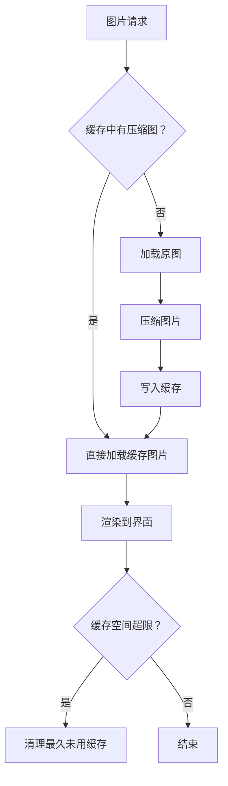

# 图片压缩与缓存优化方案

## 1. 目标与背景

为提升 Electron 桌面端应用在加载本地及 WebDAV 图片时的性能，降低内存占用和加载延迟，需设计并实现图片压缩与缓存机制。

---

## 2. 优化方案概述

### 2.1 图片压缩机制

- **触发时机**：图片首次加载时（无论本地还是 WebDAV），先判断是否有压缩缓存，无则进行压缩。
- **压缩方式**：采用 JPEG/WEBP 格式，压缩比例建议 80% 质量，优先保证清晰度。
- **实现建议**：可用 sharp、jimp 等 Node.js 图像处理库，或 Electron 原生 API。

### 2.2 图片缓存机制

- **缓存目录**：统一放在 `userData/cache/images/`（Electron 推荐），按图片来源（本地/WebDAV）和唯一标识（如 hash）分目录存储。
- **缓存命名**：建议用图片原始路径+参数生成 hash 作为文件名，避免重复。
- **缓存生效**：本地图片和 WebDAV 图片均可缓存压缩结果，后续优先读取缓存。
- **缓存清理**：
  - 启动或退出时清理（可选）。
  - 支持最大缓存空间限制（如 500MB），超出后按 LRU 策略清理。
  - 提供手动清理入口。

---

## 3. 关键流程图

---

## 4. 优缺点分析

### 优点

- 显著降低内存占用和加载延迟。
- 网络图片减少带宽消耗，提升体验。
- 缓存机制减少重复计算和 IO，提升整体性能。

### 缺点

- 首次加载图片时会有压缩延迟，需异步处理避免阻塞 UI。
- 缓存管理需额外开发和维护，增加一定复杂度。
- 需关注缓存一致性（如原图变更时需刷新缓存）。

---

## 5. 方案要点

- 压缩和缓存逻辑应封装为独立模块，便于维护和复用。
- 缓存目录、压缩参数、清理策略等应支持配置。
- UI 层可增加缓存清理按钮，提升用户可控性。
- 需处理异常情况（如压缩失败、磁盘空间不足等）。

---

## 6. 后续建议

- 结合实际业务场景，权衡压缩率、缓存策略、清理机制等细节。
- 方案可根据实际需求灵活调整。