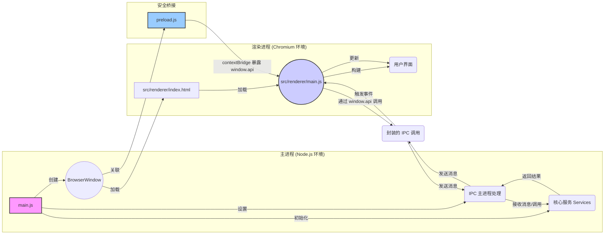

# ModelNest 项目架构说明文档

**1. 引言**

本文档详细阐述 ModelNest（一个基于 Electron 的 AIGC 模型管理与浏览工具）项目的架构设计。基于对项目关键源代码文件（包括主进程、渲染进程、IPC、服务层和数据访问层等）的分析，全面描述项目的核心组件、交互方式、数据流动路径以及整体设计模式。

**2. 核心架构：Electron 主/渲染进程模型**

ModelNest 遵循标准的 Electron 应用架构，将应用程序划分为两个主要进程：

*   **主进程 (Main Process):** 由 `main.js` 启动，是应用程序的后端。它拥有完整的 Node.js 环境访问权限，负责管理应用程序的生命周期、创建和管理渲染进程窗口 (`BrowserWindow`)、执行原生操作系统交互（如文件对话框）、处理需要更高权限或访问系统资源的操作。它是所有服务和核心业务逻辑的宿主环境。
*   **渲染进程 (Renderer Process):** 每个 `BrowserWindow` 实例运行一个独立的渲染进程，负责展示用户界面 (UI)。它本质上是一个 Chromium 浏览器环境，运行 `src/renderer/index.html` 及其关联的 JavaScript (`src/renderer/main.js` 等) 和 CSS。渲染进程受限于浏览器沙箱环境，不能直接访问 Node.js API 或系统资源，必须通过 IPC 与主进程通信来执行这些操作。

它们之间的关系如下图所示：

**3. 关键组件及其职责**

*   **主进程 (`main.js`)**:
    *   **初始化与生命周期:** 应用程序入口，处理 `app` 模块的生命周期事件 (`whenReady`, `activate`, `window-all-closed`)。
    *   **服务初始化:** 在 `whenReady` 事件中，异步调用 `src/services/index.js` 中的 `initializeServices`，创建并初始化所有服务实例（Config, DataSource, Model, Image, Update, **ModelInfoCacheService**），并处理它们之间的依赖关系。
    *   **窗口管理:** 创建主 `BrowserWindow`，加载 `index.html` 和 `preload.js`，配置窗口属性（大小、图标、菜单移除），并在开发模式下打开 DevTools。
    *   **IPC 中心:** 作为 IPC 通信的服务端。通过 `ipcMain.handle` 和 `ipcMain.on` 监听来自渲染进程的特定通道的请求和消息。
    *   **IPC 委托:** 将大部分 IPC 请求的处理逻辑委托给专门的 IPC 模块 (`src/ipc/appIPC.js`, `src/ipc/modelLibraryIPC.js`, `src/ipc/modelCrawlerIPC.js`)，并将初始化好的 `services` 对象传递给它们。部分简单请求（如 `open-folder-dialog`）或日志/错误监听直接在 `main.js` 处理。
    *   **事件推送:** 使用 `mainWindow.webContents.send` 向渲染进程主动推送事件（如配置更新 `config-updated`、更新状态 `updater.onUpdateStatus`、爬虫状态 `crawl-status-update`）。
    *   **日志与配置:** 配置 `electron-log`，包括日志文件路径、格式、级别（根据 `ConfigService` 或环境变量确定），并捕获全局错误。使用 `ConfigService` 设置 `imageCache` **和缓存系统 (`ModelInfoCacheService`)** 的配置。
    *   **更新管理:** 集成 `electron-updater`，但将具体的检查和安装逻辑封装在 `UpdateService` 中，并通过 IPC 暴露给渲染进程。

*   **渲染进程 (`src/renderer/main.js`, `*.html`, `src/renderer/js/*`, `src/renderer/styles/*`)**:
    *   **UI 渲染与管理:** 负责构建、渲染和更新用户界面。使用 HTML、CSS 和 JavaScript。UI 组件逻辑被拆分到 `src/renderer/js/components/` 目录下（如 `main-view.js`, `detail-model.js`, `settings-modal.js`）。
        *   **`main-view.js` 的列表渲染优化:** 为了提升长列表（如模型列表）的渲染性能和用户体验，`main-view.js` 引入了**虚拟滚动 (Virtual Scrolling)** 技术。该技术仅渲染用户视口内及少量缓冲区内的列表项，而不是一次性渲染所有数据项。这显著减少了 DOM 操作数量和内存占用，尤其在模型数量较多时效果明显。此举也扩展了 `main-view.js` 的职责，使其需要管理虚拟滚动的状态、计算可视区域、处理滚动事件以及动态更新和复用列表项 DOM 元素。
    *   **用户交互处理:** 监听用户的操作（点击、选择等），并触发相应的 UI 更新或与主进程的通信。
    *   **状态管理 (UI 相关):** 管理 UI 自身的状态，如当前视图模式（卡片/列表）、主题 (`theme.js`)、国际化语言 (`i18n.js`)。**`main-view.js` 组件的状态 `currentAppliedFilters` 新增了 `searchValue` 属性，用于存储和传递用户的搜索条件，影响其内部状态管理和数据加载逻辑。**
    *   **与主进程通信 (客户端):** 完全依赖 `preload.js` 暴露的 `window.api` 对象与主进程交互。通过调用 `window.api` 上的方法（如 `getConfig`, `listModels`, **缓存管理相关 API**）向主进程发送请求，并通过回调或 Promise 接收结果。使用 `window.api.on...` 方法监听主进程推送的事件。设置界面 (`settings-modal.js`, `source-edit-model.js`) 允许用户在添加或编辑数据源时配置其 `readOnly` 状态。
    *   **数据展示:** 获取数据后（通常来自主进程），负责将数据渲染到 UI 元素上。
    *   **模型列表搜索功能:**
        *   **UI层面:** 在 [`src/renderer/index.html`](src/renderer/index.html:0) 的模型列表视图中，新增了搜索输入框和搜索按钮，允许用户输入关键词进行模型搜索。相应的 CSS 样式已在 [`src/renderer/styles/main.css`](src/renderer/styles/main.css:0) 中添加。
        *   **交互逻辑:** [`src/renderer/js/components/main-view.js`](src/renderer/js/components/main-view.js:0) 中增加了处理搜索输入和按钮点击的事件监听及处理函数 (`handleSearchInputKeypress`, `handleSearchButtonClick`)，实现了将搜索词应用到模型加载流程的逻辑。
    *   **错误/日志上报:** 捕获渲染进程的 JavaScript 错误和未处理的 Promise 拒绝，并通过 `window.api.sendRendererError` 和 `window.api.logMessage` 发送给主进程记录。
    *   **爬虫功能集成:** 包含 `src/renderer/js/components/crawl-status-modal.js` 组件用于显示爬取状态和控制任务。其他组件（如 `main-view.js`）也进行了修改，以添加触发爬虫任务的按钮和逻辑。

*   **预加载脚本 (`preload.js`)**:
    *   **安全桥梁:** 在渲染进程加载页面前执行，拥有有限的 Node.js API 访问权限（特别是 `ipcRenderer` 和 `contextBridge`）。
    *   **API 暴露:** 使用 `contextBridge.exposeInMainWorld('api', {...})` 将一组精心挑选的函数安全地暴露给渲染进程。这些函数封装了 `ipcRenderer.invoke`, `ipcRenderer.send`, 和 `ipcRenderer.on` 的调用，定义了渲染进程与主进程通信的契约。暴露了 `getAllSourceConfigs` API，与模型爬虫相关的 API，**以及新增的缓存管理 API (如 `clearModelInfoMemoryCache`, `getModelInfoCacheStats` 等)**。
    *   **上下文隔离:** 与 `main.js` 中设置的 `contextIsolation: true` 配合，确保渲染进程的全局 `window` 对象与 `preload.js` 的作用域隔离，增强安全性。

*   **IPC 层 (`src/ipc/appIPC.js`, `src/ipc/modelLibraryIPC.js`, `src/ipc/modelCrawlerIPC.js`)**:
    *   **请求处理:** 作为主进程中具体的 IPC 请求处理器。
    *   **职责划分:** `appIPC` 处理应用级通用请求（**包括新增的缓存管理请求**），`modelLibraryIPC` 处理模型库核心功能请求，`modelCrawlerIPC` 专门负责处理与模型信息爬取相关的通信。
    *   **服务调用:** IPC 处理函数的核心逻辑是调用注入的 `services` 对象上的相应方法来完成任务。
    *   **错误处理:** 捕获服务层调用可能抛出的错误，记录日志，并将错误信息传递回渲染进程。

*   **服务层 (`src/services/*.js`)**:
    *   **业务逻辑封装:** 包含应用程序的核心业务逻辑，与具体的 UI 或 IPC 实现解耦。
    *   **`ConfigService`:** 负责读取、写入和缓存应用程序的配置文件。**新增了对缓存系统（L1 和 L2）相关参数的配置管理，例如缓存开关、路径、TTL（部分 TTL 现在由服务内部管理）和大小限制。**
    *   **`DataSourceService`:** 管理数据源的配置信息。
    *   **`ModelInfoCacheService` (新增):** 作为应用的核心缓存管理服务，负责实现和管理两级缓存机制：
        *   L1 缓存 (内存缓存): 使用 `Map` 实现，存储热点数据，如：单个模型的完整 `ModelObject` (对应 `CacheDataType.MODEL_DETAIL`)，以及 `listModels` 操作返回的 `ModelObject` 数组 (对应 `CacheDataType.MODEL_LIST`)。
        *   L2 缓存 (磁盘缓存): 基于 SQLite 数据库，使用 BSON 格式序列化存储。当前 L2 缓存主要用于持久化单个模型关联的 `.json` 文件解析后的原始 JSON 内容 (`modelJsonInfo`) (对应 `CacheDataType.MODEL_JSON_INFO`)，存储在 `model_json_info_cache` 表中。
        *   提供统一的 API (`getDataFromCache`, `setDataToCache`, `invalidateCacheEntry`, `clearCacheForSource`, `clearAllCache`) 供其他服务（主要是 `DataSource` 实现）调用。
        *   内部管理缓存条目的 TTL、基于元数据的有效性校验逻辑，以及 L1 的 LRU 替换策略和 L2 的定期清理任务。
        *   其初始化由 `src/services/index.js` 统一处理，并注入到需要的服务中。
    *   **`ModelService`:** 处理模型相关的操作，如获取模型列表 (`listModels`)、模型详情 (`getModelDetail`) 和保存模型 (`saveModel`)。**其自身的缓存逻辑已被重构，现在主要协调 `DataSource` 实现和 `ModelInfoCacheService` 来完成包含缓存支持的操作。**
        *   `listModels`: 委托给 `dataSourceInterface`，后者会利用 `ModelInfoCacheService`。`ModelService` 负责处理最终结果的过滤和筛选选项的更新。**其内部的 `_applyFiltersToListModels` 方法进行了扩展，增加了对模型名称的文本搜索（支持普通字符串和正则表达式，不区分大小写）过滤能力。相应的，内部判断过滤器是否为空的逻辑 (`_areFiltersEmpty`) 也已更新以包含对搜索值的检查。**
        *   `getModelDetail`: 委托给 `dataSourceInterface`，后者会利用 `ModelInfoCacheService`。
        *   `saveModel`: 准备好待保存的 `modelJsonInfo` 后，通过 `dataSourceInterface` 写入。写入成功后，相关的缓存失效逻辑主要由 `DataSource` 实现或 `ModelInfoCacheService` 的方法触发。
    *   **`ImageService`:** 处理模型图片的获取和缓存。新增了 `clearCache` 方法。
    *   **`UpdateService`:** 封装 `electron-updater` 的逻辑。
    *   **`ModelCrawlerService`:** 负责管理 Civitai 模型信息的爬取任务。
    *   **依赖注入:** `src/services/index.js` 负责按正确顺序实例化所有服务，并处理它们之间的依赖关系。

*   **数据访问层 (`src/data/*.js`)**:
    *   **`baseDataSource.js`:** 定义了抽象基类 `DataSource` (原 `BaseDataSource`)，规定了所有数据源实现的核心方法接口。**方法签名有所调整以适应缓存服务集成。**
    *   **`dataSourceInterface.js`:** 提供核心工厂函数 `getDataSourceInstance(sourceConfig, modelInfoCacheService)`，根据类型创建具体数据源实例，**并将 `ModelInfoCacheService` 实例注入到数据源中。** 接口层函数现在会利用注入的 `ModelInfoCacheService` 来执行缓存操作，或调用数据源实例上与缓存交互的方法。在执行写入操作前检查 `readOnly` 标志。
    *   **`localDataSource.js` & `webdavDataSource.js`:** 继承自 `DataSource`，实现与本地文件系统/WebDAV 服务器交互。**重构后，它们深度集成了 `ModelInfoCacheService`：**
        *   在 `listModels` 时，首先尝试从 L1 缓存 (`CacheDataType.MODEL_LIST`) 读取列表。若未命中或失效，则从源读取文件列表。在构建每个模型的 `ModelObject` 时，会尝试从 L2 缓存 (`CacheDataType.MODEL_JSON_INFO`) 获取其关联的 JSON 信息。若 L2 未命中，则读取并解析 JSON 文件，然后将结果存入 L2 缓存。最终构建的完整模型列表会存入 L1 缓存。
        *   在 `readModelDetail` 时，遵循 L1 (`MODEL_DETAIL`) -> L2 (`MODEL_JSON_INFO`) -> 源读取 的三级缓存策略。从 L2 或源获取数据后，会相应更新 L1 缓存。
        *   在 `writeModelJson` 时，写入成功后，会调用 `ModelInfoCacheService` 的方法来使相关的 `MODEL_JSON_INFO`、`MODEL_DETAIL` 缓存条目失效，并依赖内容摘要（如 `contentHash` 或 `cacheDigest`）的变化来间接使 `MODEL_LIST` 缓存失效，或进行更精确的 `MODEL_LIST` 缓存条目清理。
        *   负责计算和提供用于缓存验证的元数据，如 `LocalDataSource` 计算目录内容摘要 (`contentHash`)，两者都提供文件元数据 (`fileSize`, `metadata_lastModified_ms`, `etag`)。
    *   **`modelParser.js`:** 包含将底层数据（如文件系统条目、JSON 字符串/对象）转换为标准化模型对象 (`ModelObject`) 结构的函数。**已重构以更好地区分原始 JSON 信息 (`modelJsonInfo`) 和完整的模型对象结构，并支持从预加载的 `modelJsonInfo` 构建模型对象。新增了 `parseSingleModelFile` 用于处理单个模型文件，以及更智能的关联图片查找逻辑。**

*   **通用模块 (`src/common/*.js`)**:
    *   **`imageCache.js`:** 提供图片缓存的具体实现。缓存目录调整，优化了缓存键生成、日志和错误处理。
    *   **`constants.js`, `utils.js`:** 提供全局常量和可复用的工具函数。

*   **工具模块 (`src/utils/*.js`)**:
    *   用于存放特定领域或功能相对独立的工具函数或模块。
    *   **`civitai-model-info-crawler.js`:** 查询 Civitai API 获取模型详细信息。
    *   **`imageDownloader.js`:** 提供下载图片并使用指定 `DataSource` 保存的通用功能。

**3.1 缓存架构 (Caching Architecture)**

为提升应用性能和响应速度，ModelNest 实现了一套分层缓存机制。所有磁盘缓存数据（包括图片缓存和模型元数据缓存）现在统一存储在用户数据目录 (`%APPDATA%/model-nest/cache/`) 下，并具备从旧位置（项目根目录下的 `cache` 或 `ModelNestCache`）自动迁移的能力。

*   **图片缓存 (`src/common/imageCache.js`)**:
    *   **存储位置:** 图片缓存文件存储在 `%APPDATA%/model-nest/cache/images/` 下，采用两级哈希子目录结构（例如 `xx/yyyyyyyy...`）。
    *   **元数据管理:** 图片缓存的元数据（如缓存键、文件路径、MIME类型、大小、访问时间等）由 SQLite 数据库 `cache_metadata.db` 管理，位于 `%APPDATA%/model-nest/cache/cache_metadata.db`。
    *   **缓存策略:** 采用 LRU (Least Recently Used) 策略进行清理，当缓存大小超过设定阈值时，会移除最近最少使用的图片。
    *   **迁移:** 支持从旧的、位于项目根目录 `cache/images` 的缓存文件和 `cache/cache_metadata.db` 迁移到新的用户数据目录。

*   **模型信息缓存 (`src/services/ModelInfoCacheService.js`)**:
    *   **L1 缓存 (内存缓存):** 使用 `Map` 实现，存储最常访问且已处理的数据对象（如 `MODEL_LIST`, `MODEL_DETAIL`），提供最快的访问速度。
    *   **L2 缓存 (磁盘 SQLite 数据库):**
        *   **存储位置:** SQLite 数据库文件 `model_cache.sqlite` 存储在 `%APPDATA%/model-nest/cache/model_cache.sqlite`。
        *   **主要缓存内容:** `MODEL_JSON_INFO` (从模型关联的 `.json` 文件解析出的原始 JSON 内容，使用 BSON 序列化存储在 `model_json_info_cache` 表中)。
        *   **迁移:** 支持从旧的、位于用户数据目录 `ModelNestCache/model_cache.sqlite` 的数据库迁移到新的 `cache` 子目录。
    *   **`CacheDataType` 枚举:** 定义了缓存数据的类型 (`MODEL_LIST`, `MODEL_DETAIL`, `MODEL_JSON_INFO`)，指导缓存服务进行差异化处理。
    *   **缓存键策略:**
        *   `MODEL_JSON_INFO` 键: `model_info:{sourceId}:{normalized_json_path}`
        *   `MODEL_LIST` 键 (L1 专用): `list_models:{sourceId}:{normalized_directory_path}:{show_subdirectory_flag}:{supported_exts_hash}`
    *   **缓存交互流程 (与之前类似，但 L2 路径已更新):**
        *   `listModels`: L1 (`MODEL_LIST`) -> 数据源遍历 -> L2 (`MODEL_JSON_INFO`) -> 源读取 -> L2 存储 -> L1 存储。
        *   `readModelDetail`: L1 (`MODEL_DETAIL`) -> L2 (`MODEL_JSON_INFO`) -> 源读取 -> L2 存储 -> L1 存储。
    *   **缓存失效机制:**
        *   TTL (Time-To-Live)。
        *   元数据校验 (文件修改时间、大小、`contentHash` 等)。
        *   写操作触发失效。
    *   **`ModelInfoCacheService` 职责:** 封装 L1 和 L2 的所有缓存逻辑，提供统一接口，处理序列化/反序列化 (BSON for L2)，以及缓存清理和数据库迁移。

**3.2 用户数据清理机制 (User Data Cleanup)**

新增了用户数据清理机制，主要用于应用卸载时清理缓存和日志文件，保持系统整洁。

*   **清理目标:**
    *   图片缓存目录: `%APPDATA%/model-nest/cache/images/`
    *   模型信息缓存数据库: `%APPDATA%/model-nest/cache/model_cache.sqlite`
    *   图片缓存元数据数据库: `%APPDATA%/model-nest/cache/cache_metadata.db`
    *   日志目录: `%APPDATA%/model-nest/logs/`
*   **触发方式:**
    *   **卸载时自动清理:** 通过 NSIS 卸载脚本 (`scripts/installer.nsh`) 和主进程 (`main.js`) 的 `will-quit` 事件配合实现。卸载脚本会创建一个标记文件 (`.uninstall_cleanup_required`)，主进程在退出时检测到此文件则执行清理。
    *   **手动清理:** 用户可以通过新增的调试缓存统计面板 (`src/renderer/js/components/debug-cache-stats.js`) 手动触发清理缓存目录或日志目录的操作。
*   **实现:** 清理逻辑由 `scripts/cleanup-handler.js` 中的 `cleanupUserData` 函数处理，并通过 IPC (`appIPC.js`) 暴露给渲染进程。
*   **注意事项:** 清理操作不会删除用户配置文件 `config.json`。

**4. 核心数据流示例**

*   **列出模型 (List Models):**
    1.  用户在渲染进程 UI 选择数据源和目录。
    2.  Renderer (`main-view.js`) 调用 `window.api.listModels(sourceId, directory, filters, supportedExtensions, showSubdirectory)`。
    3.  Preload (`preload.js`) 通过 `ipcRenderer.invoke('listModels', ...)` 发送请求。
    4.  Main Process (`modelLibraryIPC.js`) 接收请求，调用 `services.modelService.listModels(...)`。
    5.  `ModelService` 调用 `services.dataSourceService.getSourceConfig(sourceId)` 获取配置，并获取将使用的扩展名。
    6.  `ModelService` 调用 `dataSourceInterface.listModels(sourceConfig, directory, extsToUse, showSubdirectory, services.modelInfoCacheService)`。
    7.  `DataSourceInterface` 调用 `getDataSourceInstance(sourceConfig, services.modelInfoCacheService)` 获取具体的数据源实例。
    8.  `DataSourceInterface` 调用该实例的 `listModels(...)` 方法，**该方法内部会与 `ModelInfoCacheService` 交互：**
        a.  **尝试从 L1 缓存读取 `MODEL_LIST`。** 若命中且有效，直接返回。
        b.  若 L1 未命中/失效，`DataSource` 从物理源列出文件。
        c.  对于每个模型文件，**尝试从 L2 缓存 (`ModelInfoCacheService`) 读取其关联的 `modelJsonInfo`。**
        d.  若 `modelJsonInfo` L2 未命中/失效，则读取并解析实际的 `.json` 文件，**然后将 `modelJsonInfo` 存入 L2 缓存。**
        e.  使用获取到的 `modelJsonInfo` 和模型文件信息，通过 `modelParser.js` 构建基础 `ModelObject` (不含完整详情，但包含 `modelJsonInfo`)。
    9.  收集所有基础 `ModelObject` 形成列表。**此列表随后被存入 L1 缓存 (`MODEL_LIST`)。**
    10. `ModelService` 接收到基础模型信息列表后，**可能会对每个模型调用 `getModelDetail` 以获取完整的 `ModelObject` (此步骤取决于 `listModels` 的具体实现是返回基础信息还是完整对象；当前设计倾向于 `listModels` 返回的已经是包含 `modelJsonInfo` 的较完整对象，而 `getModelDetail` 确保获取到最新的单个完整对象)。** 然后应用过滤器。
    11. 数据沿调用链返回：DataSource Instance -> DataSourceInterface -> ModelService -> IPC Layer -> Preload -> Renderer。
    12. Renderer (`main-view.js`) 接收模型对象列表 (`Array<ModelObject>`)，并通过其内部的虚拟滚动机制更新 UI，仅渲染可见部分。

*   **获取模型详情 (Get Model Detail):**
    1.  用户在渲染进程 UI 点击某个模型。
    2.  Renderer (`main-view.js`) 调用 `window.api.getModelDetail({sourceId, jsonPath, modelFilePath})`。
    3.  Preload (`preload.js`) 通过 `ipcRenderer.invoke('getModelDetail', ...)` 发送请求。
    4.  Main Process (`modelLibraryIPC.js`) 接收请求，调用 `services.modelService.getModelDetail(sourceId, jsonPath, modelFilePath)`。
    5.  `ModelService` 调用 `services.dataSourceService.getSourceConfig(sourceId)` 获取配置。
    6.  `ModelService` 调用 `dataSourceInterface.readModelDetail(sourceConfig, jsonPath, modelFilePath, services.modelInfoCacheService)`。
    7.  `DataSourceInterface` 调用 `getDataSourceInstance(sourceConfig, services.modelInfoCacheService)` 获取具体的数据源实例。
    8.  `DataSourceInterface` 调用该实例的 `readModelDetail(jsonPath, modelFilePath, sourceId)` 方法，**该方法内部会与 `ModelInfoCacheService` 交互，遵循 L1 (`MODEL_DETAIL`) -> L2 (`MODEL_JSON_INFO`) -> 源读取 的三级缓存策略：**
        a.  尝试从 L1 缓存读取完整的 `ModelObject` (`MODEL_DETAIL`)。若命中且有效，直接返回。
        b.  若 L1 未命中/失效，尝试从 L2 缓存读取此模型的 `modelJsonInfo` (`MODEL_JSON_INFO`)。
        c.  若 L2 命中且有效，使用此 `modelJsonInfo` 和模型主文件信息构建完整的 `ModelObject`，**然后将此 `ModelObject` 存入 L1 缓存 (`MODEL_DETAIL`)**，并返回。
        d.  若 L2 也未命中/失效，则从数据源读取原始 `.json` 文件内容（如果存在），解析得到 `modelJsonInfo`。**将此 `modelJsonInfo` 存入 L2 缓存 (`MODEL_JSON_INFO`)。** 然后，使用此 `modelJsonInfo` 和模型文件信息构建完整的 `ModelObject`，**再将此 `ModelObject` 存入 L1 缓存 (`MODEL_DETAIL`)**，并返回。
    9.  数据沿调用链返回。
    10. Renderer 显示模型详情。

*   **获取图片 (Get Image):** (流程保持不变，但 `ImageService` 内部的缓存机制是独立的图片文件缓存，非 `ModelInfoCacheService` 管理的模型元数据缓存)
    1.  Renderer (e.g., `detail-model.js`) 需要显示图片，调用 `window.api.getModelImage({sourceId, imagePath})`。
    2.  Preload (`preload.js`) 通过 `ipcRenderer.invoke('getModelImage', ...)` 发送请求。
    3.  Main Process (`modelLibraryIPC.js`) 接收请求，调用 `services.imageService.getImage(sourceId, imagePath)`。
    4.  ImageService 首先检查 `imageCache` 是否存在有效缓存。
    5.  **缓存命中:** 直接从缓存返回数据。
    6.  **缓存未命中:**
        a.  ImageService 调用 `services.dataSourceService.getSourceConfig(sourceId)`。
        b.  ImageService 调用 `dataSourceInterface.getImageData(sourceConfig, imagePath, services.modelInfoCacheService)` (将 cache service 传递，尽管 image service 可能不直接用它)。
        c.  DataSourceInterface 调用 `getDataSourceInstance(sourceConfig, services.modelInfoCacheService)` 获取具体的数据源实例。
        d.  DataSourceInterface 调用该实例的 `getImageData(imagePath)` 方法。
        e.  具体 DataSource 实例 (`LocalDataSource` 或 `WebDavDataSource`) 执行文件读取或下载。
        f.  获取原始图片数据 (Buffer)。
        g.  ImageService 可能对数据进行处理，然后将其存入 `imageCache`。
        h.  返回处理后的数据。
    7.  数据沿调用链返回。
    8.  Renderer 显示图片。

*   **保存模型 (Save Model) / 写入操作 (含只读检查):**
    1.  用户在渲染进程 UI 编辑模型信息并点击保存。
    2.  Renderer (`detail-model.js`) 收集更新后的模型数据（通常是完整的 `ModelObject`，其中 `modelJsonInfo` 部分包含更改），调用 `window.api.saveModel(modelObjectToSave)`。
    3.  Preload (`preload.js`) 通过 `ipcRenderer.invoke('saveModel', ...)` 发送请求。
    4.  Main Process (`modelLibraryIPC.js`) 接收请求，调用 `services.modelService.saveModel(modelObjectToSave)`。
    5.  `ModelService` 获取源配置，检查只读状态。调用 `modelParser.prepareModelDataForSaving(modelObjectToSave)` 提取出需要保存到 `.json` 文件的 `modelJsonInfo` 部分，并将其序列化为 JSON 字符串。
    6.  `ModelService` 调用 `dataSourceInterface.writeModelJson(sourceConfig, modelIdentifier, jsonDataString, services.modelInfoCacheService)`。
    7.  `DataSourceInterface` 调用 `getDataSourceInstance` 获取实例，并调用该实例的 `writeModelJson(filePath, jsonString)` 方法。
    8.  **写入成功后，`DataSource` 实例内部会调用 `ModelInfoCacheService` 的方法来使与此模型相关的缓存条目失效，包括 L2 中的 `MODEL_JSON_INFO`，以及 L1 中的 `MODEL_DETAIL` 和相关的 `MODEL_LIST` (通常通过内容摘要变化间接失效或精确失效)。**
    9.  操作结果沿调用链返回。主进程返回成功状态，**并可能返回更新后的完整模型对象 (`ModelObject`)。**
    10. Renderer 接收响应，**可能会使用返回的更新后的模型对象来更新 `main-view.js` 中的对应卡片，** 并向用户显示成功或失败消息。

*   **启动模型信息爬取 (Start Model Info Crawl):** (流程保持不变)
    (Mermaid 图和步骤描述省略，与原文一致)

**5. 筛选功能架构**
(内容保持不变，与原文一致)

**6. IPC 通信机制总结**
(内容保持不变，与原文一致)

**7. 架构优点**
(内容保持不变，与原文一致)

**8. 观察与潜在考虑点**
*   **WebDAV 实例缓存:** `dataSourceInterface.js` 中的 `getDataSourceInstance` 函数对 WebDAV 客户端实例进行了缓存，这是一个很好的优化。需要注意缓存实例的生命周期管理。
*   **错误处理一致性:** `dataSourceInterface` 中的函数在底层数据源实例返回错误时，会捕获错误并返回默认值或重新抛出。这需要根据业务需求考虑是否统一错误处理行为。
*   **缓存系统:** 项目的缓存系统已得到显著增强和统一。
    *   **图片缓存:** 采用 SQLite 数据库管理元数据，文件存储在用户数据目录的 `cache/images` 下，支持 LRU 清理和从旧位置迁移。
    *   **模型信息缓存:** L2 缓存的 SQLite 数据库也迁移至用户数据目录的 `cache` 子目录下，并支持从旧位置迁移。
    *   **统一管理:** 所有磁盘缓存均位于 `%APPDATA%/model-nest/cache/`，便于管理和清理。
*   **`main-view.js` 的职责与虚拟滚动逻辑的内聚性:**
    *   当前 `main-view.js` 组件集成了虚拟滚动 (Virtual Scrolling) 的核心逻辑，包括状态管理、DOM 元素复用和视口计算等。这虽然实现了性能优化，但也显著增加了该组件的复杂度和代码量。
    *   **考虑点:** 从单一职责和高内聚、低耦合的原则出发，未来可以考虑将通用的虚拟滚动逻辑从 `main-view.js` 中**抽象出来，封装成一个独立的、可复用的虚拟列表组件** (例如 `src/renderer/js/components/VirtualList.js` 或 `src/renderer/js/core/VirtualScroller.js`)。
    *   **优点:** 这样做可以使 `main-view.js` 更专注于其核心业务（模型数据的获取与筛选协调、作为视图容器），而将列表的高效渲染和滚动管理交由专门的组件负责，从而提高代码的可维护性、可测试性，并促进该虚拟滚动方案在项目中其他潜在长列表场景的复用。
*   **第三方库 `js-booster` 的引入方式:**
    *   项目中 `js-booster` 库（用于虚拟滚动）目前是通过直接将源码放置在 `src/renderer/vendor/` 目录下引入的，而非通过 npm 等包管理器。
    *   **考虑点:** 这种方式虽然在某些情况下（如需对库进行少量定制、库本身非模块化、或避免特定版本问题）有其灵活性，但也带来了额外的管理成本：
        *   **版本追踪与更新:** 如何有效追踪 `vendor` 中库的版本，以及如何便捷地将其更新到官方新版本？
        *   **构建集成:** 需要确保构建流程能正确处理 `vendor` 目录下的文件。
        *   **许可证管理:** 需要关注并遵守 `vendor` 中库的原始许可证。文件名中的 `-recycled` 字样可能暗示其来源或经过修改，更需谨慎。
    *   **建议:** 查明采用此方式的具体原因。如果可行，优先考虑通过包管理器引入。如果必须本地化，应在项目文档中明确记录其版本、来源、修改点（如有）和许可证信息，并建立相应的更新检查机制。具体规范见 10.3.2 小节。
*   **调试与管理能力增强:** 新增的 `debug-cache-stats.js` 组件（通过 Ctrl+Shift+C 触发）提供了对图片缓存的实时统计、手动清理缓存、触发缓存迁移以及清理用户数据（缓存和日志）的功能，极大地增强了应用的可维护性和问题排查能力。

**9. 构建与打包**
*   构建配置 (`electron-builder.yml`) 已更新，以包含新的 `scripts` 目录（用于 `cleanup-handler.js`）。
*   NSIS 安装程序配置 (`scripts/installer.nsh`) 已更新，以支持卸载时触发用户数据清理流程。

**10. 开发规范 (Development Specifications)**

**10.1 日志规范 (Logging Specification)**

*   **存储位置:** 所有日志文件统一存储在用户数据目录下的 `logs` 子目录 (`%APPDATA%/model-nest/logs/`)。
*   **库与配置**:
    *   **主进程**: 使用 `electron-log`。通过 `src/utils/logger.js` 中的 `initializeLogger` 函数进行统一配置。
    *   **渲染进程**: 通过 `window.api.logMessage(level, message, ...args)` 将日志发送到主进程记录。
*   **日志级别**:
    *   遵循标准日志级别：`error`, `warn`, `info`, `verbose`, `debug`, `silly`。
    *   生产环境默认级别为 `info`，可通过 `ConfigService` 或环境变量 `LOG_LEVEL` 进行覆盖。
    *   开发模式 (`__DEV__`) 下默认级别为 `debug`。
*   **日志格式与内容**:
    *   **主进程**: 日志内容应包含明确的来源标识符前缀，例如 `[Main]`, `[IPC:App]`, `[IPC:ModelLib]`, `[Service:Config]`, `[Service:ModelInfoCache]`, `[DataSource:Local]`, `[DataSource:WebDAV]`, `[Lifecycle]`, `[Updater]`, `[ImageCache]`, `[Service:Crawler]`, `[IPC:Crawler]`, `[Util:CivitaiCrawler]`, `[Util:ImageDownloader]`, `[Cleanup]` 等。
    *   **渲染进程**: 通过 `window.api.logMessage(level, message, ...args)` 发送日志。主进程接收后会自动添加 `[Renderer]` 前缀。渲染进程内部代码也应使用类似 `[UI]`, `[i18n]`, `[Component:MainView]`, `[Component:CrawlModal]`, `[Component:DebugCacheStats]`, **`[Component:MainView:VirtualScroll]` (或简写为 `[VS]`, 若虚拟滚动逻辑内聚)** 等前缀区分来源。
    *   **错误日志**:
        *   使用 `log.error()` 记录错误。
        *   错误日志应包含错误对象本身 (或 `error.message` 和 `error.stack`) 以便追溯。
        *   `electron-log` 会自动捕获未处理的异常和 Promise 拒绝。
*   **结构化信息**:
    *   对于复杂对象或数据，应考虑将其作为日志消息的附加参数记录，`electron-log` 会将其格式化。
    *   避免将大型对象直接字符串化到消息主体中，除非必要。
*   **日志清理:** `src/utils/logger.js` 改进了日志目录的创建和旧日志文件的清理逻辑，确保日志文件不会无限增长。

**10.2 多语言规范 (i18n Specification)**

*   **库与配置**:
    *   使用 `i18next` 作为国际化库。
    *   配置文件位于 `src/renderer/js/core/i18n.js`。
    *   语言资源文件 (JSON格式) 存放于 `src/renderer/locales/` 目录下，例如 `en-US.json`, `zh-CN.json`。
*   **文本使用**:
    *   所有面向用户的静态文本（UI标签、按钮文字、提示信息等）都必须通过 `i18next.t('key')` 函数获取。
    *   键 (key) 的命名应具有描述性，并按功能或模块组织，例如 `settings.title`, `common.button.save`。
*   **动态内容与插值**:
    *   对于包含动态数据的文本，使用 `i18next` 的插值功能，例如 `i18next.t('greeting', { name: 'User' })` 对应资源文件中的 `"greeting": "Hello, {{name}}"`。
*   **复数处理**:
    *   根据需要使用 `i18next` 的复数处理规则。
*   **语言切换**:
    *   应用启动时根据 `ConfigService` 中保存的用户偏好或系统语言（如果未设置）初始化语言。
    *   用户应能在设置界面更改显示语言，更改后实时生效。
*   **新增语言**:
    *   在 `src/renderer/locales/` 下添加新的语言资源文件 (e.g., `ja-JP.json`)。
    *   在 `i18n.js` 中注册新语言。
    *   确保所有键在新语言文件中都有对应的翻译。

**10.3 架构规范 (Architecture Specification)**

*   **10.3.1 分层与组件设计原则**:
    *   严格遵守 主进程/渲染进程、服务层、数据访问层、IPC 层、UI 层 的划分。各层职责明确，避免跨层直接调用（除明确定义的接口外）。
    *   **组件单一职责**: UI 组件应尽可能遵循单一职责原则。对于功能复杂、包含较多内部状态和逻辑的组件（如当前集成了虚拟滚动的 `main-view.js`），应审视其职责是否过于集中。考虑将可复用的、具有独立内聚逻辑的部分（如虚拟滚动核心机制）抽象为独立的子组件或核心模块，以提升整体代码的可维护性和可测试性。
*   **10.3.2 服务层 (`src/services/`)**:
    *   新的独立业务功能应封装成单独的服务类。
    *   服务的初始化和依赖关系必须在 `src/services/index.js` 的 `initializeServices` 函数中集中管理和注入。
*   **10.3.3 数据访问层 (`src/data/`)**:
    *   **接口统一**: 所有数据访问操作必须通过 `src/data/dataSourceInterface.js` 提供的接口函数进行。
    *   **扩展数据源**: 严格遵循既定步骤添加新的数据源类型。
    *   **只读处理**: 所有通过 `dataSourceInterface.js` 进行的写入操作，都必须考虑并处理数据源的 `readOnly` 状态。
*   **10.3.4 IPC 通信 (`src/ipc/`, `preload.js`)**:
    *   渲染进程与主进程的所有通信必须通过 `preload.js` 中暴露的接口进行。`preload.js` 已更新，增加了用于缓存统计、缓存迁移和用户数据清理的 API。
    *   主进程的 IPC 消息处理逻辑应按功能划分到 `src/ipc/` 目录下的不同文件中。`appIPC.js` 已添加了处理上述新 API 的 handlers。
    *   避免在 `main.js` 中直接编写复杂的 IPC 处理逻辑。
    *   根据通信需求选择合适的模式。
*   **10.3.5 通用模块与工具模块 (`src/common/`, `src/utils/`)**:
    *   与具体业务逻辑无关、可在多处复用的代码应放在 `src/common/`。
    *   特定领域或功能相对独立的、较复杂的工具模块放在 `src/utils/`。
    *   `scripts/` 目录用于存放构建、安装或特定任务相关的脚本，如 `cleanup-handler.js`。
*   **10.3.6 第三方库依赖管理 (新增)**:
    *   **优先使用包管理器:** 项目应优先通过 npm 或 yarn 等包管理器来管理第三方依赖。这有助于版本控制、依赖解析、安全审计和构建集成。**（例如，项目已引入 `better-sqlite3` 和 `bson` 作为 npm 依赖来支持新的 L2 缓存功能。）**
    *   **本地 `vendor` 库的引入:**
        *   **适用场景:** 在特定情况下，如需对库进行深度定制、原库不再维护且存在关键问题、库本身非模块化难以通过标准构建工具处理，或为纯前端、轻量级且无复杂依赖的辅助库，可以考虑将其源码直接引入项目的 `vendor` 目录。
        *   **管理要求:** 若采用此方式，必须：
            1.  在项目文档（如本架构文档或专门的依赖说明文件）中明确记录该库的**名称、准确版本号、原始来源 (URL)、选择本地引入的具体原因以及其许可证类型和链接**。
            2.  如果对库源码进行了任何修改，必须详细记录修改内容和原因。
            3.  定期检查库的官方更新，评估升级的必要性和可行性。
            4.  确保构建流程能正确处理 `vendor` 目录下的文件，并符合库的许可证要求进行分发。
        *   **案例:** 当前项目中 `js-booster` 库（用于虚拟滚动）即为此种引入方式，需补充上述管理信息。
*   **10.3.7 前端性能优化实践 (新增)**:
    *   项目致力于提供流畅的用户体验，性能优化是持续关注的重点。
    *   **虚拟滚动 (Virtual Scrolling):** 对于需要展示大量数据项的列表（如模型列表），已引入虚拟滚动技术。该技术通过仅渲染视口内及少量缓冲区内的列表项，显著减少 DOM 数量和操作，从而提升渲染性能和滚动流畅度。相关实现位于 `src/renderer/js/components/main-view.js`（未来可考虑抽象为独立组件）。
    *   **图片懒加载与缓存:** 通过 `ImageService` 和 `imageCache.js` 实现图片的按需加载和多级缓存（内存与磁盘），减少不必要的网络请求和加快图片显示。**渲染器中的 `BlobUrlCache` 进一步优化了图片 Blob URL 的管理和释放。**
    *   **模型元数据缓存:** 通过 `ModelInfoCacheService` 实现 L1 和 L2 缓存，大幅减少对模型 `.json` 文件的重复读取和解析，加速模型列表和详情的加载。
    *   **其他考虑:** 未来可根据需要，进一步探索和应用代码分割、Tree Shaking、Web Workers（用于耗时计算）、合理利用 IPC 通信避免阻塞等优化手段。

*   **通用模块 (`src/common/`)**:
    *   **`imageCache.js`:** 提供图片缓存的具体实现。缓存目录调整，优化了缓存键生成、日志和错误处理。
    *   **`constants.js`, `utils.js`:** 提供全局常量和可复用的工具函数。
*   **工具模块 (`src/utils/`)**:
    *   用于存放特定领域或功能相对独立的工具函数或模块。
    *   **`civitai-model-info-crawler.js`:** 查询 Civitai API 获取模型详细信息。
    *   **`imageDownloader.js`:** 提供下载图片并使用指定 `DataSource` 保存的通用功能。
