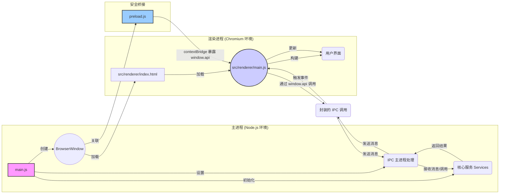

# ModelNest 项目架构说明文档

**1. 引言**

本文档详细阐述 ModelNest（一个基于 Electron 的 AIGC 模型管理与浏览工具）项目的架构设计。基于对项目关键源代码文件（包括主进程、渲染进程、IPC、服务层和数据访问层等）的分析，全面描述项目的核心组件、交互方式、数据流动路径以及整体设计模式。

**2. 核心架构：Electron 主/渲染进程模型**

ModelNest 遵循标准的 Electron 应用架构，将应用程序划分为两个主要进程：

*   **主进程 (Main Process):** 由 `main.js` 启动，是应用程序的后端。它拥有完整的 Node.js 环境访问权限，负责管理应用程序的生命周期、创建和管理渲染进程窗口 (`BrowserWindow`)、执行原生操作系统交互（如文件对话框）、处理需要更高权限或访问系统资源的操作。它是所有服务和核心业务逻辑的宿主环境。
*   **渲染进程 (Renderer Process):** 每个 `BrowserWindow` 实例运行一个独立的渲染进程，负责展示用户界面 (UI)。它本质上是一个 Chromium 浏览器环境，运行 `src/renderer/index.html` 及其关联的 JavaScript (`src/renderer/main.js` 等) 和 CSS。渲染进程受限于浏览器沙箱环境，不能直接访问 Node.js API 或系统资源，必须通过 IPC 与主进程通信来执行这些操作。

它们之间的关系如下图所示：



**3. 关键组件及其职责**

*   **主进程 (`main.js`)**:
    *   **初始化与生命周期:** 应用程序入口，处理 `app` 模块的生命周期事件 (`whenReady`, `activate`, `window-all-closed`)。
    *   **服务初始化:** 在 `whenReady` 事件中，异步调用 `src/services/index.js` 中的 `initializeServices`，创建并初始化所有服务实例（Config, DataSource, Model, Image, Update），并处理它们之间的依赖关系。
    *   **窗口管理:** 创建主 `BrowserWindow`，加载 `index.html` 和 `preload.js`，配置窗口属性（大小、图标、菜单移除），并在开发模式下打开 DevTools。
    *   **IPC 中心:** 作为 IPC 通信的服务端。通过 `ipcMain.handle` 和 `ipcMain.on` 监听来自渲染进程的特定通道的请求和消息。
    *   **IPC 委托:** 将大部分 IPC 请求的处理逻辑委托给专门的 IPC 模块 (`src/ipc/appIPC.js`, `src/ipc/modelLibraryIPC.js`, **新增的 `src/ipc/modelCrawlerIPC.js`**)，并将初始化好的 `services` 对象传递给它们。部分简单请求（如 `open-folder-dialog`）或日志/错误监听直接在 `main.js` 处理。
    *   **事件推送:** 使用 `mainWindow.webContents.send` 向渲染进程主动推送事件（如配置更新 `config-updated`、更新状态 `updater.onUpdateStatus`、**新增的爬虫状态 `crawl-status-update`**）。
    *   **日志与配置:** 配置 `electron-log`，包括日志文件路径、格式、级别（根据 `ConfigService` 或环境变量确定），并捕获全局错误。使用 `ConfigService` 设置 `imageCache` 配置。
    *   **更新管理:** 集成 `electron-updater`，但将具体的检查和安装逻辑封装在 `UpdateService` 中，并通过 IPC 暴露给渲染进程。

*   **渲染进程 (`src/renderer/main.js`, `*.html`, `src/renderer/js/*`, `src/renderer/styles/*`)**:
    *   **UI 渲染与管理:** 负责构建、渲染和更新用户界面。使用 HTML、CSS 和 JavaScript。UI 组件逻辑被拆分到 `src/renderer/js/components/` 目录下（如 `main-view.js`, `detail-model.js`, `settings-modal.js`）。
    *   **用户交互处理:** 监听用户的操作（点击、选择等），并触发相应的 UI 更新或与主进程的通信。
    *   **状态管理 (UI 相关):** 管理 UI 自身的状态，如当前视图模式（卡片/列表）、主题 (`theme.js`)、国际化语言 (`i18n.js`)。
    *   **与主进程通信 (客户端):** 完全依赖 `preload.js` 暴露的 `window.api` 对象与主进程交互。通过调用 `window.api` 上的方法（如 `getConfig`, `listModels`）向主进程发送请求，并通过回调或 Promise 接收结果。使用 `window.api.on...` 方法监听主进程推送的事件。**设置界面 (`settings-modal.js`, `source-edit-model.js`) 允许用户在添加或编辑数据源时配置其 `readOnly` 状态。**
    *   **数据展示:** 获取数据后（通常来自主进程），负责将数据渲染到 UI 元素上。
    *   **错误/日志上报:** 捕获渲染进程的 JavaScript 错误和未处理的 Promise 拒绝，并通过 `window.api.sendRendererError` 和 `window.api.logMessage` 发送给主进程记录。
    *   **爬虫功能集成 (新增):** 包含新增的 `src/renderer/js/components/crawl-status-modal.js` 组件用于显示爬取状态和控制任务（暂停/恢复/取消）。其他组件（如 `main-view.js`）也进行了修改，以添加触发爬虫任务的按钮和逻辑。

*   **预加载脚本 (`preload.js`)**:
    *   **安全桥梁:** 在渲染进程加载页面前执行，拥有有限的 Node.js API 访问权限（特别是 `ipcRenderer` 和 `contextBridge`）。
    *   **API 暴露:** 使用 `contextBridge.exposeInMainWorld('api', {...})` 将一组精心挑选的函数安全地暴露给渲染进程。这些函数封装了 `ipcRenderer.invoke`, `ipcRenderer.send`, 和 `ipcRenderer.on` 的调用，定义了渲染进程与主进程通信的契约。**新增暴露了 `getAllSourceConfigs` API，允许渲染进程获取所有数据源的配置列表。** **同样，与模型爬虫相关的 API（如 `startCrawl`, `getCrawlStatus`, `pauseCrawl`, `resumeCrawl`, `cancelCrawl`, `onCrawlStatusUpdate`）也通过此机制暴露。**
    *   **上下文隔离:** 与 `main.js` 中设置的 `contextIsolation: true` 配合，确保渲染进程的全局 `window` 对象与 `preload.js` 的作用域隔离，增强安全性。

*   **IPC 层 (`src/ipc/appIPC.js`, `src/ipc/modelLibraryIPC.js`)**:
    *   **请求处理:** 作为主进程中具体的 IPC 请求处理器。`initializeAppIPC` 和 `initializeModelLibraryIPC` 函数在 `main.js` 中被调用，并接收 `services` 对象。
    *   **职责划分:** `appIPC` 处理应用级通用请求（配置、版本信息、缓存清理等），`modelLibraryIPC` 处理模型库核心功能请求（列出模型/目录、获取详情/图片、保存模型）。**新增的 `src/ipc/modelCrawlerIPC.js` 则专门负责处理与模型信息爬取相关的通信。**
    *   **服务调用:** IPC 处理函数的核心逻辑是调用注入的 `services` 对象上的相应方法来完成任务。例如，`clear-image-cache` 请求现在会调用 `services.imageService.clearCache()`。**新增处理 `getAllSourceConfigs` 的 IPC 请求，调用 `DataSourceService` 获取数据。**
    *   **错误处理:** 捕获服务层调用可能抛出的错误，记录日志，并将错误信息传递回渲染进程。
    *   **`ModelCrawlerIPC` (新增):** 处理与模型信息爬取相关的 IPC 请求。`initializeModelCrawlerIPC` 在 `main.js` 中调用，接收 `services` 对象。处理来自渲染进程的 `start-crawl`, `get-crawl-status`, `pause-crawl`, `resume-crawl`, `cancel-crawl` 等请求，并调用 `modelCrawlerService` 的相应方法。

*   **服务层 (`src/services/*.js`)**:
    *   **业务逻辑封装:** 包含应用程序的核心业务逻辑，与具体的 UI 或 IPC 实现解耦。
    *   **`ConfigService`:** 负责读取、写入和缓存应用程序的配置文件 (`config.json`)。提供 `getConfig` 和 `saveConfig` 方法。是其他多个服务的基础依赖。**加载配置时，会确保 `modelSources` 配置中的每个数据源都包含 `readOnly` 属性，默认为 `false`。**
    *   **`DataSourceService`:** 管理数据源的*配置*信息。从 `ConfigService` 读取 `modelSources` 数组，提供 `getSourceConfig(id)` 和 `getAllSourceConfigs` 方法，供需要了解数据源元数据（类型、路径、凭据等）的服务使用。还提供 `getSupportedExtensions`。
    *   **`ModelService`:** 处理模型相关的操作。依赖 `DataSourceService` 获取数据源配置，然后调用 `dataSourceInterface.js` 中的函数来执行实际的数据源交互（列表、读详情、写 JSON）。
    *   **`ImageService`:** 处理模型图片的获取和缓存。依赖 `DataSourceService` 获取数据源配置，调用 `dataSourceInterface.js` 获取原始图片数据，并结合 `src/common/imageCache.js` 进行缓存管理。**新增了 `clearCache` 方法，用于清除内存和磁盘缓存，并通过 IPC 暴露。**
    *   **`UpdateService`:** 封装 `electron-updater` 的逻辑，处理检查更新、下载更新和触发安装的流程，并将状态通过 `webContents.send` 推送给渲染进程。
    *   **`ModelCrawlerService` (新增):** 负责管理 Civitai 模型信息的爬取任务。协调爬虫的启动、暂停、恢复、取消，跟踪状态和进度，处理爬取结果（调用 `civitai-model-info-crawler` 获取信息，调用 `LocalDataSource` 保存 JSON，调用 `imageDownloader` 下载并保存图片），并将状态更新通过 `webContents.send('crawl-status-update', ...)` 推送给渲染进程。依赖 `ConfigService` (获取爬虫配置，如速率限制), `DataSourceService` (获取数据源实例以写入文件), `civitai-model-info-crawler.js`, `imageDownloader.js`。
    *   **依赖注入:** `src/services/index.js` 负责按正确顺序实例化所有服务，并处理它们之间的依赖关系（例如，将 `configService` 注入 `dataSourceService`，将 `dataSourceService` 注入 `modelService` 和 `imageService`）。**新增的 `modelCrawlerService` 也在此处进行初始化并注入所需依赖。**

*   **数据访问层 (`src/data/*.js`)**:
    *   **`baseDataSource.js` (新增):** 定义了一个抽象基类 `BaseDataSource`，规定了所有数据源实现（如 Local, WebDAV）必须提供的核心方法接口（`listModels`, `readModelDetail`, `listSubdirectories`, `getImageData`, `writeModelJson` 等）。这强制了接口统一性，便于扩展。
    *   **`dataSourceInterface.js` (重构 - 接口层/工厂):** 不再直接包含针对不同类型数据源的 `if/else` 逻辑。提供了一个核心工厂函数 `getDataSourceInstance(sourceConfig)`，该函数根据 `sourceConfig.type` 创建（或从缓存获取，主要针对 WebDAV）相应的 `BaseDataSource` 子类实例（`LocalDataSource` 或 `WebDavDataSource`）。接口层暴露的函数（如 `listModels`, `readModelDetail`, `getImageData`, `writeModelJson`）现在通过调用 `getDataSourceInstance` 获取实例，然后调用该实例上的对应方法来完成操作。这极大地简化了接口层的逻辑，提高了可维护性和扩展性。**在执行写入操作（如 `writeModelJson`）之前，会检查数据源配置的 `readOnly` 标志。如果为 `true`，则会抛出 `ReadOnlyError` 以阻止写入，增强数据保护。**
    *   **`localDataSource.js` (更新):** 继承自 `BaseDataSource`。实现了与本地文件系统交互的逻辑。使用 Node.js 的 `fs` 模块进行文件和目录的读取、遍历。依赖 `modelParser.js` 来解析文件列表和 JSON 内容。**实现了 `getImageData` (读取本地图片文件)、`writeModelJson` (写入 JSON 文件) 和 `writeFile` (写入通用文件，如爬虫下载的图片) 方法。**
    *   **`webdavDataSource.js` (更新):** 继承自 `BaseDataSource`。实现了与 WebDAV 服务器交互的逻辑。使用 `webdav` 库创建客户端，执行目录列表、文件读写等操作。同样依赖 `modelParser.js` 来构建模型对象和解析 JSON。包含客户端初始化 (`ensureInitialized`) 和错误处理（如 404 Not Found）。
    *   **`modelParser.js`:** 包含将底层数据（文件系统条目、WebDAV 返回的条目、JSON 文件内容）转换为应用程序内部使用的标准化模型对象结构的函数。例如，`parseLocalModels` 处理本地文件，`createWebDavModelObject` 处理 WebDAV 文件，`parseModelDetailFromJsonContent` 解析 JSON 内容。

*   **通用模块 (`src/common/*.js`)**:
    *   **`imageCache.js` (重构):** 提供图片缓存的具体实现。**缓存目录已调整为 `userData/ModelNestCache/images`。** 包含内存缓存 (`Map`) 和磁盘缓存（文件系统）。**优化了缓存键生成 (`getCacheFileName`)、日志记录（减少噪音，增强错误信息）和错误处理（如目录创建、文件读写）。`clearCache` 方法现在更健壮。** 被 `ImageService` 使用。
    *   **`constants.js`, `utils.js`:** 提供全局常量和可复用的工具函数。

*   **工具模块 (`src/utils/*.js`) (新增):**
    *   用于存放特定领域或功能相对独立的工具函数或模块。与 `src/common/utils.js` 中存放的全局通用、小型辅助函数不同，此目录下的模块通常具有更明确的职责或更复杂的逻辑。
    *   **`civitai-model-info-crawler.js` (新增):** 包含通过模型文件哈希查询 Civitai API 获取模型详细信息（包括版本、标签、图片 URL 等）的逻辑。被 `ModelCrawlerService` 调用。
    *   **`imageDownloader.js` (新增):** 提供下载图片并使用指定 `DataSource` 保存的通用功能。包含从 Content-Type 或 URL 推断文件扩展名的逻辑。被 `ModelCrawlerService` 用于下载模型预览图。
**4. 核心数据流示例**

*   **列出模型 (List Models):**
    1.  用户在渲染进程 UI 选择数据源和目录。
    2.  Renderer (`main-view.js`) 调用 `window.api.listModels(sourceId, directory)`。
    3.  Preload (`preload.js`) 通过 `ipcRenderer.invoke('listModels', ...)` 发送请求。
    4.  Main Process (`modelLibraryIPC.js`) 接收请求，调用 `services.modelService.listModels(sourceId, directory)`。
    5.  ModelService 调用 `services.dataSourceService.getSourceConfig(sourceId)` 获取配置，并调用 `services.dataSourceService.getSupportedExtensions()` 获取支持的扩展名。
    6.  ModelService 调用 `dataSourceInterface.listModels(sourceConfig, directory, supportedExts)`。
    7.  DataSourceInterface 调用 `getDataSourceInstance(sourceConfig)` 获取具体的数据源实例。
    8.  DataSourceInterface 调用该实例的 `listModels(directory, supportedExts)` 方法。
    9.  具体 DataSource 实例 (`LocalDataSource` 或 `WebDavDataSource`) 与存储交互（读目录、递归、过滤），使用 `modelParser` 构建模型对象列表。
    10. 数据沿调用链返回：DataSource Instance -> DataSourceInterface -> ModelService -> IPC Layer -> Preload -> Renderer。
    11. Renderer (`main-view.js`) 接收模型列表并更新 UI。

*   **获取图片 (Get Image):**
    1.  Renderer (e.g., `detail-model.js`) 需要显示图片，调用 `window.api.getModelImage({sourceId, imagePath})`。
    2.  Preload (`preload.js`) 通过 `ipcRenderer.invoke('getModelImage', ...)` 发送请求。
    3.  Main Process (`modelLibraryIPC.js`) 接收请求，调用 `services.imageService.getImage(sourceId, imagePath)`。
    4.  ImageService 首先检查 `imageCache` 是否存在有效缓存。
    5.  **缓存命中:** 直接从缓存返回数据。
    6.  **缓存未命中:**
        a.  ImageService 调用 `services.dataSourceService.getSourceConfig(sourceId)`。
        b.  ImageService 调用 `dataSourceInterface.getImageData(sourceConfig, imagePath)`。
        c.  DataSourceInterface 调用 `getDataSourceInstance(sourceConfig)` 获取具体的数据源实例。
        d.  DataSourceInterface 调用该实例的 `getImageData(imagePath)` 方法。
        e.  具体 DataSource 实例 (`LocalDataSource` 或 `WebDavDataSource`) 执行文件读取或下载，返回包含 `data` (Buffer), `mimeType` 等信息的对象或 `null`。
        f.  获取原始图片数据 (Buffer)。
        g.  ImageService 可能对数据进行处理（如生成缩略图），然后将其存入 `imageCache`。
        h.  返回处理后的数据（或原始数据）。
    7.  数据沿调用链返回：ImageService -> IPC Layer -> Preload -> Renderer。
    8.  Renderer 显示图片。

*   **保存模型 (Save Model) / 写入操作 (含只读检查):**
    1.  用户在渲染进程 UI 编辑模型信息后点击保存。
    2.  Renderer (e.g., `detail-model.js`) 调用 `window.api.saveModel(sourceId, modelData)`。
    3.  Preload (`preload.js`) 通过 `ipcRenderer.invoke('saveModel', ...)` 发送请求。
    4.  Main Process (`modelLibraryIPC.js`) 接收请求，调用 `services.modelService.saveModel(sourceId, modelData)`。
    5.  ModelService 调用 `services.dataSourceService.getSourceConfig(sourceId)` 获取数据源配置。
    6.  ModelService 调用 `dataSourceInterface.writeModelJson(sourceConfig, model, dataToWrite)`。
    7.  **DataSourceInterface 检查 `sourceConfig.readOnly` 属性。**
    8.  **如果 `readOnly` 为 `true`:**
        a.  DataSourceInterface 抛出 `ReadOnlyError`。
        b.  错误沿调用链返回：ModelService -> IPC Layer -> Preload -> Renderer。
        c.  Renderer 收到错误，向用户显示只读提示。
    9.  **如果 `readOnly` 为 `false`:**
        a.  DataSourceInterface 调用 `getDataSourceInstance(sourceConfig)` 获取具体的数据源实例。
        b.  DataSourceInterface 调用该实例的 `writeModelJson(model, dataToWrite)` 方法。
        c.  具体 DataSource 实例 (`LocalDataSource` 或 `WebDavDataSource`) 与存储交互（写入 JSON 文件）。
        d.  成功信息沿调用链返回：DataSource Instance -> DataSourceInterface -> ModelService -> IPC Layer -> Preload -> Renderer。
        e.  Renderer 收到成功信息，向用户显示保存成功提示。

    ```mermaid
    sequenceDiagram
        participant R as Renderer (UI)
        participant P as Preload (window.api)
        participant I as IPC (modelLibraryIPC)
        participant MS as ModelService
        participant DS as DataSourceService
        participant DI as DataSourceInterface
        participant SpecificDS as Specific DataSource (e.g., Local/WebDAV)

        R->>P: window.api.saveModel(sourceId, modelData)
        P->>I: ipcRenderer.invoke('saveModel', ...)
        I->>MS: services.modelService.saveModel(...)
        MS->>DS: services.dataSourceService.getSourceConfig(sourceId)
        DS-->>MS: sourceConfig (含 readOnly)
        MS->>DI: dataSourceInterface.writeModelJson(sourceConfig, model, data)
        DI->>DI: 检查 sourceConfig.readOnly
        alt readOnly 为 true
            DI-->>MS: 抛出 ReadOnlyError
            MS-->>I: 传递错误
            I-->>P: 传递错误
            P-->>R: 返回错误 (提示只读)
        else readOnly 为 false
            DI->>DI: getDataSourceInstance(sourceConfig)
            DI-->>SpecificDS: writeModelJson(model, data)
            SpecificDS->>存储: 写入数据
            SpecificDS-->>DI: 返回成功
            DI-->>MS: 返回成功
            MS-->>I: 返回成功
            I-->>P: 返回成功
            P-->>R: 返回成功 (提示保存成功)
        end
    ```
*   **启动模型信息爬取 (Start Model Info Crawl) (新增):**
    1.  用户在渲染进程 UI (如 `main-view.js`) 点击“同步 Civitai 信息”按钮，选择本地数据源。
    2.  Renderer 调用 `window.api.startCrawl(sourceId, directory)`。
    3.  Preload (`preload.js`) 通过 `ipcRenderer.invoke('start-crawl', sourceId, directory)` 发送请求。
    4.  Main Process (`modelCrawlerIPC.js`) 接收请求，调用 `services.modelCrawlerService.startCrawl(sourceId, directory)`。
    5.  ModelCrawlerService:
        a.  获取 `LocalDataSource` 实例。
        b.  扫描目录，识别需要处理的模型（缺 JSON 或图片）。
        c.  初始化任务状态和队列，设置 `isProcessing = true`。
        d.  开始异步处理队列 (`_processQueue`)。
        e.  通过 `webContents.send('crawl-status-update', ...)` 推送初始状态。
    6.  **任务处理循环 (`_processQueue`):**
        a.  检查暂停/取消状态。
        b.  取出一个任务项（模型路径、是否缺 JSON/图片）。
        c.  推送当前处理的模型名给 UI (`crawl-status-update`)。
        d.  调用 `civitai-model-info-crawler.getCivitaiModelInfoWithTagsAndVersions(modelPath)`。
        e.  **若成功获取信息:**
            i.  **若缺 JSON:** 调用 `LocalDataSource.writeModelJson(jsonPath, modelInfo)` 保存 **原始** 信息。
            ii. **若缺图片且信息含图片 URL:** 调用 `imageDownloader.downloadAndSaveImage(imageUrl, targetPathBase, dataSource)` 下载并保存图片。
        f.  更新完成计数，推送进度给 UI (`crawl-status-update`)。
        g.  应用速率限制延迟。
        h.  处理下一个任务。
    7.  **状态推送:** `ModelCrawlerService` 在任务进行中（开始、处理中、暂停、恢复、完成、取消、错误）通过 `webContents.send('crawl-status-update', statusInfo)` 推送状态。
    8.  **UI 监听:** Preload (`preload.js`) 监听 `crawl-status-update` 事件，通过 `window.api.onCrawlStatusUpdate(callback)` 触发渲染进程的回调。
    9.  **UI 更新:** Renderer (`crawl-status-modal.js`) 接收状态更新并更新进度条、状态文本、当前处理模型等。
    10. **用户控制:** 用户点击暂停/恢复/取消按钮，通过 `window.api.pauseCrawl() / resumeCrawl() / cancelCrawl()` 调用对应 IPC，最终调用 `ModelCrawlerService` 的方法改变任务状态。
    11. **任务结束:** 队列处理完毕、被取消或出错，推送最终状态给 UI。

    ```mermaid
    sequenceDiagram
        participant R as Renderer (UI)
        participant P as Preload (window.api)
        participant IPC as IPC (modelCrawlerIPC)
        participant MCS as ModelCrawlerService
        participant DS as LocalDataSource
        participant CC as CivitaiCrawlerUtil
        participant IDL as ImageDownloaderUtil
        participant Main as Main Process (webContents)

        R->>P: window.api.startCrawl(sourceId, dir)
        P->>IPC: ipcRenderer.invoke('start-crawl', ...)
        IPC->>MCS: services.modelCrawlerService.startCrawl(...)
        activate MCS
        MCS->>DS: scanDirectory(...)
        DS-->>MCS: modelFilesList
        MCS->>MCS: buildTaskQueue()
        MCS->>Main: webContents.send('crawl-status-update', {status: STARTING, ...})
        Main-->>P: (IPC Event)
        P-->>R: window.api.onCrawlStatusUpdate(status)
        R->>R: Show Crawl Status Modal

        loop Process Queue
            alt Paused or Canceled
                MCS->>MCS: Wait or Exit Loop
            end
            MCS->>MCS: Get next taskItem
            MCS->>Main: webContents.send('crawl-status-update', {status: RUNNING, currentModel: ...})
            Main-->>P: (IPC Event)
            P-->>R: window.api.onCrawlStatusUpdate(status)
            R->>R: Update Modal (Current Model)

            MCS->>CC: getCivitaiModelInfo...(taskItem.modelPath)
            CC-->>MCS: modelInfo / null

            opt modelInfo found
                opt taskItem.needsJson
                    MCS->>DS: writeModelJson(jsonPath, modelInfo)
                    DS-->>MCS: Success/Error
                end
                opt taskItem.needsImage and modelInfo.images[0]
                    MCS->>IDL: downloadAndSaveImage(imageUrl, basePath, DS)
                    IDL->>DS: writeFile(imagePath, imageData)
                    DS-->>IDL: Success/Error
                    IDL-->>MCS: savedImagePath / null
                end
            end

            MCS->>MCS: Update progress.completed
            MCS->>Main: webContents.send('crawl-status-update', {status: RUNNING, progress: ...})
            Main-->>P: (IPC Event)
            P-->>R: window.api.onCrawlStatusUpdate(status)
            R->>R: Update Modal (Progress Bar)

            MCS->>MCS: Apply Rate Limit Delay
        end

        MCS->>Main: webContents.send('crawl-status-update', {status: FINISHED/CANCELED/ERROR, ...})
        Main-->>P: (IPC Event)
        P-->>R: window.api.onCrawlStatusUpdate(status)
        R->>R: Update Modal (Final Status)
        deactivate MCS
        MCS-->>IPC: Return final status
        IPC-->>P: Return final status
        P-->>R: Return final status

        note over R, MCS: User can Pause/Resume/Cancel via IPC calls anytime
    ```

**5. 筛选功能架构**

近期对模型的筛选功能进行了重构，引入了更灵活和高效的架构设计，主要体现在以下几个方面：

**5.1 UI 组件化与交互逻辑**

*   **`FilterPanel` 组件**: 引入了新的前端 UI 组件 `src/renderer/js/components/filter-panel.js`。该组件负责动态渲染筛选器界面（例如，根据可用的筛选选项生成下拉列表或输入框），并管理用户在筛选面板上的交互。
*   **`main-view.js` 的集成与控制**: `src/renderer/js/components/main-view.js` 现在负责控制 `FilterPanel` 的显示和隐藏逻辑。此外，`main-view.js` 还实现了点击筛选面板外部区域时自动关闭面板的用户体验优化。
*   **样式分离**: 为了更好的模块化和可维护性，筛选面板相关的 CSS 样式被提取并统一管理在 `src/renderer/styles/filter-panel.css` 文件中。

**5.2 筛选选项的动态获取与按数据源缓存**

*   **`ModelService` 增强**: 服务层中的 `src/services/modelService.js` 内的 `getAvailableFilterOptions` 方法进行了重构。现在它支持传入 `sourceId` 参数，从而能够为特定的数据源动态获取其可用的筛选选项（如模型类型、基础模型等）。
*   **IPC 与 Preload 更新**: 为支持按数据源获取筛选选项，相关的 IPC 通道 (`modelLibraryIPC.js`) 和预加载脚本 (`preload.js`) 中的 API (例如，暴露给渲染进程的 `getAvailableFilterOptions` 函数) 已更新，以接受并传递 `sourceId` 参数。
*   **`main-view.js` 的缓存策略**: 渲染进程的 `main-view.js` 实现了新的筛选选项缓存机制。它会根据当前激活的 `sourceId` 来缓存从主进程获取的筛选选项。当用户切换数据源时，`main-view.js` 会负责刷新这些选项，并重新将它们应用到 `FilterPanel` 组件以更新UI显示。

**5.3 筛选行为与数据处理**

*   **`modelType` 筛选**:
    *   UI 显示：在 `FilterPanel` 中，`modelType` 的选项统一以全大写形式展示给用户，以保持视觉上的一致性。
    *   匹配逻辑：实际在 `ModelService` 或数据源层面进行筛选匹配时，对 `modelType` 的比较是大小写不敏感的，以提高筛选的容错性和用户体验。
*   **`baseModel` 筛选**:
    *   匹配逻辑：与 `modelType` 类似，对 `baseModel` 字段进行筛选匹配时，同样采用大小写不敏感的策略。

这些架构变更旨在提升筛选功能的灵活性、性能和用户体验，同时也使得代码结构更加清晰和易于维护。

**6. IPC 通信机制总结**

*   **请求-响应 (Invoke/Handle):** 用于渲染进程需要从主进程获取数据或执行操作并等待结果的场景。这是最常用的模式（例如 `listModels`, `saveModel`, 以及新增的 `start-crawl`, `get-crawl-status`, `pause-crawl`, `resume-crawl`, `cancel-crawl`）。
*   **单向消息 (Send/On):** 用于渲染进程向主进程发送信息而不需要回复（如日志、错误），或主进程向特定渲染进程发送通知。
*   **主进程推送 (webContents.send/On):** 用于主进程需要向一个或所有渲染进程广播事件（如配置已更新 `config-updated`、更新状态变化 `updater.onUpdateStatus`，以及新增的爬虫状态更新 `crawl-status-update`）。

**7. 架构优点**

*   **模块化与分层清晰:** 各层职责明确，降低了耦合度，提高了代码的可理解性和可维护性。
*   **关注点分离:** UI、业务逻辑、数据访问逻辑分离，便于独立开发、测试和修改。
*   **安全性:** 通过 `contextBridge` 和上下文隔离，限制了渲染进程的能力，提高了安全性。
*   **可扩展性:** **数据访问层的抽象设计（`BaseDataSource` 基类）和 `dataSourceInterface.js` 的工厂模式 (`getDataSourceInstance`) 使得未来添加新的数据源类型（如 S3、本地数据库）非常容易，只需创建新的 `BaseDataSource` 子类并更新工厂函数即可，无需修改上层服务代码。** 服务层也易于添加新的业务功能。
*   **代码复用:** 通用功能（如日志、缓存、解析）被提取到公共模块或服务中。
*   **数据保护:** **引入数据源只读模式，允许用户保护重要数据源不被意外修改，提高了数据安全性。**

**8. 观察与潜在考虑点**
*   **WebDAV 实例缓存:** `dataSourceInterface.js` 中的 `getDataSourceInstance` 函数对 WebDAV 实例进行了缓存，这是一个很好的优化。需要注意缓存实例的生命周期管理（虽然在当前单主进程场景下通常不是问题）。
*   **错误处理一致性:** `dataSourceInterface` 中的 `readModelDetail` 和 `getImageData` 在底层数据源实例（`LocalDataSource` 或 `WebDavDataSource`）返回错误（如文件未找到）时，会捕获错误并返回默认值（空对象或 null）。虽然有日志记录，但这可能隐藏了底层问题，需要根据业务需求考虑是否统一错误处理行为，例如向上抛出标准化错误。

**9. 构建与打包**

*   **`package.json`:** Node.js 项目的标准配置文件。定义了项目依赖、开发依赖、项目脚本（如 `start`, `build`, `lint`）以及一些元数据。Electron 应用的入口点 (`main`) 通常也在这里指定。
*   **`electron-builder.yml`:** `electron-builder` 工具的配置文件。用于定义如何构建和打包 Electron 应用，包括应用程序 ID、版权信息、打包目标平台（Windows, macOS, Linux）、图标、签名配置、文件包含/排除规则等。

**10. 开发规范 (Development Specifications)**

为了确保项目代码的一致性、可维护性和可扩展性，后续开发应遵循以下规范：

**10.1 日志规范 (Logging Specification)**

*   **库与配置**:
    *   统一使用 `electron-log` 库进行日志记录。
    *   主进程日志配置（包括文件路径 `userData/logs/main.log`、格式 `{y}-{m}-{d} {h}:{i}:{s}.{ms} [{level}] {text}`、最大大小 `10MB`、级别确定逻辑）在 `main.js` 中完成。
    *   日志级别优先级：`config.json` 中的 `logLevel` > 环境变量 `LOG_LEVEL` > 默认 `warn`。
*   **日志级别**:
    *   遵循 `electron-log` 的标准级别: `error`, `warn`, `info`, `verbose`, `debug`, `silly`。
    *   根据信息的重要性和类型选择合适的级别。关键操作、错误、生命周期事件、重要状态变更应至少使用 `info` 或 `warn` 级别。调试信息使用 `debug` 或 `verbose`。
*   **日志格式与内容**:
    *   **主进程**: 日志内容应包含明确的来源标识符前缀，例如 `[Main]`, `[IPC:App]`, `[IPC:ModelLib]`, `[Service:Config]`, `[DataSource:Local]`, `[Lifecycle]`, `[Updater]`, `[ImageCache]`, **`[Service:Crawler]`, `[IPC:Crawler]`, `[Util:CivitaiCrawler]`, `[Util:ImageDownloader]`** 等，以便于筛选和定位问题。
    *   **渲染进程**: 通过 `window.api.logMessage(level, message, ...args)` （已通过`apiBridge.js` 进行封装，请引用`apiBridge.js` 中定义的内容）发送日志。主进程接收后会自动添加 `[Renderer]` 前缀。渲染进程内部代码也应使用类似 `[UI]`, `[i18n]`, `[Component:MainView]`, **`[Component:CrawlModal]`** 等前缀区分来源。
    *   **错误日志**:
        *   主进程未捕获错误由 `electron-log` 自动处理。
        *   渲染进程未捕获错误通过 `window.api.sendRendererError(errorInfo)` 发送，主进程记录时添加 `[RendererError]` 前缀。
        *   业务逻辑中可预见的错误或异常情况，应使用 `log.error()` 或 `log.warn()` 记录详细的错误信息、上下文和可能的堆栈跟踪。
*   **结构化信息**: 鼓励在日志消息中包含关键的上下文信息，如操作涉及的对象 ID、文件路径、函数参数、执行耗时等，以提高日志的可分析性。

**10.2 多语言规范 (i18n Specification)**

*   **文件位置**: 语言资源文件统一存放在 `src/renderer/locales/` 目录下，文件名为语言代码 (e.g., `zh-CN.json`, `en-US.json`)。
*   **文件结构**: 使用嵌套的 JSON 对象来组织翻译键 (key)，保持与 UI 结构或功能模块的逻辑对应关系。
*   **Key 命名**:
    *   使用点 (`.`) 分隔的层级结构，例如 `settings.dataSources.addTitle` 或 `common.confirm`。
    *   命名应清晰、简洁、表意明确，建议使用小驼峰或下划线分隔。
*   **文本使用**:
    *   **JavaScript**: 必须使用 `src/renderer/js/core/i18n.js` 导出的 `t(key, params)` 函数来获取翻译后的文本。
    *   **HTML**: 使用自定义数据属性来标记需要翻译的元素：
        *   `data-i18n-key`: 用于设置元素的 `textContent` (非输入元素) 或 `value` (输入/按钮元素)。
        *   `data-i18n-title-key`: 用于设置元素的 `title` 属性 (鼠标悬停提示)。
        *   `data-i18n-placeholder-key`: 用于设置输入元素的 `placeholder` 属性。
    *   `updateUIWithTranslations()` 函数会自动查找并更新这些元素。
*   **参数化**: 对于需要动态插入内容的文本，在 JSON 文件中使用 `{paramName}` 形式的占位符，并在调用 `t()` 函数时传入包含参数值的对象，例如 `t('greeting', { userName: 'Roo' })`。**已新增与只读模式相关的翻译键（如 `settings.modelSources.readOnlyLabel`, `errors.readOnlyDataSource`）。同样，新增的爬虫功能相关的 UI 文本（如按钮标签 `mainView.syncCivitai`, 状态消息 `crawlStatus.running`, 弹窗标题 `crawlModal.title` 等）也应遵循此规范添加翻译键。**
*   **添加新语言**:
    1.  在 `src/renderer/js/core/i18n.js` 的 `SUPPORTED_LOCALES` 数组中添加新语言的 `{ code, name }` 对象。
    2.  在 `src/renderer/locales/` 目录下创建对应的 `<code>.json` 文件，复制现有语言文件的结构，并翻译所有文本。
    3.  在设置界面的语言选项中添加新语言的选项（如果尚未动态生成）。

**10.3 架构规范 (Architecture Specification)**

*   **分层原则**: 严格遵守 主进程/渲染进程、服务层、数据访问层、IPC 层、UI 层 的划分。各层职责明确，避免跨层直接调用（除明确定义的接口外）。
*   **服务层 (`src/services/`)**:
    *   新的独立业务功能应封装成单独的服务类（例如新增的 `ModelCrawlerService`）。
    *   服务的初始化和依赖关系必须在 `src/services/index.js` 的 `initializeServices` 函数中集中管理和注入。服务应尽可能无状态，依赖通过构造函数注入。**新增的 `ModelCrawlerService` 也遵循此原则。**
*   **数据访问层 (`src/data/`)**:
    *   **接口统一**: 所有数据访问操作（模型列表、详情读写、图片获取等）必须通过 `src/data/dataSourceInterface.js` 提供的接口函数进行。上层服务不得直接实例化或调用具体的数据源实现类 (`LocalDataSource`, `WebDavDataSource` 等)。**注意：`ModelCrawlerService` 在处理本地文件写入时，会直接获取 `LocalDataSource` 实例，这是一个特例，因为它需要直接调用 `writeFile` 等本地文件系统操作。**
    *   **扩展数据源**: 严格遵循以下步骤添加新的数据源类型：
        1.  创建新的数据源类 (e.g., `S3DataSource`)，继承自 `src/data/baseDataSource.js` 的 `DataSource` 基类。
        2.  在新类中完整实现基类定义的所有抽象方法。
        3.  修改 `src/data/dataSourceInterface.js` 中的 `getDataSourceInstance` 工厂函数，添加对新 `type` 的处理逻辑。
        4.  修改 `src/data/dataSourceInterface.js` 中的 `compareDataSourceConfigs` 函数，确保能正确比较新类型的配置是否发生变化。
    *   **只读处理**: **所有通过 `dataSourceInterface.js` 进行的写入操作，都必须考虑并处理数据源的 `readOnly` 状态。**
*   **IPC 通信 (`src/ipc/`, `preload.js`)**:
    *   渲染进程与主进程的所有通信必须通过 `preload.js` 中 `contextBridge.exposeInMainWorld('api', ...)` 暴露的接口进行。严禁直接使用 `ipcRenderer` 发送未封装的消息。
    *   主进程的 IPC 消息处理逻辑应按功能划分到 `src/ipc/` 目录下的不同文件中 (e.g., `appIPC.js`, `modelLibraryIPC.js`, **`modelCrawlerIPC.js`**)。处理函数应接收 `services` 对象作为参数，调用服务层方法完成实际工作。
    *   避免在 `main.js` 中直接编写复杂的 IPC 处理逻辑。
    *   根据通信需求选择合适的模式：`invoke/handle` (请求-响应), `send/on` (单向消息), `webContents.send` (主进程推送)。**新增了 `getAllSourceConfigs` 接口，用于渲染进程获取数据源配置。新增的爬虫功能也遵循此规范，通过 `modelCrawlerIPC.js` 处理相关请求 (`start-crawl`, `pause-crawl` 等)，并通过 `preload.js` 暴露 `startCrawl`, `pauseCrawl` 等接口。爬虫状态更新使用 `webContents.send('crawl-status-update', ...)`。**
*   **通用模块 (`src/common/`)**:
    *   与具体业务逻辑无关、可在多处复用的工具函数、常量、基础类（如 `imageCache`）应放在此目录下。
*   **工具模块 (`src/utils/`) (新增):**
    *   存放特定领域或功能相对独立的工具函数或模块。这些模块通常比 `src/common/utils.js` 中的函数更复杂或特定，例如用于与外部服务交互的辅助工具（如 `civitai-model-info-crawler.js`）、复杂的数据处理逻辑或通用下载功能（如 `imageDownloader.js`）等。应保持模块化，职责单一。**新增的 `civitai-model-info-crawler.js` 和 `imageDownloader.js` 属于此类。**

