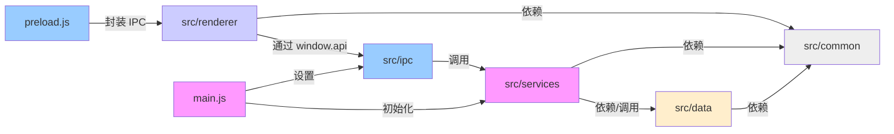

# ModelNest 项目架构说明文档

## 1. 引言

ModelNest 是一个基于 Electron 技术栈构建的桌面应用程序，旨在为用户提供一个高效、便捷的模型管理解决方案。本文档旨在清晰地阐述 ModelNest 项目的整体架构、核心模块的功能划分以及关键脚本的职责，以便于团队成员理解项目结构、进行后续开发和维护。

## 2. 整体架构

ModelNest 采用了典型的 Electron **主进程 (Main Process)** / **渲染进程 (Renderer Process)** 架构。

*   **主进程:** 由 `main.js` 作为入口启动。它拥有完整的 Node.js 环境，负责管理应用程序的生命周期、创建和管理浏览器窗口 (BrowserWindow)、处理系统级操作（如菜单、对话框）、初始化核心服务以及设置进程间通信 (IPC)。
*   **渲染进程:** 每个应用窗口运行一个独立的渲染进程。它负责展示用户界面 (UI)，本质上是一个 Chromium 浏览器环境。`src/renderer/index.html` 是 UI 的入口 HTML 文件，它会加载 `src/renderer/main.js` 来初始化界面逻辑。渲染进程不直接访问 Node.js API 或操作系统资源。
*   **预加载脚本 (Preload Script):** `preload.js` 是一个特殊的脚本，运行在渲染进程环境中，但在一个具有更高权限的上下文中执行，可以访问部分 Node.js API 和 `window` 对象。它充当主进程和渲染进程之间的安全桥梁，通过 `contextBridge` 向渲染进程暴露特定的、经过封装的 IPC 调用接口 (`window.api`)，避免将完整的 `ipcRenderer` 暴露给渲染进程，增强安全性。

它们之间的关系如下图所示：

```mermaid
graph LR
    subgraph 主进程 (Node.js 环境)
        M[main.js] -->|创建| W(BrowserWindow)
        M -->|初始化| S(核心服务 Services)
        M -->|设置| I(IPC 主进程处理)
    end
    subgraph 渲染进程 (Chromium 环境)
        Idx(src/renderer/index.html) -->|加载| RM(src/renderer/main.js)
        RM -->|构建| UI(用户界面)
    end
    subgraph 安全桥接
        P[preload.js]
    end

    W -- 加载 --> Idx
    W -- 关联 --> P
    P -- contextBridge 暴露 window.api --> RM
    RM -- 通过 window.api 调用 --> IpcRendererProxy(封装的 IPC 调用)
    IpcRendererProxy -- 发送消息 --> I(IPC 主进程处理)
    I -- 接收消息/调用 --> S
    S -- 返回结果 --> I
    I -- 发送消息 --> IpcRendererProxy
    IpcRendererProxy -- 触发事件 --> RM
    RM -- 更新 --> UI

    style M fill:#f9f,stroke:#333,stroke-width:2px
    style RM fill:#ccf,stroke:#333,stroke-width:2px
    style P fill:#9cf,stroke:#333,stroke-width:2px
```

## 3. 核心模块划分

项目源代码主要划分为以下几个核心模块，各司其职，相互协作：

*   **`src/common`**:
    *   **功能定位:** 提供项目全局共享的资源和功能。
    *   **包含内容:** 全局常量 (`constants.js`)、通用工具函数 (`utils.js`)、图片缓存机制 (`imageCache.js`) 等。被多个其他模块依赖。
*   **`src/data`**:
    *   **功能定位:** 负责数据的持久化、访问和解析。定义统一的数据源接口，并提供具体实现。
    *   **包含内容:** 数据源接口定义 (`dataSourceInterface.js`)、本地文件系统数据源实现 (`dataSource.js` - LocalDataSource)、WebDAV 数据源实现 (`webdavDataSource.js`)、模型数据解析器 (`modelParser.js`)，负责将不同来源的原始数据转换为标准的模型对象。
*   **`src/ipc`**:
    *   **功能定位:** 处理主进程与渲染进程之间的通信 (IPC)。
    *   **包含内容:** 根据功能领域划分 IPC 事件处理逻辑，例如 `appIPC.js` 处理应用级配置相关的通信，`modelLibraryIPC.js` 处理模型库操作相关的通信。它们接收渲染进程通过 `preload.js` 发送的请求，调用相应的 `Service` 进行处理，并将结果返回给渲染进程。
*   **`src/renderer`**:
    *   **功能定位:** 构建用户界面 (UI) 和处理用户交互。
    *   **包含内容:** UI 入口 (`index.html`, `main.js`)、可复用的 UI 组件 (`js/components/`)、国际化支持 (`js/core/i18n.js`, `locales/`)、主题管理 (`js/utils/theme.js`)、UI 工具函数 (`js/utils/ui-utils.js`) 和样式文件 (`styles/`)。
*   **`src/services`**:
    *   **功能定位:** 实现应用程序的核心业务逻辑。作为主进程中的主要工作单元，协调其他模块完成具体任务。
    *   **包含内容:** 配置管理服务 (`configService.js`)、数据源管理服务 (`dataSourceService.js`)、图片处理服务 (`imageService.js`)、模型管理服务 (`modelService.js`)、应用更新检查服务 (`updateService.js`) 等。`index.js` 可能用于统一初始化和导出服务实例。

**模块依赖关系:**



## 4. 关键脚本职责

*   **`main.js` (主进程入口):**
    *   **应用生命周期管理:** 控制应用的启动、退出、窗口激活等事件。
    *   **窗口创建与管理:** 创建主窗口 (`BrowserWindow`) 并加载 `index.html`。
    *   **服务初始化:** 实例化并初始化 `src/services` 中的核心服务。
    *   **IPC 设置:** 注册 `src/ipc` 中定义的 IPC 事件监听器，准备接收渲染进程的通信请求。
    *   **自动更新:** 集成 `electron-updater` 或类似模块，处理应用更新逻辑 (由 `UpdateService` 实现)。
    *   **日志配置:** 设置日志记录器。
    *   **系统集成:** 创建应用菜单、托盘图标等。
*   **`preload.js` (预加载脚本):**
    *   **安全桥接:** 使用 `contextBridge.exposeInMainWorld` 安全地将主进程的功能子集暴露给渲染进程，通常挂载在 `window.api` 对象上。
    *   **IPC 封装:** 封装 `ipcRenderer.invoke` 和 `ipcRenderer.on` 的调用，提供更简洁、类型安全的接口给渲染进程使用，隐藏底层的 IPC 细节。
*   **`src/renderer/main.js` (渲染进程入口):**
    *   **UI 初始化:** 负责整个 Vue/React/或其他框架应用的初始化和挂载。
    *   **国际化 (i18n) 设置:** 加载语言文件，初始化 i18n 库。
    *   **主题加载:** 应用用户选择的主题样式。
    *   **组件加载:** 注册和加载 UI 组件。
    *   **初始数据获取:** 在应用启动时，通过 `window.api` 调用 IPC 接口从主进程获取必要的初始数据（如配置、模型列表）。
    *   **事件监听:** 监听来自主进程通过 IPC 推送的事件（如数据更新通知），并更新 UI。
*   **`src/ipc/*.js` (IPC 事件处理):**
    *   **`appIPC.js`:** 监听与应用配置相关的 IPC 事件（如获取配置、保存配置），调用 `ConfigService` 处理。
    *   **`modelLibraryIPC.js`:** 监听与模型库操作相关的 IPC 事件（如加载模型列表、获取模型详情、处理图片），调用 `ModelService` 和 `ImageService` 处理。
*   **`src/services/*.js` (核心服务):**
    *   **`configService.js`:** 负责加载、保存和提供对应用配置文件 (`config.json`) 的访问。
    *   **`dataSourceService.js`:** 管理数据源配置，提供访问当前配置的数据源实例的接口，依赖 `ConfigService` 获取配置信息。
    *   **`modelService.js`:** 核心的模型管理逻辑，负责从配置的数据源加载模型列表、获取模型详情等。它会协调 `DataSourceService` 获取数据源实例，并调用具体数据源实现 (`dataSource.js`, `webdavDataSource.js`) 以及 `modelParser.js` 来完成任务。
    *   **`imageService.js`:** 处理与模型相关的图片获取、缓存和处理逻辑。
*   **`src/data/*.js` (数据处理):**
    *   **`dataSourceInterface.js`:** 定义了所有数据源必须遵守的接口规范（如 `getModels`, `getModelDetails` 等方法）。
    *   **`dataSource.js` / `webdavDataSource.js`:** 实现了 `DataSourceInterface`，分别负责从本地文件系统和 WebDAV 服务器读取原始模型数据。
    *   **`modelParser.js`:** 提供函数，将从各种数据源获取的原始数据（可能是 JSON、文件结构等）解析/构建成应用程序内部统一使用的标准模型对象结构。

## 5. 数据流 / 核心流程 (示例：加载模型列表)

以下是一个典型的用户操作（在 UI 上请求加载模型列表）的数据流转过程：

1.  **用户操作 (Renderer):** 用户在渲染进程的 UI 界面上触发了加载模型列表的操作（例如，点击“刷新”按钮）。
2.  **UI 调用 API (Renderer):** `src/renderer/main.js` 或其调用的某个组件中的事件处理函数，通过 `window.api` 调用预加载脚本暴露的接口，例如 `window.api.loadModels()`。
3.  **IPC 请求发送 (Preload -> Main):** `preload.js` 中封装的 `loadModels` 函数内部使用 `ipcRenderer.invoke('load-models')` 向主进程发送一个 IPC 请求。
4.  **IPC 事件处理 (Main):** `src/ipc/modelLibraryIPC.js` 中注册的 `'load-models'` 事件监听器被触发。
5.  **调用核心服务 (Main):** IPC 处理函数调用 `ModelService` 的相应方法，例如 `modelService.loadModels()`。
6.  **服务协调 (Main - Services):**
    *   `ModelService` 调用 `DataSourceService` 获取当前配置的数据源实例。
    *   `DataSourceService` 从 `ConfigService` 读取数据源配置，并返回相应的数据源对象（如 `LocalDataSource` 或 `WebdavDataSource` 实例）。
7.  **数据源访问 (Main - Data):** `ModelService` 调用数据源实例的 `getModels()` 方法。
8.  **数据获取与解析 (Main - Data):**
    *   具体的数据源实现 (`dataSource.js` 或 `webdavDataSource.js`) 访问物理存储（本地文件或 WebDAV 服务器）获取原始数据。
    *   获取到的原始数据传递给 `modelParser.js` 进行解析，转换成标准的模型对象数组。
9.  **结果返回 (Main -> Renderer):**
    *   解析后的模型列表数据沿着调用链返回：Data -> Service -> IPC Handler。
    *   IPC Handler 将结果通过 `invoke` 的 Promise 返回给渲染进程。
10. **UI 更新 (Renderer):** `preload.js` 将主进程返回的结果传递给 `src/renderer/main.js` 中发起调用的地方。渲染进程的逻辑接收到模型列表数据，更新 Vue/React 的状态，最终反映到 UI 界面上，用户看到更新后的模型列表。

## 6. 配置管理

*   **`config.json`:** (通常位于用户数据目录) 存储应用程序的可配置项，例如数据源设置（类型、路径/URL、凭据）、主题偏好、窗口大小/位置等。`config.example.json` 是一个配置模板示例。
*   **`src/services/configService.js`:** 负责管理 `config.json` 文件。提供加载配置、获取特定配置项、保存配置的方法。应用启动时加载配置，当用户在设置界面修改配置后，通过该服务进行保存。其他需要访问配置的服务（如 `DataSourceService`）会依赖 `ConfigService`。

## 7. 构建与打包

*   **`package.json`:** Node.js 项目的标准配置文件。定义了项目依赖、开发依赖、项目脚本（如 `start`, `build`, `lint`）以及一些元数据。Electron 应用的入口点 (`main`) 通常也在这里指定。
*   **`electron-builder.yml`:** `electron-builder` 工具的配置文件。用于定义如何构建和打包 Electron 应用，包括应用程序 ID、版权信息、打包目标平台（Windows, macOS, Linux）、图标、签名配置、文件包含/排除规则等。