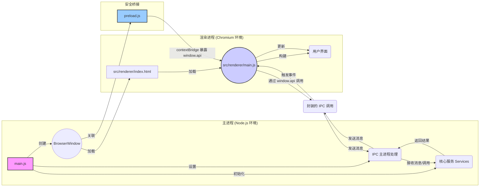

# ModelNest 项目架构说明文档

**1. 引言**

本文档详细阐述 ModelNest（一个基于 Electron 的 AIGC 模型管理与浏览工具）项目的架构设计。基于对项目关键源代码文件（包括主进程、渲染进程、IPC、服务层和数据访问层等）的分析，全面描述项目的核心组件、交互方式、数据流动路径以及整体设计模式。

**2. 核心架构：Electron 主/渲染进程模型**

ModelNest 遵循标准的 Electron 应用架构，将应用程序划分为两个主要进程：

*   **主进程 (Main Process):** 由 `main.js` 启动，是应用程序的后端。它拥有完整的 Node.js 环境访问权限，负责管理应用程序的生命周期、创建和管理渲染进程窗口 (`BrowserWindow`)、执行原生操作系统交互（如文件对话框）、处理需要更高权限或访问系统资源的操作。它是所有服务和核心业务逻辑的宿主环境。
*   **渲染进程 (Renderer Process):** 每个 `BrowserWindow` 实例运行一个独立的渲染进程，负责展示用户界面 (UI)。它本质上是一个 Chromium 浏览器环境，运行 `src/renderer/index.html` 及其关联的 JavaScript (`src/renderer/main.js` 等) 和 CSS。渲染进程受限于浏览器沙箱环境，不能直接访问 Node.js API 或系统资源，必须通过 IPC 与主进程通信来执行这些操作。

它们之间的关系如下图所示：

**3. 关键组件及其职责**

*   **主进程 (`main.js`)**:
    *   **初始化与生命周期:** 应用程序入口，处理 `app` 模块的生命周期事件 (`whenReady`, `activate`, `window-all-closed`)。
    *   **服务初始化:** 在 `whenReady` 事件中，异步调用 `src/services/index.js` 中的 `initializeServices`，创建并初始化所有服务实例（Config, DataSource, Model, Image, Update），并处理它们之间的依赖关系。
    *   **窗口管理:** 创建主 `BrowserWindow`，加载 `index.html` 和 `preload.js`，配置窗口属性（大小、图标、菜单移除），并在开发模式下打开 DevTools。
    *   **IPC 中心:** 作为 IPC 通信的服务端。通过 `ipcMain.handle` 和 `ipcMain.on` 监听来自渲染进程的特定通道的请求和消息。
    *   **IPC 委托:** 将大部分 IPC 请求的处理逻辑委托给专门的 IPC 模块 (`src/ipc/appIPC.js`, `src/ipc/modelLibraryIPC.js`, `src/ipc/modelCrawlerIPC.js`)，并将初始化好的 `services` 对象传递给它们。部分简单请求（如 `open-folder-dialog`）或日志/错误监听直接在 `main.js` 处理。
    *   **事件推送:** 使用 `mainWindow.webContents.send` 向渲染进程主动推送事件（如配置更新 `config-updated`、更新状态 `updater.onUpdateStatus`、爬虫状态 `crawl-status-update`）。
    *   **日志与配置:** 配置 `electron-log`，包括日志文件路径、格式、级别（根据 `ConfigService` 或环境变量确定），并捕获全局错误。使用 `ConfigService` 设置 `imageCache` 配置。
    *   **更新管理:** 集成 `electron-updater`，但将具体的检查和安装逻辑封装在 `UpdateService` 中，并通过 IPC 暴露给渲染进程。

*   **渲染进程 (`src/renderer/main.js`, `*.html`, `src/renderer/js/*`, `src/renderer/styles/*`)**:
    *   **UI 渲染与管理:** 负责构建、渲染和更新用户界面。使用 HTML、CSS 和 JavaScript。UI 组件逻辑被拆分到 `src/renderer/js/components/` 目录下（如 `main-view.js`, `detail-model.js`, `settings-modal.js`）。
        *   **`main-view.js` 的列表渲染优化:** 为了提升长列表（如模型列表）的渲染性能和用户体验，`main-view.js` 引入了**虚拟滚动 (Virtual Scrolling)** 技术。该技术仅渲染用户视口内及少量缓冲区内的列表项，而不是一次性渲染所有数据项。这显著减少了 DOM 操作数量和内存占用，尤其在模型数量较多时效果明显。此举也扩展了 `main-view.js` 的职责，使其需要管理虚拟滚动的状态、计算可视区域、处理滚动事件以及动态更新和复用列表项 DOM 元素。
    *   **用户交互处理:** 监听用户的操作（点击、选择等），并触发相应的 UI 更新或与主进程的通信。
    *   **状态管理 (UI 相关):** 管理 UI 自身的状态，如当前视图模式（卡片/列表）、主题 (`theme.js`)、国际化语言 (`i18n.js`)。
    *   **与主进程通信 (客户端):** 完全依赖 `preload.js` 暴露的 `window.api` 对象与主进程交互。通过调用 `window.api` 上的方法（如 `getConfig`, `listModels`）向主进程发送请求，并通过回调或 Promise 接收结果。使用 `window.api.on...` 方法监听主进程推送的事件。设置界面 (`settings-modal.js`, `source-edit-model.js`) 允许用户在添加或编辑数据源时配置其 `readOnly` 状态。
    *   **数据展示:** 获取数据后（通常来自主进程），负责将数据渲染到 UI 元素上。
    *   **错误/日志上报:** 捕获渲染进程的 JavaScript 错误和未处理的 Promise 拒绝，并通过 `window.api.sendRendererError` 和 `window.api.logMessage` 发送给主进程记录。
    *   **爬虫功能集成:** 包含 `src/renderer/js/components/crawl-status-modal.js` 组件用于显示爬取状态和控制任务。其他组件（如 `main-view.js`）也进行了修改，以添加触发爬虫任务的按钮和逻辑。

*   **预加载脚本 (`preload.js`)**:
    *   **安全桥梁:** 在渲染进程加载页面前执行，拥有有限的 Node.js API 访问权限（特别是 `ipcRenderer` 和 `contextBridge`）。
    *   **API 暴露:** 使用 `contextBridge.exposeInMainWorld('api', {...})` 将一组精心挑选的函数安全地暴露给渲染进程。这些函数封装了 `ipcRenderer.invoke`, `ipcRenderer.send`, 和 `ipcRenderer.on` 的调用，定义了渲染进程与主进程通信的契约。暴露了 `getAllSourceConfigs` API，以及与模型爬虫相关的 API。
    *   **上下文隔离:** 与 `main.js` 中设置的 `contextIsolation: true` 配合，确保渲染进程的全局 `window` 对象与 `preload.js` 的作用域隔离，增强安全性。

*   **IPC 层 (`src/ipc/appIPC.js`, `src/ipc/modelLibraryIPC.js`, `src/ipc/modelCrawlerIPC.js`)**:
    *   **请求处理:** 作为主进程中具体的 IPC 请求处理器。
    *   **职责划分:** `appIPC` 处理应用级通用请求，`modelLibraryIPC` 处理模型库核心功能请求，`modelCrawlerIPC` 专门负责处理与模型信息爬取相关的通信。
    *   **服务调用:** IPC 处理函数的核心逻辑是调用注入的 `services` 对象上的相应方法来完成任务。
    *   **错误处理:** 捕获服务层调用可能抛出的错误，记录日志，并将错误信息传递回渲染进程。

*   **服务层 (`src/services/*.js`)**:
    *   **业务逻辑封装:** 包含应用程序的核心业务逻辑，与具体的 UI 或 IPC 实现解耦。
    *   **`ConfigService`:** 负责读取、写入和缓存应用程序的配置文件。
    *   **`DataSourceService`:** 管理数据源的配置信息。
    *   **`ModelService`:** 处理模型相关的操作。
    *   **`ImageService`:** 处理模型图片的获取和缓存。新增了 `clearCache` 方法。
    *   **`UpdateService`:** 封装 `electron-updater` 的逻辑。
    *   **`ModelCrawlerService`:** 负责管理 Civitai 模型信息的爬取任务。
    *   **依赖注入:** `src/services/index.js` 负责按正确顺序实例化所有服务，并处理它们之间的依赖关系。

*   **数据访问层 (`src/data/*.js`)**:
    *   **`baseDataSource.js`:** 定义了抽象基类 `BaseDataSource`，规定了所有数据源实现的核心方法接口。
    *   **`dataSourceInterface.js`:** 提供核心工厂函数 `getDataSourceInstance(sourceConfig)`，根据类型创建具体数据源实例。接口层函数通过此工厂获取实例并调用其方法。在执行写入操作前检查 `readOnly` 标志。
    *   **`localDataSource.js`:** 继承自 `BaseDataSource`，实现与本地文件系统交互。
    *   **`webdavDataSource.js`:** 继承自 `BaseDataSource`，实现与 WebDAV 服务器交互。
    *   **`modelParser.js`:** 包含将底层数据转换为标准化模型对象结构的函数。

*   **通用模块 (`src/common/*.js`)**:
    *   **`imageCache.js`:** 提供图片缓存的具体实现。缓存目录调整，优化了缓存键生成、日志和错误处理。
    *   **`constants.js`, `utils.js`:** 提供全局常量和可复用的工具函数。

*   **工具模块 (`src/utils/*.js`)**:
    *   用于存放特定领域或功能相对独立的工具函数或模块。
    *   **`civitai-model-info-crawler.js`:** 查询 Civitai API 获取模型详细信息。
    *   **`imageDownloader.js`:** 提供下载图片并使用指定 `DataSource` 保存的通用功能。

**4. 核心数据流示例**

*   **列出模型 (List Models):** (流程保持不变，但 Renderer (`main-view.js`) 接收到模型列表后，会通过虚拟滚动机制进行高效渲染)
    1.  用户在渲染进程 UI 选择数据源和目录。
    2.  Renderer (`main-view.js`) 调用 `window.api.listModels(sourceId, directory)`。
    3.  Preload (`preload.js`) 通过 `ipcRenderer.invoke('listModels', ...)` 发送请求。
    4.  Main Process (`modelLibraryIPC.js`) 接收请求，调用 `services.modelService.listModels(sourceId, directory)`。
    5.  ModelService 调用 `services.dataSourceService.getSourceConfig(sourceId)` 获取配置，并调用 `services.dataSourceService.getSupportedExtensions()` 获取支持的扩展名。
    6.  ModelService 调用 `dataSourceInterface.listModels(sourceConfig, directory, supportedExts)`。
    7.  DataSourceInterface 调用 `getDataSourceInstance(sourceConfig)` 获取具体的数据源实例。
    8.  DataSourceInterface 调用该实例的 `listModels(directory, supportedExts)` 方法。
    9.  具体 DataSource 实例 (`LocalDataSource` 或 `WebDavDataSource`) 与存储交互（读目录、递归、过滤），使用 `modelParser` 构建模型对象列表。
    10. 数据沿调用链返回：DataSource Instance -> DataSourceInterface -> ModelService -> IPC Layer -> Preload -> Renderer。
    11. Renderer (`main-view.js`) 接收模型列表，**并通过其内部的虚拟滚动机制更新 UI，仅渲染可见部分**。

*   **获取图片 (Get Image):** (流程保持不变)
    1.  Renderer (e.g., `detail-model.js`) 需要显示图片，调用 `window.api.getModelImage({sourceId, imagePath})`。
    2.  Preload (`preload.js`) 通过 `ipcRenderer.invoke('getModelImage', ...)` 发送请求。
    3.  Main Process (`modelLibraryIPC.js`) 接收请求，调用 `services.imageService.getImage(sourceId, imagePath)`。
    4.  ImageService 首先检查 `imageCache` 是否存在有效缓存。
    5.  **缓存命中:** 直接从缓存返回数据。
    6.  **缓存未命中:**
        a.  ImageService 调用 `services.dataSourceService.getSourceConfig(sourceId)`。
        b.  ImageService 调用 `dataSourceInterface.getImageData(sourceConfig, imagePath)`。
        c.  DataSourceInterface 调用 `getDataSourceInstance(sourceConfig)` 获取具体的数据源实例。
        d.  DataSourceInterface 调用该实例的 `getImageData(imagePath)` 方法。
        e.  具体 DataSource 实例 (`LocalDataSource` 或 `WebDavDataSource`) 执行文件读取或下载。
        f.  获取原始图片数据 (Buffer)。
        g.  ImageService 可能对数据进行处理，然后将其存入 `imageCache`。
        h.  返回处理后的数据。
    7.  数据沿调用链返回。
    8.  Renderer 显示图片。

*   **保存模型 (Save Model) / 写入操作 (含只读检查):** (流程保持不变)
    (Mermaid 图和步骤描述省略，与原文一致)

*   **启动模型信息爬取 (Start Model Info Crawl):** (流程保持不变)
    (Mermaid 图和步骤描述省略，与原文一致)

**5. 筛选功能架构**
(内容保持不变，与原文一致)

**6. IPC 通信机制总结**
(内容保持不变，与原文一致)

**7. 架构优点**
(内容保持不变，与原文一致)

**8. 观察与潜在考虑点**
*   **WebDAV 实例缓存:** `dataSourceInterface.js` 中的 `getDataSourceInstance` 函数对 WebDAV 实例进行了缓存，这是一个很好的优化。需要注意缓存实例的生命周期管理。
*   **错误处理一致性:** `dataSourceInterface` 中的 `readModelDetail` 和 `getImageData` 在底层数据源实例返回错误时，会捕获错误并返回默认值。这可能隐藏了底层问题，需要根据业务需求考虑是否统一错误处理行为。
*   **`main-view.js` 的职责与虚拟滚动逻辑的内聚性:**
    *   当前 `main-view.js` 组件集成了虚拟滚动 (Virtual Scrolling) 的核心逻辑，包括状态管理、DOM 元素复用和视口计算等。这虽然实现了性能优化，但也显著增加了该组件的复杂度和代码量。
    *   **考虑点:** 从单一职责和高内聚、低耦合的原则出发，未来可以考虑将通用的虚拟滚动逻辑从 `main-view.js` 中**抽象出来，封装成一个独立的、可复用的虚拟列表组件** (例如 `src/renderer/js/components/VirtualList.js` 或 `src/renderer/js/core/VirtualScroller.js`)。
    *   **优点:** 这样做可以使 `main-view.js` 更专注于其核心业务（模型数据的获取与筛选协调、作为视图容器），而将列表的高效渲染和滚动管理交由专门的组件负责，从而提高代码的可维护性、可测试性，并促进该虚拟滚动方案在项目中其他潜在长列表场景的复用。
*   **第三方库 `js-booster` 的引入方式:**
    *   项目中 `js-booster` 库（用于虚拟滚动）目前是通过直接将源码放置在 `src/renderer/vendor/` 目录下引入的，而非通过 npm 等包管理器。
    *   **考虑点:** 这种方式虽然在某些情况下（如需对库进行少量定制、库本身非模块化、或避免特定版本问题）有其灵活性，但也带来了额外的管理成本：
        *   **版本追踪与更新:** 如何有效追踪 `vendor` 中库的版本，以及如何便捷地将其更新到官方新版本？
        *   **构建集成:** 需要确保构建流程能正确处理 `vendor` 目录下的文件。
        *   **许可证管理:** 需要关注并遵守 `vendor` 中库的原始许可证。文件名中的 `-recycled` 字样可能暗示其来源或经过修改，更需谨慎。
    *   **建议:** 查明采用此方式的具体原因。如果可行，优先考虑通过包管理器引入。如果必须本地化，应在项目文档中明确记录其版本、来源、修改点（如有）和许可证信息，并建立相应的更新检查机制。具体规范见 10.3.2 小节。

**9. 构建与打包**
(内容保持不变，与原文一致)

**10. 开发规范 (Development Specifications)**

**10.1 日志规范 (Logging Specification)**

*   **库与配置**: (内容保持不变)
*   **日志级别**: (内容保持不变)
*   **日志格式与内容**:
    *   **主进程**: 日志内容应包含明确的来源标识符前缀，例如 `[Main]`, `[IPC:App]`, `[IPC:ModelLib]`, `[Service:Config]`, `[DataSource:Local]`, `[Lifecycle]`, `[Updater]`, `[ImageCache]`, `[Service:Crawler]`, `[IPC:Crawler]`, `[Util:CivitaiCrawler]`, `[Util:ImageDownloader]` 等。
    *   **渲染进程**: 通过 `window.api.logMessage(level, message, ...args)` 发送日志。主进程接收后会自动添加 `[Renderer]` 前缀。渲染进程内部代码也应使用类似 `[UI]`, `[i18n]`, `[Component:MainView]`, `[Component:CrawlModal]`, **`[Component:MainView:VirtualScroll]` (或简写为 `[VS]`, 若虚拟滚动逻辑内聚)** 等前缀区分来源。
    *   **错误日志**: (内容保持不变)
*   **结构化信息**: (内容保持不变)

**10.2 多语言规范 (i18n Specification)**
(内容保持不变，与原文一致)

**10.3 架构规范 (Architecture Specification)**

*   **10.3.1 分层与组件设计原则**:
    *   严格遵守 主进程/渲染进程、服务层、数据访问层、IPC 层、UI 层 的划分。各层职责明确，避免跨层直接调用（除明确定义的接口外）。
    *   **组件单一职责**: UI 组件应尽可能遵循单一职责原则。对于功能复杂、包含较多内部状态和逻辑的组件（如当前集成了虚拟滚动的 `main-view.js`），应审视其职责是否过于集中。考虑将可复用的、具有独立内聚逻辑的部分（如虚拟滚动核心机制）抽象为独立的子组件或核心模块，以提升整体代码的可维护性和可测试性。
*   **10.3.2 服务层 (`src/services/`)**:
    *   新的独立业务功能应封装成单独的服务类。
    *   服务的初始化和依赖关系必须在 `src/services/index.js` 的 `initializeServices` 函数中集中管理和注入。
*   **10.3.3 数据访问层 (`src/data/`)**:
    *   **接口统一**: 所有数据访问操作必须通过 `src/data/dataSourceInterface.js` 提供的接口函数进行。
    *   **扩展数据源**: 严格遵循既定步骤添加新的数据源类型。
    *   **只读处理**: 所有通过 `dataSourceInterface.js` 进行的写入操作，都必须考虑并处理数据源的 `readOnly` 状态。
*   **10.3.4 IPC 通信 (`src/ipc/`, `preload.js`)**:
    *   渲染进程与主进程的所有通信必须通过 `preload.js` 中暴露的接口进行。
    *   主进程的 IPC 消息处理逻辑应按功能划分到 `src/ipc/` 目录下的不同文件中。
    *   避免在 `main.js` 中直接编写复杂的 IPC 处理逻辑。
    *   根据通信需求选择合适的模式。
*   **10.3.5 通用模块与工具模块 (`src/common/`, `src/utils/`)**:
    *   与具体业务逻辑无关、可在多处复用的代码应放在 `src/common/`。
    *   特定领域或功能相对独立的、较复杂的工具模块放在 `src/utils/`。
*   **10.3.6 第三方库依赖管理 (新增)**:
    *   **优先使用包管理器:** 项目应优先通过 npm 或 yarn 等包管理器来管理第三方依赖。这有助于版本控制、依赖解析、安全审计和构建集成。
    *   **本地 `vendor` 库的引入:**
        *   **适用场景:** 在特定情况下，如需对库进行深度定制、原库不再维护且存在关键问题、库本身非模块化难以通过标准构建工具处理，或为纯前端、轻量级且无复杂依赖的辅助库，可以考虑将其源码直接引入项目的 `vendor` 目录。
        *   **管理要求:** 若采用此方式，必须：
            1.  在项目文档（如本架构文档或专门的依赖说明文件）中明确记录该库的**名称、准确版本号、原始来源 (URL)、选择本地引入的具体原因以及其许可证类型和链接**。
            2.  如果对库源码进行了任何修改，必须详细记录修改内容和原因。
            3.  定期检查库的官方更新，评估升级的必要性和可行性。
            4.  确保构建流程能正确处理 `vendor` 目录下的文件，并符合库的许可证要求进行分发。
        *   **案例:** 当前项目中 `js-booster` 库（用于虚拟滚动）即为此种引入方式，需补充上述管理信息。
*   **10.3.7 前端性能优化实践 (新增)**:
    *   项目致力于提供流畅的用户体验，性能优化是持续关注的重点。
    *   **虚拟滚动 (Virtual Scrolling):** 对于需要展示大量数据项的列表（如模型列表），已引入虚拟滚动技术。该技术通过仅渲染视口内及少量缓冲区内的列表项，显著减少 DOM 数量和操作，从而提升渲染性能和滚动流畅度。相关实现位于 `src/renderer/js/components/main-view.js`（未来可考虑抽象为独立组件）。
    *   **图片懒加载与缓存:** 通过 `ImageService` 和 `imageCache.js` 实现图片的按需加载和多级缓存（内存与磁盘），减少不必要的网络请求和加快图片显示。
    *   **其他考虑:** 未来可根据需要，进一步探索和应用代码分割、Tree Shaking、Web Workers（用于耗时计算）、合理利用 IPC 通信避免阻塞等优化手段。

*   **通用模块 (`src/common/`)**: (内容保持不变)
*   **工具模块 (`src/utils/`)**: (内容保持不变)
