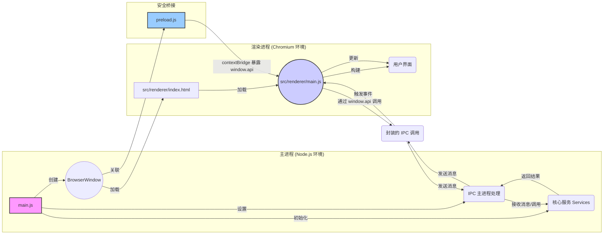

# ModelNest 项目架构说明文档

**1. 引言**

本文档详细阐述 ModelNest（一个基于 Electron 的 AIGC 模型管理与浏览工具）项目的架构设计。基于对项目关键源代码文件（包括主进程、渲染进程、IPC、服务层和数据访问层等）的分析，全面描述项目的核心组件、交互方式、数据流动路径以及整体设计模式。

**2. 核心架构：Electron 主/渲染进程模型**

ModelNest 遵循标准的 Electron 应用架构，将应用程序划分为两个主要进程：

*   **主进程 (Main Process):** 由 `main.js` 启动，是应用程序的后端。它拥有完整的 Node.js 环境访问权限，负责管理应用程序的生命周期、创建和管理渲染进程窗口 (`BrowserWindow`)、执行原生操作系统交互（如文件对话框）、处理需要更高权限或访问系统资源的操作。它是所有服务和核心业务逻辑的宿主环境。
*   **渲染进程 (Renderer Process):** 每个 `BrowserWindow` 实例运行一个独立的渲染进程，负责展示用户界面 (UI)。它本质上是一个 Chromium 浏览器环境，运行 `src/renderer/index.html` 及其关联的 JavaScript (`src/renderer/main.js` 等) 和 CSS。渲染进程受限于浏览器沙箱环境，不能直接访问 Node.js API 或系统资源，必须通过 IPC 与主进程通信来执行这些操作。

它们之间的关系如下图所示：

**3. 关键组件及其职责**

*   **主进程 (`main.js`)**:
    *   **初始化与生命周期:** 应用程序入口，处理 `app` 模块的生命周期事件 (`whenReady`, `activate`, `window-all-closed`)。
    *   **服务初始化:** 在 `whenReady` 事件中，异步调用 `src/services/index.js` 中的 `initializeServices`，创建并初始化所有服务实例（Config, DataSource, Model, Image, Update），并处理它们之间的依赖关系。
    *   **窗口管理:** 创建主 `BrowserWindow`，加载 `index.html` 和 `preload.js`，配置窗口属性（大小、图标、菜单移除），并在开发模式下打开 DevTools。
    *   **IPC 中心:** 作为 IPC 通信的服务端。通过 `ipcMain.handle` 和 `ipcMain.on` 监听来自渲染进程的特定通道的请求和消息。
    *   **IPC 委托:** 将大部分 IPC 请求的处理逻辑委托给专门的 IPC 模块 (`src/ipc/appIPC.js`, `src/ipc/modelLibraryIPC.js`)，并将初始化好的 `services` 对象传递给它们。部分简单请求（如 `open-folder-dialog`）或日志/错误监听直接在 `main.js` 处理。
    *   **事件推送:** 使用 `mainWindow.webContents.send` 向渲染进程主动推送事件（如配置更新 `config-updated`、更新状态 `updater.onUpdateStatus`）。
    *   **日志与配置:** 配置 `electron-log`，包括日志文件路径、格式、级别（根据 `ConfigService` 或环境变量确定），并捕获全局错误。使用 `ConfigService` 设置 `imageCache` 配置。
    *   **更新管理:** 集成 `electron-updater`，但将具体的检查和安装逻辑封装在 `UpdateService` 中，并通过 IPC 暴露给渲染进程。

*   **渲染进程 (`src/renderer/main.js`, `*.html`, `src/renderer/js/*`, `src/renderer/styles/*`)**:
    *   **UI 渲染与管理:** 负责构建、渲染和更新用户界面。使用 HTML、CSS 和 JavaScript。UI 组件逻辑被拆分到 `src/renderer/js/components/` 目录下（如 `main-view.js`, `detail-model.js`, `settings-model.js`）。
    *   **用户交互处理:** 监听用户的操作（点击、选择等），并触发相应的 UI 更新或与主进程的通信。
    *   **状态管理 (UI 相关):** 管理 UI 自身的状态，如当前视图模式（卡片/列表）、主题 (`theme.js`)、国际化语言 (`i18n.js`)。
    *   **与主进程通信 (客户端):** 完全依赖 `preload.js` 暴露的 `window.api` 对象与主进程交互。通过调用 `window.api` 上的方法（如 `getConfig`, `listModels`）向主进程发送请求，并通过回调或 Promise 接收结果。使用 `window.api.on...` 方法监听主进程推送的事件。
    *   **数据展示:** 获取数据后（通常来自主进程），负责将数据渲染到 UI 元素上。
    *   **错误/日志上报:** 捕获渲染进程的 JavaScript 错误和未处理的 Promise 拒绝，并通过 `window.api.sendRendererError` 和 `window.api.logMessage` 发送给主进程记录。

*   **预加载脚本 (`preload.js`)**:
    *   **安全桥梁:** 在渲染进程加载页面前执行，拥有有限的 Node.js API 访问权限（特别是 `ipcRenderer` 和 `contextBridge`）。
    *   **API 暴露:** 使用 `contextBridge.exposeInMainWorld('api', {...})` 将一组精心挑选的函数安全地暴露给渲染进程。这些函数封装了 `ipcRenderer.invoke`, `ipcRenderer.send`, 和 `ipcRenderer.on` 的调用，定义了渲染进程与主进程通信的契约。
    *   **上下文隔离:** 与 `main.js` 中设置的 `contextIsolation: true` 配合，确保渲染进程的全局 `window` 对象与 `preload.js` 的作用域隔离，增强安全性。

*   **IPC 层 (`src/ipc/appIPC.js`, `src/ipc/modelLibraryIPC.js`)**:
    *   **请求处理:** 作为主进程中具体的 IPC 请求处理器。`initializeAppIPC` 和 `initializeModelLibraryIPC` 函数在 `main.js` 中被调用，并接收 `services` 对象。
    *   **职责划分:** `appIPC` 处理应用级通用请求（配置、版本信息、缓存清理等），`modelLibraryIPC` 处理模型库核心功能请求（列出模型/目录、获取详情/图片、保存模型）。
    *   **服务调用:** IPC 处理函数的核心逻辑是调用注入的 `services` 对象上的相应方法来完成任务。
    *   **错误处理:** 捕获服务层调用可能抛出的错误，记录日志，并将错误信息传递回渲染进程。

*   **服务层 (`src/services/*.js`)**:
    *   **业务逻辑封装:** 包含应用程序的核心业务逻辑，与具体的 UI 或 IPC 实现解耦。
    *   **`ConfigService`:** 负责读取、写入和缓存应用程序的配置文件 (`config.json`)。提供 `getConfig` 和 `saveConfig` 方法。是其他多个服务的基础依赖。
    *   **`DataSourceService`:** 管理数据源的*配置*信息。从 `ConfigService` 读取 `modelSources` 数组，提供 `getSourceConfig(id)` 和 `getAllSourceConfigs` 方法，供需要了解数据源元数据（类型、路径、凭据等）的服务使用。还提供 `getSupportedExtensions`。
    *   **`ModelService`:** 处理模型相关的操作。依赖 `DataSourceService` 获取数据源配置，然后调用 `dataSourceInterface.js` 中的函数来执行实际的文件系统/WebDAV 操作（列表、读详情、写 JSON）。
    *   **`ImageService`:** 处理模型图片的获取和缓存。依赖 `DataSourceService` 获取数据源配置，调用 `dataSourceInterface.js` 获取原始图片数据，并结合 `src/common/imageCache.js` 进行缓存管理（可能包括读取、写入、清理缓存，以及潜在的图片处理如缩略图生成 - 使用 `sharp` 库）。
    *   **`UpdateService`:** 封装 `electron-updater` 的逻辑，处理检查更新、下载更新和触发安装的流程，并将状态通过 `webContents.send` 推送给渲染进程。
    *   **依赖注入:** `src/services/index.js` 负责按正确顺序实例化所有服务，并处理它们之间的依赖关系（例如，将 `configService` 注入 `dataSourceService`，将 `dataSourceService` 注入 `modelService` 和 `imageService`）。

*   **数据访问层 (`src/data/*.js`)**:
    *   **`dataSourceInterface.js` (分发器/工厂):** 提供一组核心的数据操作函数 (`listModels`, `readModelDetail`, `getImageData`, `writeModelJson`, `listSubdirectories`)。这些函数接收 `sourceConfig` 作为参数，根据 `sourceConfig.type` ('local' 或 'webdav') 决定调用哪个具体的数据源实现。它隐藏了底层实现的差异，为上层服务提供了统一的调用接口。还包含对 WebDAV 客户端实例的缓存逻辑以提高效率。
    *   **`localDataSource.js`:** 实现了与本地文件系统交互的逻辑。使用 Node.js 的 `fs` 模块进行文件和目录的读取、遍历。依赖 `modelParser.js` 来解析文件列表和 JSON 内容。
    *   **`webdavDataSource.js`:** 实现了与 WebDAV 服务器交互的逻辑。使用 `webdav` 库创建客户端，执行目录列表、文件读写等操作。同样依赖 `modelParser.js` 来构建模型对象和解析 JSON。包含客户端初始化 (`ensureInitialized`) 和错误处理（如 404 Not Found）。
    *   **`modelParser.js`:** 包含将底层数据（文件系统条目、WebDAV 返回的条目、JSON 文件内容）转换为应用程序内部使用的标准化模型对象结构的函数。例如，`parseLocalModels` 处理本地文件，`createWebDavModelObject` 处理 WebDAV 文件，`parseModelDetailFromJsonContent` 解析 JSON 内容。

*   **通用模块 (`src/common/*.js`)**:
    *   **`imageCache.js`:** 提供图片缓存的具体实现，可能包括内存缓存和/或磁盘缓存，以及缓存清理逻辑。被 `ImageService` 使用。
    *   **`constants.js`, `utils.js`:** 提供全局常量和可复用的工具函数。

**4. 核心数据流示例**

*   **列出模型 (List Models):**
    1.  用户在渲染进程 UI 选择数据源和目录。
    2.  Renderer (`main-view.js`) 调用 `window.api.listModels(sourceId, directory)`。
    3.  Preload (`preload.js`) 通过 `ipcRenderer.invoke('listModels', ...)` 发送请求。
    4.  Main Process (`modelLibraryIPC.js`) 接收请求，调用 `services.modelService.listModels(sourceId, directory)`。
    5.  ModelService 调用 `services.dataSourceService.getSourceConfig(sourceId)` 获取配置，并调用 `services.dataSourceService.getSupportedExtensions()` 获取支持的扩展名。
    6.  ModelService 调用 `dataSourceInterface.listModels(sourceConfig, directory, supportedExts)`。
    7.  DataSourceInterface 根据 `sourceConfig.type` 调用 `localDataSource.listModels` 或 `webdavDataSource.listModels`。
    8.  具体 DataSource 实现与存储交互（读目录、递归、过滤），使用 `modelParser` 构建模型对象列表。
    9.  数据沿调用链返回：DataSource -> DataSourceInterface -> ModelService -> IPC Layer -> Preload -> Renderer。
    10. Renderer (`main-view.js`) 接收模型列表并更新 UI。

*   **获取图片 (Get Image):**
    1.  Renderer (e.g., `detail-model.js`) 需要显示图片，调用 `window.api.getModelImage({sourceId, imagePath})`。
    2.  Preload (`preload.js`) 通过 `ipcRenderer.invoke('getModelImage', ...)` 发送请求。
    3.  Main Process (`modelLibraryIPC.js`) 接收请求，调用 `services.imageService.getImage(sourceId, imagePath)`。
    4.  ImageService 首先检查 `imageCache` 是否存在有效缓存。
    5.  **缓存命中:** 直接从缓存返回数据。
    6.  **缓存未命中:**
        a.  ImageService 调用 `services.dataSourceService.getSourceConfig(sourceId)`。
        b.  ImageService 调用 `dataSourceInterface.getImageData(sourceConfig, imagePath)`。
        c.  DataSourceInterface 根据类型调用 `localDataSource` (读文件) 或 `webdavDataSource` (下载文件)。
        d.  获取原始图片数据 (Buffer)。
        e.  ImageService 可能对数据进行处理（如生成缩略图），然后将其存入 `imageCache`。
        f.  返回处理后的数据（或原始数据）。
    7.  数据沿调用链返回：ImageService -> IPC Layer -> Preload -> Renderer。
    8.  Renderer 显示图片。

**5. IPC 通信机制总结**

*   **请求-响应 (Invoke/Handle):** 用于渲染进程需要从主进程获取数据或执行操作并等待结果的场景。这是最常用的模式。
*   **单向消息 (Send/On):** 用于渲染进程向主进程发送信息而不需要回复（如日志、错误），或主进程向特定渲染进程发送通知。
*   **主进程推送 (webContents.send/On):** 用于主进程需要向一个或所有渲染进程广播事件（如配置已更新、更新状态变化）。

**6. 架构优点**

*   **模块化与分层清晰:** 各层职责明确，降低了耦合度，提高了代码的可理解性和可维护性。
*   **关注点分离:** UI、业务逻辑、数据访问逻辑分离，便于独立开发、测试和修改。
*   **安全性:** 通过 `contextBridge` 和上下文隔离，限制了渲染进程的能力，提高了安全性。
*   **可扩展性:** 数据访问层的抽象设计使得未来添加新的数据源类型（如 S3、本地数据库）相对容易，只需实现新的 DataSource 类并在 `dataSourceInterface.js` 中注册即可。服务层也易于添加新的业务功能。
*   **代码复用:** 通用功能（如日志、缓存、解析）被提取到公共模块或服务中。

**7. 观察与潜在考虑点**

*   **`DataSource` 基类:** `localDataSource.js` 中定义的 `DataSource` 基类目前并未强制实现接口或提供共享功能，其作用有限。实际的接口约束由 `dataSourceInterface.js` 的分发逻辑隐式定义。
*   **直接缓存访问:** `appIPC.js` 中的 `clear-image-cache` 处理程序直接调用了 `common/imageCache.clearCache()`，而不是通过 `ImageService`。虽然功能上可行，但这与通过服务层管理其依赖资源的模式略有不一致。统一通过 `ImageService` 管理缓存操作可能更符合封装原则。
*   **WebDAV 实例缓存:** `dataSourceInterface.js` 对 WebDAV 实例进行了缓存，这是一个很好的优化。需要注意缓存实例的生命周期管理（虽然在当前单主进程场景下通常不是问题）。
*   **错误处理一致性:** 大部分 IPC 处理器在服务调用失败时会重新抛出错误，但 `dataSourceInterface` 中的 `readModelDetail` 和 `getImageData` 在底层读取失败时会返回默认值（空对象或 null）以兼容旧逻辑。虽然有日志记录，但这可能隐藏了底层问题，需要根据业务需求考虑是否统一错误处理行为。

**8. 构建与打包**

*   **`package.json`:** Node.js 项目的标准配置文件。定义了项目依赖、开发依赖、项目脚本（如 `start`, `build`, `lint`）以及一些元数据。Electron 应用的入口点 (`main`) 通常也在这里指定。
*   **`electron-builder.yml`:** `electron-builder` 工具的配置文件。用于定义如何构建和打包 Electron 应用，包括应用程序 ID、版权信息、打包目标平台（Windows, macOS, Linux）、图标、签名配置、文件包含/排除规则等。